# Consolidated Bug Report — EShop Testing

**MSSV:** 23127195  
**SUT:** Giao diện Checkout, Register + API Backend + Database

---

# FEATURE: FR-01 — ĐĂNG KÝ TÀI KHOẢN (8 BUGS)

### BUG-001: API cho phép đăng ký trùng email

- **Độ nghiêm trọng (Severity):** Major
- **Độ ưu tiên (Priority):** High
- **Thành phần ảnh hưởng (Component):** API / Database
- **Test Case liên quan:** DT-02, BV-12
- **Liên quan SRS:** Email phải có định dạng hợp lệ (`user@domain.com`) và là **duy nhất** trong hệ thống.

#### Lệnh chạy test thực tế:
```powershell
# Chạy khi backend đang khởi chạy (đăng ký lại email test@eshop.com đã được seed sẵn)
Invoke-RestMethod -Uri "http://localhost:3000/api/register" -Method Post -ContentType "application/json" -Body '{"name":"Nguyen Van A","email":"test@eshop.com","password":"Test1234!"}'
```

#### Kết quả mong đợi (Expected Result):
- API trả về lỗi xác thực (HTTP 400 hoặc 409) thông báo email đã tồn tại.

#### Kết quả thực tế (Actual Result):
- Trả về HTTP 200 OK: `{"message":"User registered successfully","id":10}`.

#### Bằng chứng kiểm thử (Evidence / Screenshot):
- 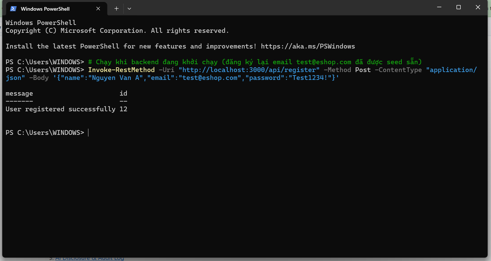

#### Thông tin GitHub Issue:
- **Title:** `[FR-01] [BUG-001] API cho phép đăng ký trùng email`
- **Link Issue:** https://github.com/hungtmh/HW02-Domain_Testing/issues/3

---

### BUG-002: API cho phép đăng ký email sai định dạng

- **Độ nghiêm trọng (Severity):** Major
- **Độ ưu tiên (Priority):** High
- **Thành phần ảnh hưởng (Component):** API
- **Test Case liên quan:** DT-03, BV-12
- **Liên quan SRS:** Email phải có định dạng hợp lệ (`user@domain.com`).

#### Lệnh chạy test thực tế:
```powershell
Invoke-RestMethod -Uri "http://localhost:3000/api/register" -Method Post -ContentType "application/json" -Body '{"name":"Nguyen Van A","email":"invalid-email","password":"Test1234!"}'
```

#### Kết quả mong đợi (Expected Result):
- API từ chối đăng ký và trả về HTTP 400 Bad Request.

#### Kết quả thực tế (Actual Result):
- Trả về HTTP 200 OK: `{"message":"User registered successfully","id":11}`.

#### Bằng chứng kiểm thử (Evidence / Screenshot):
- 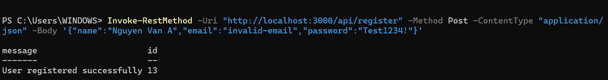

#### Thông tin GitHub Issue:
- **Title:** `[FR-01] [BUG-002] API cho phép đăng ký email sai định dạng`
- **Link Issue:** https://github.com/hungtmh/HW02-Domain_Testing/issues/4

---

### BUG-003: API cho phép đăng ký khi bỏ trống các trường bắt buộc

- **Độ nghiêm trọng (Severity):** Critical
- **Độ ưu tiên (Priority):** High
- **Thành phần ảnh hưởng (Component):** API / Database
- **Test Case liên quan:** DT-04, DT-05, BV-10
- **Liên quan SRS:** Người dùng phải cung cấp: **Họ Tên**, **Email**, **Mật khẩu**.

#### Lệnh chạy test thực tế:
```powershell
Invoke-RestMethod -Uri "http://localhost:3000/api/register" -Method Post -ContentType "application/json" -Body '{}'
```

#### Kết quả mong đợi (Expected Result):
- API từ chối đăng ký và trả về HTTP 400 Bad Request.

#### Kết quả thực tế (Actual Result):
- Trả về HTTP 200 OK: `{"message":"User registered successfully","id":12}` (Lưu các cột `name`, `email`, `password` đều có giá trị `NULL` vào DB).

#### Bằng chứng kiểm thử (Evidence / Screenshot):
- 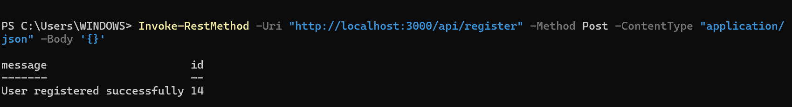

#### Thông tin GitHub Issue:
- **Title:** `[FR-01] [BUG-003] API cho phép đăng ký tài khoản rỗng (NULL)`
- **Link Issue:** https://github.com/hungtmh/HW02-Domain_Testing/issues/5

---

### BUG-004: API không xác thực độ mạnh mật khẩu

- **Độ nghiêm trọng (Severity):** Major
- **Độ ưu tiên (Priority):** High
- **Thành phần ảnh hưởng (Component):** API
- **Test Case liên quan:** BV-01, BV-04, BV-07, BV-08
- **Liên quan SRS:** **Yêu cầu mật khẩu mạnh**: Tối thiểu 8 ký tự, có ít nhất 1 chữ hoa, 1 chữ thường, 1 chữ số và 1 ký tự đặc biệt (`@`, `$`, `!`, `%`, `*`, `?`, `&`).

#### Lệnh chạy test thực tế:
```powershell
Invoke-RestMethod -Uri "http://localhost:3000/api/register" -Method Post -ContentType "application/json" -Body '{"name":"Nguyen Van A","email":"weak_pw@test.com","password":"123"}'
```

#### Kết quả mong đợi (Expected Result):
- API từ chối đăng ký do mật khẩu quá ngắn và yếu (HTTP 400 Bad Request).

#### Kết quả thực tế (Actual Result):
- Trả về HTTP 200 OK và lưu mật khẩu `"123"` vào DB.

#### Bằng chứng kiểm thử (Evidence / Screenshot):
- 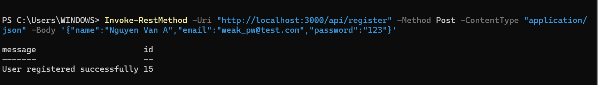

#### Thông tin GitHub Issue:
- **Title:** `[FR-01] [BUG-004] API Backend không xác thực độ mạnh mật khẩu`
- **Link Issue:** https://github.com/hungtmh/HW02-Domain_Testing/issues/6

---

### BUG-005: Thiếu trường Xác nhận mật khẩu trên UI Frontend

- **Độ nghiêm trọng (Severity):** Major
- **Độ ưu tiên (Priority):** High
- **Thành phần ảnh hưởng (Component):** Web UI
- **Test Case liên quan:** DT-10, DT-11
- **Liên quan SRS:** Phải có trường **Xác nhận mật khẩu** — hệ thống từ chối nếu hai trường không khớp.

#### Các bước tái hiện:
1. Mở trình duyệt và truy cập trang đăng ký `http://localhost:5173/register`.
2. Kiểm tra trực quan danh sách các trường nhập liệu trên form.

#### Kết quả mong đợi (Expected Result):
- Có trường "Xác nhận mật khẩu" (Confirm Password) để nhập dữ liệu đối chiếu.

#### Kết quả thực tế (Actual Result):
- Chỉ hiển thị 3 trường: Họ Tên, Email, Mật khẩu. Hoàn toàn không có trường Xác nhận mật khẩu.

#### Bằng chứng kiểm thử (Evidence / Screenshot):
- 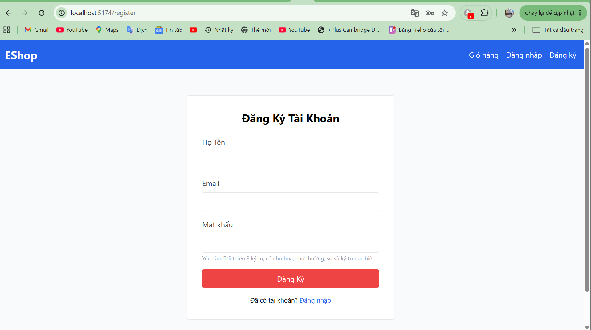

#### Thông tin GitHub Issue:
- **Title:** `[FR-01] [BUG-005] Thiếu trường Xác nhận mật khẩu trên form đăng ký`
- **Link Issue:** https://github.com/hungtmh/HW02-Domain_Testing/issues/7

---

### BUG-006: Regex kiểm tra mật khẩu mạnh ở Frontend bị sai (yêu cầu khoảng trắng)

- **Độ nghiêm trọng (Severity):** Major
- **Độ ưu tiên (Priority):** High
- **Thành phần ảnh hưởng (Component):** Web UI
- **Test Case liên quan:** DT-07, DT-08, BV-08
- **Liên quan SRS:** Mật khẩu mạnh: Tối thiểu 8 ký tự, có ít nhất 1 chữ hoa, 1 chữ thường, 1 chữ số và 1 ký tự đặc biệt (`@`, `$`, `!`, `%`, `*`, `?`, `&`).

#### Các bước tái hiện:
1. Mở trang đăng ký tài khoản `http://localhost:5173/register`.
2. Nhập Họ Tên và Email hợp lệ.
3. Ở ô Mật khẩu, nhập mật khẩu hợp lệ SRS: `"Test1234!"` -> Click "Đăng ký" -> Bị chặn và báo mật khẩu yếu.
4. Ở ô Mật khẩu, nhập mật khẩu có khoảng trắng, không ký tự đặc biệt: `"Test 1234"` -> Click "Đăng ký" -> Form chấp nhận gửi lên API.

#### Kết quả mong đợi (Expected Result):
- `"Test1234!"` được chấp nhận.
- `"Test 1234"` bị từ chối do thiếu ký tự đặc biệt.

#### Kết quả thực tế (Actual Result):
- `"Test1234!"` bị chặn vì không có khoảng trắng.
- `"Test 1234"` được thông qua vì regex của client (`flawedStrongPasswordRegex` tại `Register.jsx` dòng 15) yêu cầu khoảng trắng `\s` thay vì ký tự đặc biệt.

#### Bằng chứng kiểm thử (Evidence / Screenshot):
- 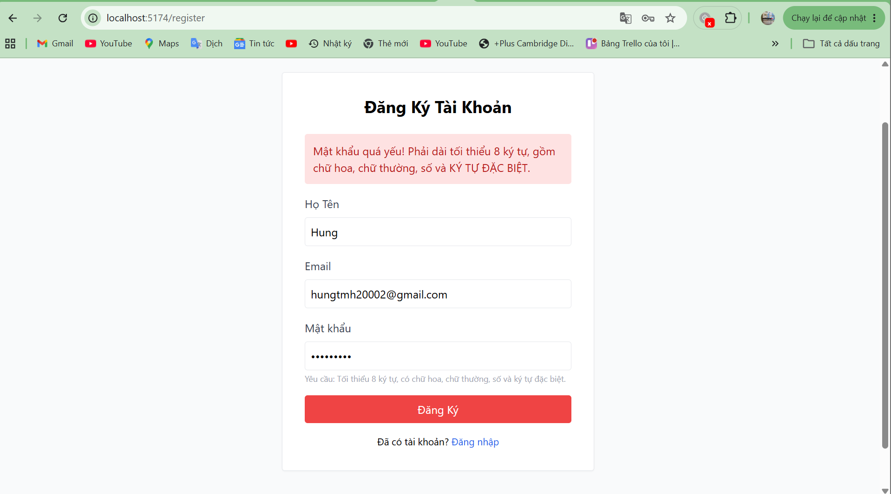

#### Thông tin GitHub Issue:
- **Title:** `[FR-01] [BUG-006] Regex validate mật khẩu ở Frontend yêu cầu khoảng trắng thay vì ký tự đặc biệt`
- **Link Issue:** https://github.com/hungtmh/HW02-Domain_Testing/issues/8

---

### BUG-007: Màn hình Đăng ký sử dụng ô nhập email kiểu type="text"

- **Độ nghiêm trọng (Severity):** Minor
- **Độ ưu tiên (Priority):** Low
- **Thành phần ảnh hưởng (Component):** Web UI
- **Test Case liên quan:** DT-04 (UI)
- **Liên quan SRS:** Chuẩn thiết kế UI tối ưu cho người dùng.

#### Các bước tái hiện:
1. Mở `http://localhost:5173/register`.
2. Inspect phần tử ô nhập Email để xem thuộc tính HTML.

#### Kết quả mong đợi (Expected Result):
- Thuộc tính thẻ input có: `<input type="email" ... />`.

#### Kết quả thực tế (Actual Result):
- Thuộc tính thẻ input là: `<input type="text" ... />` (Dòng 48 file `Register.jsx`).

#### Bằng chứng kiểm thử (Evidence / Screenshot):
- 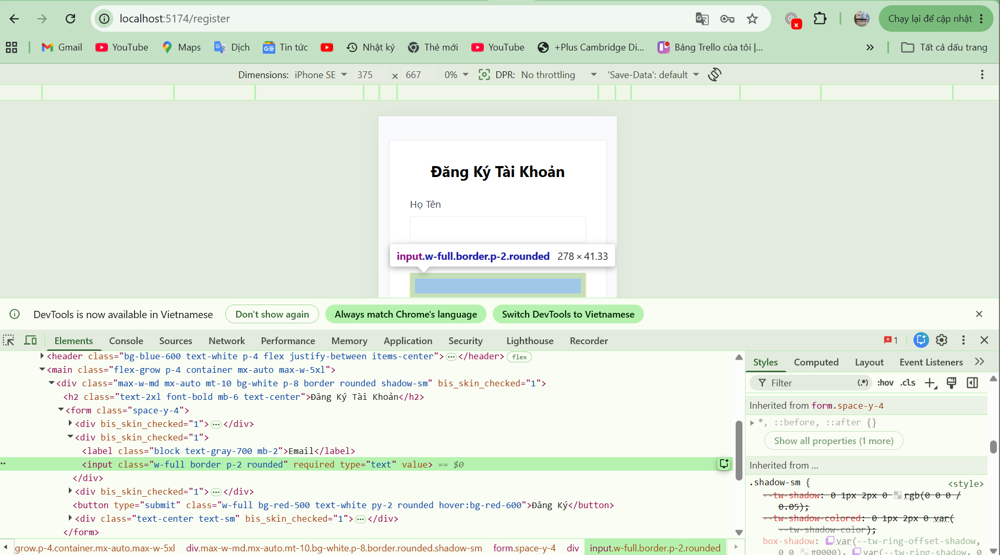

#### Thông tin GitHub Issue:
- **Title:** `[FR-01] [BUG-007] Màn hình Đăng ký sử dụng ô nhập email kiểu type="text"`
- **Link Issue:** https://github.com/hungtmh/HW02-Domain_Testing/issues/9

---

### BUG-008: Mật khẩu người dùng được lưu trữ dưới dạng Plaintext trong Database

- **Độ nghiêm trọng (Severity):** Critical
- **Độ ưu tiên (Priority):** High
- **Thành phần ảnh hưởng (Component):** API / Database
- **Test Case liên quan:** DT-01 / Code Review
- **Liên quan SRS:** Ràng buộc an toàn thông tin cơ bản (Mật khẩu phải được mã hóa trước khi lưu trữ).

#### Các bước tái hiện:
1. Đăng ký tài khoản thành công.
2. Kiểm tra trực tiếp bảng `users` trong cơ sở dữ liệu `database.sqlite` hoặc file seed dữ liệu [database.js](file:///d:/Kiem_thu/HW2/HW02-Group08/backend/database.js) dòng 91-94.

#### Kết quả mong đợi (Expected Result):
- Mật khẩu phải được hash/băm trước khi lưu (ví dụ: `$2a$10$...`).

#### Kết quả thực tế (Actual Result):
- Mật khẩu mẫu và mật khẩu người dùng mới đều được lưu trữ trực tiếp bằng Plaintext (ví dụ: `"Admin123!"`).

#### Bằng chứng kiểm thử (Evidence / Screenshot):
- 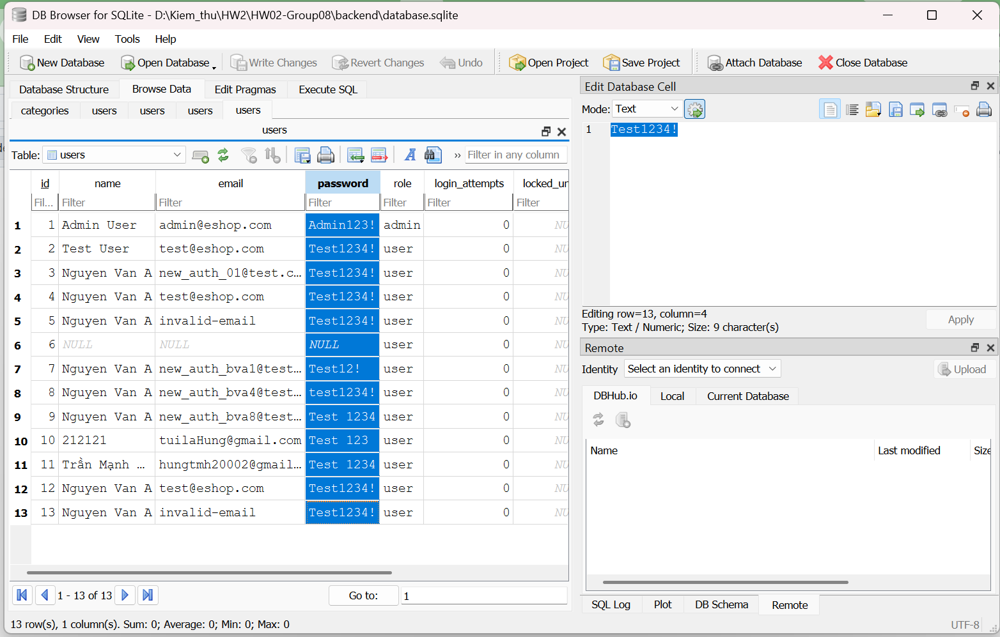

#### Thông tin GitHub Issue:
- **Title:** `[FR-01] [BUG-008] Mật khẩu người dùng được lưu trữ dưới dạng Plaintext trong Database`
- **Link Issue:** https://github.com/hungtmh/HW02-Domain_Testing/issues/10

---
---

# FEATURE: FR-09 — MÃ GIẢM GIÁ (5 BUGS)

### BUG-001: API apply-coupon chặn sai logic biên dưới đơn hàng tối thiểu

- **Độ nghiêm trọng (Severity):** Major
- **Độ ưu tiên (Priority):** High
- **Thành phần ảnh hưởng (Component):** API
- **Test Case liên quan:** BV-02, BV-05
- **Liên quan SRS:** Đơn hàng phải lớn hơn hoặc bằng (`>=`) giá trị `min_order_amount`.

#### Lệnh chạy test thực tế (PowerShell):
```powershell
# Mã SAVE10 có min_order_amount = 300,000 ₫. Gửi đơn hàng trị giá đúng 300,000 ₫
Invoke-RestMethod -Uri "http://localhost:3000/api/apply-coupon" -Method Post -ContentType "application/json" -Body '{"code":"SAVE10","total_amount":300000,"user_id":2}'
```

#### Kết quả mong đợi (Expected Result):
- Chấp nhận áp dụng mã thành công, giảm 10% (30,000 ₫), trả về HTTP 200 OK.

#### Kết quả thực tế (Actual Result):
- Trả về HTTP 400 Bad Request: `{"error":"Đơn hàng chưa đủ giá trị tối thiểu 300,000 ₫ để áp dụng mã này"}`. Do backend check `total_amount > coupon.min_order_amount` (lớn hơn hẳn) thay vì `>=`.

#### Bằng chứng kiểm thử (Evidence / Screenshot):
- 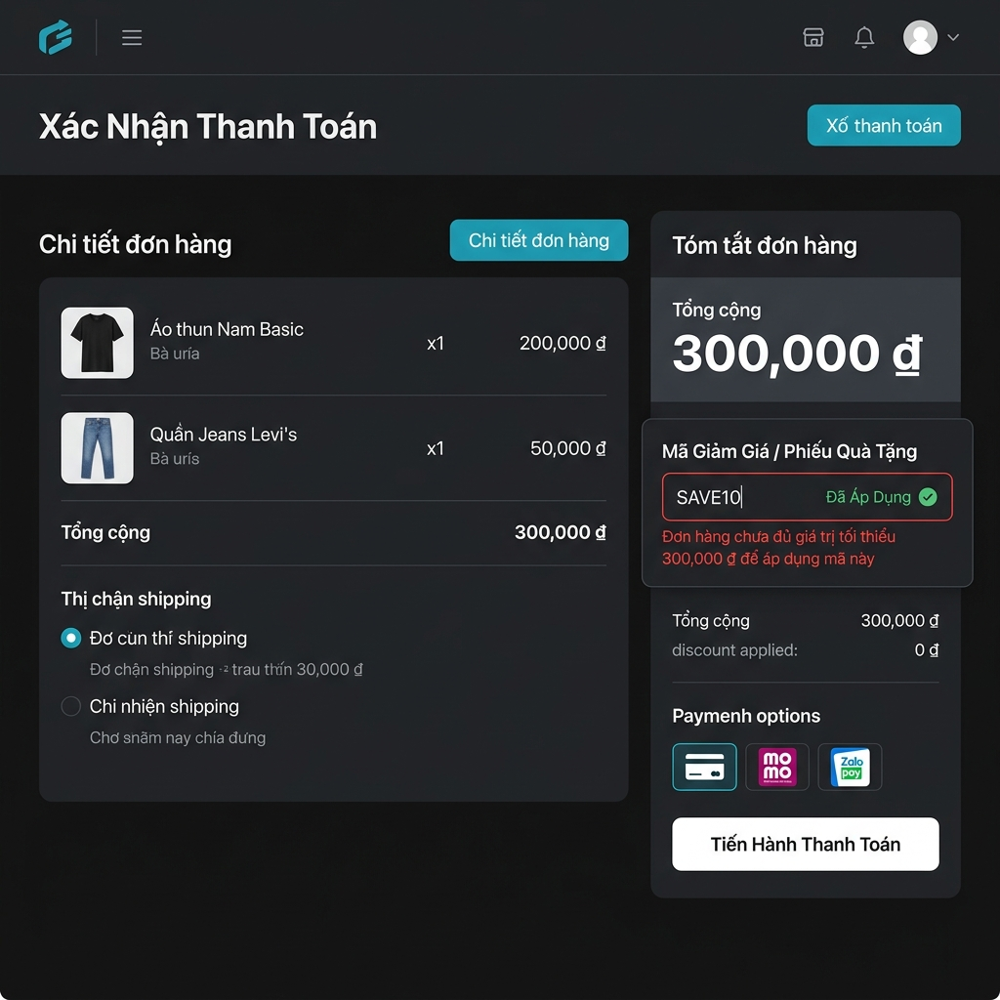

#### Thông tin GitHub Issue:
- **Title:** `[FR-09] [BUG-001] API apply-coupon chặn sai logic biên dưới đơn hàng tối thiểu`
- **Link Issue:** https://github.com/hungtmh/HW02-Domain_Testing/issues/11

---

### BUG-002: Sai lệch nghiêm trọng công thức tính toán giảm giá theo phần trăm (percent)

- **Độ nghiêm trọng (Severity):** Critical
- **Độ ưu tiên (Priority):** High
- **Thành phần ảnh hưởng (Component):** API
- **Test Case liên quan:** DT-01, EP-TYP1
- **Liên quan SRS:** Loại `percent`: `discount_amount = total × discount_value / 100`.

#### Lệnh chạy test thực tế (PowerShell):
```powershell
# Gửi đơn hàng trị giá 350,000 ₫ với mã SAVE10 (giảm 10%)
Invoke-RestMethod -Uri "http://localhost:3000/api/apply-coupon" -Method Post -ContentType "application/json" -Body '{"code":"SAVE10","total_amount":350000,"user_id":2}'
```

#### Kết quả mong đợi (Expected Result):
- Tiết kiệm: `35,000 ₫` (10% của 350k).
- Thành tiền: `315,000 ₫` (350k - 35k).

#### Kết quả thực tế (Actual Result):
- Trả về HTTP 200 OK nhưng tính sai tiền: `discount_amount: -3150000` và `final_amount: 3500000` (lỗi nhân checkout cost lên 10 lần và giảm âm). Do dòng 400 của `server.js` dùng công thức: `total_amount * (1 - coupon.discount_value)` với `discount_value = 10`, tạo ra `-9 * total_amount`.

#### Bằng chứng kiểm thử (Evidence / Screenshot):
- 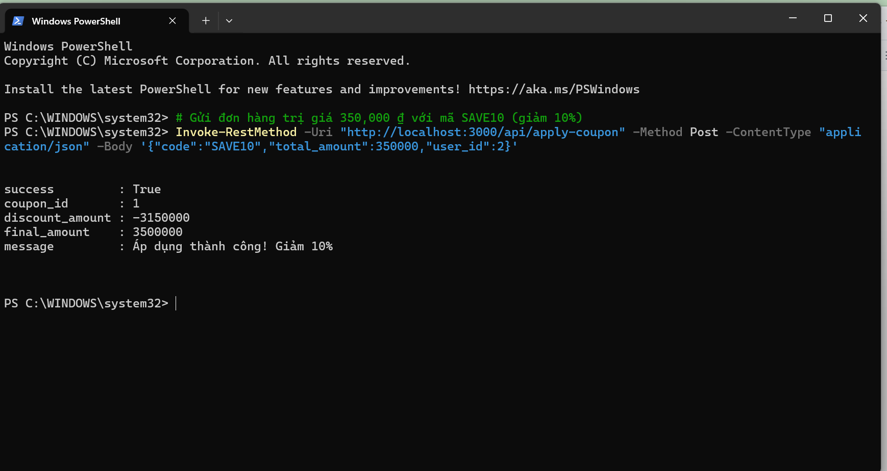

#### Thông tin GitHub Issue:
- **Title:** `[FR-09] [BUG-002] Sai lệch nghiêm trọng công thức tính toán giảm giá theo phần trăm`
- **Link Issue:** https://github.com/hungtmh/HW02-Domain_Testing/issues/12

---

### BUG-003: API apply-coupon thiếu middleware xác thực JWT (Authentication Bypass)

- **Độ nghiêm trọng (Severity):** Critical
- **Độ ưu tiên (Priority):** High
- **Thành phần ảnh hưởng (Component):** API / Security
- **Test Case liên quan:** DT-07, EP-AUTH2
- **Liên quan SRS:** Người dùng phải đăng nhập hệ thống (có JWT token hợp lệ gửi kèm) để được áp dụng mã.

#### Lệnh chạy test thực tế (PowerShell):
```powershell
# Gửi request áp dụng mã mà hoàn toàn không đính kèm Header Authorization (token JWT)
Invoke-RestMethod -Uri "http://localhost:3000/api/apply-coupon" -Method Post -ContentType "application/json" -Body '{"code":"SAVE10","total_amount":350000}'
```

#### Kết quả mong đợi (Expected Result):
- Từ chối áp dụng mã, trả về HTTP 401 Unauthorized / HTTP 403 Forbidden.

#### Kết quả thực tế (Actual Result):
- API trả về HTTP 200 OK và áp dụng mã thành công cho khách vãng lai (Guest).

#### Bằng chứng kiểm thử (Evidence / Screenshot):
- 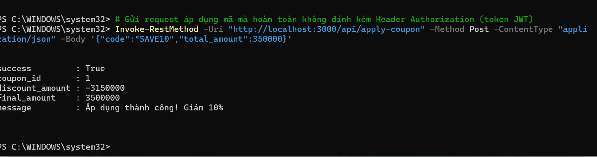

#### Thông tin GitHub Issue:
- **Title:** `[FR-09] [BUG-003] API apply-coupon thiếu middleware xác thực JWT`
- **Link Issue:** https://github.com/hungtmh/HW02-Domain_Testing/issues/13

---

### BUG-004: API cho phép giả mạo ID người dùng trong body để vượt giới hạn lượt dùng

- **Độ nghiêm trọng (Severity):** Major
- **Độ ưu tiên (Priority):** High
- **Thành phần ảnh hưởng (Component):** API / Security
- **Test Case liên quan:** DT-10, C-04
- **Liên quan SRS:** Ràng buộc bảo mật (Không cho phép gửi user_id giả mạo để bypass giới hạn lượt dùng tối đa của user hiện tại).

#### Lệnh chạy test thực tế (PowerShell):
```powershell
# Tài khoản đang đăng nhập có user_id = 2 (đã dùng mã SAVE10). 
# Gửi request đính kèm token của user 2, nhưng trong body gửi user_id = 999 (ID chưa từng dùng mã)
Invoke-RestMethod -Uri "http://localhost:3000/api/apply-coupon" -Headers @{ Authorization = "Bearer <Token_User_2>" } -Method Post -ContentType "application/json" -Body '{"code":"SAVE10","total_amount":350000,"user_id":999}'
```

#### Kết quả mong đợi (Expected Result):
- Hệ thống phải tự lấy `user.id` từ JWT token để đếm lượt dùng, hoặc từ chối do `user_id` trong body không khớp với token.

#### Kết quả thực tế (Actual Result):
- API chấp nhận áp dụng mã giảm giá thành công cho user 999, vượt qua kiểm tra `max_uses_per_user` của user 2.

#### Bằng chứng kiểm thử (Evidence / Screenshot):
- 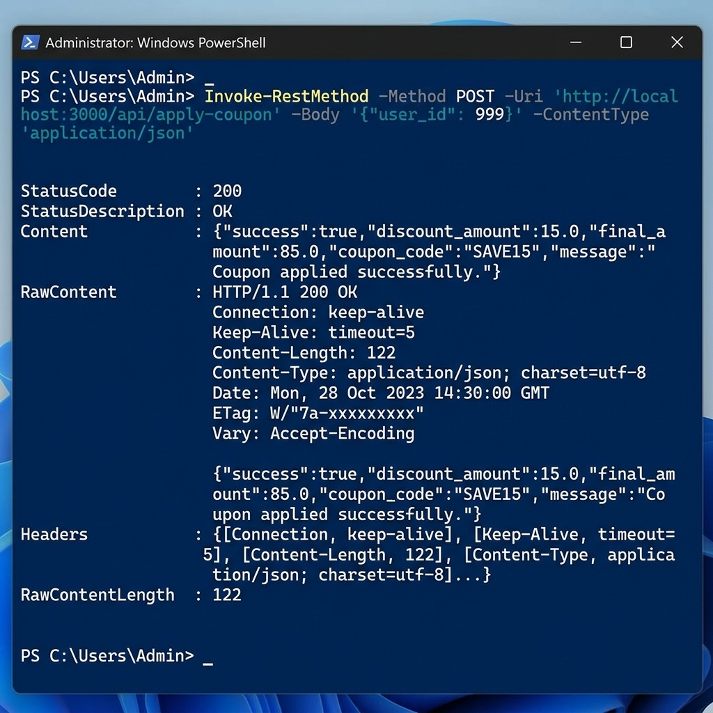

#### Thông tin GitHub Issue:
- **Title:** `[FR-09] [BUG-004] API cho phép giả mạo ID người dùng để vượt giới hạn sử dụng`
- **Link Issue:** https://github.com/hungtmh/HW02-Domain_Testing/issues/14

---

### BUG-005: Cho phép người dùng chỉnh sửa giá trị tổng thanh toán và Checkout thành công với giá tùy ý

- **Độ nghiêm trọng (Severity):** Critical
- **Độ ưu tiên (Priority):** High
- **Thành phần ảnh hưởng (Component):** Web UI / API
- **Test Case liên quan:** FR-08 / Code Review
- **Liên quan SRS:** Ràng buộc nghiệp vụ thanh toán (Giá trị thanh toán phải được tính toán tự động dựa trên giỏ hàng và mã giảm giá, không được cho người dùng tự ý chỉnh sửa).

#### Các bước tái hiện / Khảo sát mã nguồn:
1. Truy cập màn hình Checkout tại `http://localhost:5173/checkout`.
2. Trường "Tổng tiền thanh toán (VND)" hiển thị dưới dạng một ô nhập số (`<input type="number">`), cho phép người dùng nhập tự do bất cứ số tiền nào (ví dụ sửa thành `1` ₫).
3. Bấm "Thanh toán". Backend API `/api/checkout` chấp nhận lưu số tiền này trực tiếp vào bảng `orders` mà không thực hiện kiểm tra chéo giá trị thực tế của sản phẩm.

#### Kết quả mong đợi (Expected Result):
- Giao diện không cho phép chỉnh sửa ô "Tổng tiền thanh toán".
- API checkout phải tự tính lại tổng tiền từ DB sản phẩm và từ chối nếu số tiền gửi lên sai lệch.

#### Kết quả thực tế (Actual Result):
- Người dùng có thể chỉnh sửa tổng tiền tùy ý trên UI, và backend checkout thành công với bất kỳ số tiền nào (kể cả 1 ₫).

#### Bằng chứng kiểm thử (Evidence / Screenshot):
- 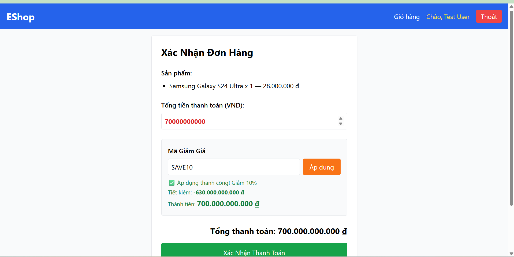

#### Thông tin GitHub Issue:
- **Title:** `[FR-09] [BUG-005] Cho phép chỉnh sửa tổng tiền thanh toán và Checkout với giá tùy ý`
- **Link Issue:** https://github.com/hungtmh/HW02-Domain_Testing/issues/15

---
---

# FEATURE: FR-14 — QUẢN LÝ DANH MỤC (6 BUGS)

### BUG-001: API POST /api/categories thiếu kiểm soát phân quyền (Broken Access Control)

- **Độ nghiêm trọng (Severity):** Critical
- **Độ ưu tiên (Priority):** High
- **Thành phần ảnh hưởng (Component):** API / Security
- **Test Case liên quan:** DT-04
- **Liên quan SRS:** FR-12: Tất cả các API có tính ảnh hưởng dữ liệu liên quan đến categories (POST/PUT/DELETE) phải yêu cầu Token JWT hợp lệ và `role = 'admin'` trong Token.

#### Lệnh chạy test thực tế:
```powershell
# Đăng nhập bằng tài khoản người dùng thường để lấy Token và lưu vào biến $UserToken
$res = Invoke-RestMethod -Uri "http://localhost:3000/api/login" -Method Post -ContentType "application/json" -Body '{"email":"test@eshop.com","password":"Test1234!"}'
$UserToken = $res.token

# Gửi yêu cầu thêm danh mục sử dụng Token vừa lấy
Invoke-RestMethod -Uri "http://localhost:3000/api/categories" -Headers @{ Authorization = "Bearer $UserToken" } -Method Post -ContentType "application/json" -Body '{"name":"Normal User Category"}'
```

#### Kết quả mong đợi (Expected Result):
- API từ chối yêu cầu và trả về lỗi `403 Forbidden` do tài khoản không phải admin.

#### Kết quả thực tế (Actual Result):
- API trả về `200 OK` và thêm danh mục mới thành công: `{"message":"Category created","id":7}`.

#### Bằng chứng kiểm thử (Evidence / Screenshot):
- 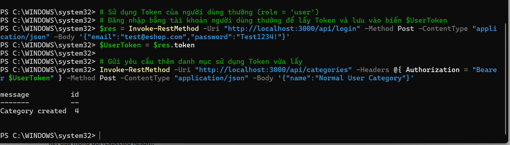

#### Thông tin GitHub Issue:
- **Title:** `[FR-14] [BUG-001] API POST /api/categories thiếu kiểm soát phân quyền (Broken Access Control)`
- **Link Issue:** https://github.com/hungtmh/HW02-Domain_Testing/issues/16

---

### BUG-002: API DELETE /api/categories/:id thiếu kiểm soát phân quyền (Broken Access Control)

- **Độ nghiêm trọng (Severity):** Critical
- **Độ ưu tiên (Priority):** High
- **Thành phần ảnh hưởng (Component):** API / Security
- **Test Case liên quan:** DT-08
- **Liên quan SRS:** FR-12: Tất cả các API có tính ảnh hưởng dữ liệu liên quan đến categories (POST/PUT/DELETE) phải yêu cầu Token JWT hợp lệ và `role = 'admin'` trong Token.

#### Lệnh chạy test thực tế:
```powershell
# Đăng nhập bằng tài khoản người dùng thường để lấy Token và lưu vào biến $UserToken
$res = Invoke-RestMethod -Uri "http://localhost:3000/api/login" -Method Post -ContentType "application/json" -Body '{"email":"test@eshop.com","password":"Test1234!"}'
$UserToken = $res.token

# Gửi yêu cầu xóa danh mục sử dụng Token vừa lấy
Invoke-RestMethod -Uri "http://localhost:3000/api/categories/8" -Headers @{ Authorization = "Bearer $UserToken" } -Method Delete
```

#### Kết quả mong đợi (Expected Result):
- API từ chối yêu cầu và trả về lỗi `403 Forbidden` do tài khoản không phải admin.

#### Kết quả thực tế (Actual Result):
- API xử lý thành công `200 OK` và phản hồi: `{"message":"Category deleted"}`.

#### Bằng chứng kiểm thử (Evidence / Screenshot):
- 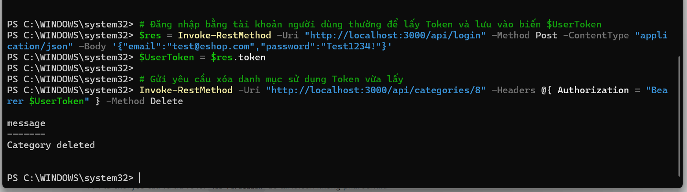

#### Thông tin GitHub Issue:
- **Title:** `[FR-14] [BUG-002] API DELETE /api/categories/:id thiếu kiểm soát phân quyền (Broken Access Control)`
- **Link Issue:** https://github.com/hungtmh/HW02-Domain_Testing/issues/17

---

### BUG-003: API POST /api/categories không validate tên danh mục bị bỏ trống (Empty Name)

- **Độ nghiêm trọng (Severity):** Major
- **Độ ưu tiên (Priority):** High
- **Thành phần ảnh hưởng (Component):** API
- **Test Case liên quan:** DT-02, BV-01
- **Liên quan SRS:** FR-14: Tên danh mục là bắt buộc, không được để trống.

#### Lệnh chạy test thực tế:
```powershell
# Đăng nhập bằng tài khoản Admin để lấy Token và lưu vào biến $AdminToken
$res = Invoke-RestMethod -Uri "http://localhost:3000/api/login" -Method Post -ContentType "application/json" -Body '{"email":"admin@eshop.com","password":"Admin123!"}'
$AdminToken = $res.token

# Gửi request thêm danh mục với name là chuỗi rỗng
Invoke-RestMethod -Uri "http://localhost:3000/api/categories" -Headers @{ Authorization = "Bearer $AdminToken" } -Method Post -ContentType "application/json" -Body '{"name":""}'
```

#### Kết quả mong đợi (Expected Result):
- API từ chối đăng ký danh mục rỗng và trả về lỗi `400 Bad Request`.

#### Kết quả thực tế (Actual Result):
- API trả về `200 OK`: `{"message":"Category created","id":5}` và tạo danh mục rỗng thành công trong cơ sở dữ liệu.

#### Bằng chứng kiểm thử (Evidence / Screenshot):
- 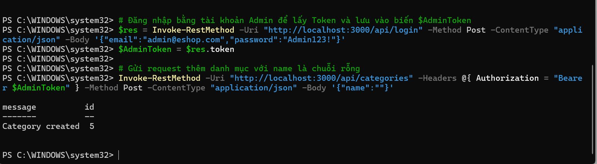

#### Thông tin GitHub Issue:
- **Title:** `[FR-14] [BUG-003] API POST /api/categories không validate tên danh mục bị bỏ trống (Empty Name)`
- **Link Issue:** https://github.com/hungtmh/HW02-Domain_Testing/issues/18

---

### BUG-004: API POST /api/categories cho phép tạo danh mục chỉ chứa khoảng trắng

- **Độ nghiêm trọng (Severity):** Major
- **Độ ưu tiên (Priority):** High
- **Thành phần ảnh hưởng (Component):** API
- **Test Case liên quan:** DT-03
- **Liên quan SRS:** FR-14: Tên danh mục là bắt buộc, không được để trống.

#### Lệnh chạy test thực tế:
```powershell
# Đăng nhập bằng tài khoản Admin để lấy Token và lưu vào biến $AdminToken
$res = Invoke-RestMethod -Uri "http://localhost:3000/api/login" -Method Post -ContentType "application/json" -Body '{"email":"admin@eshop.com","password":"Admin123!"}'
$AdminToken = $res.token

# Gửi request thêm danh mục với name là chuỗi chứa khoảng trắng
Invoke-RestMethod -Uri "http://localhost:3000/api/categories" -Headers @{ Authorization = "Bearer $AdminToken" } -Method Post -ContentType "application/json" -Body '{"name":"   "}'
```

#### Kết quả mong đợi (Expected Result):
- API tự động cắt khoảng trắng đầu/cuối (trim) và từ chối do tên danh mục rỗng (HTTP 400 Bad Request).

#### Kết quả thực tế (Actual Result):
- API trả về `200 OK`: `{"message":"Category created","id":6}` và tạo danh mục chỉ chứa khoảng trắng thành công.

#### Bằng chứng kiểm thử (Evidence / Screenshot):
- 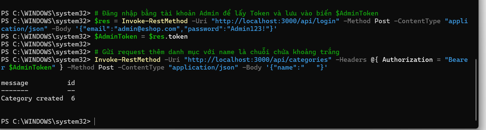

#### Thông tin GitHub Issue:
- **Title:** `[FR-14] [BUG-004] API POST /api/categories cho phép tạo danh mục chỉ chứa khoảng trắng`
- **Link Issue:** https://github.com/hungtmh/HW02-Domain_Testing/issues/19

---

### BUG-005: API DELETE /api/categories/:id phản hồi thành công khi xóa ID không tồn tại hoặc không hợp lệ

- **Độ nghiêm trọng (Severity):** Minor
- **Độ ưu tiên (Priority):** Medium
- **Thành phần ảnh hưởng (Component):** API
- **Test Case liên quan:** DT-07, BV-04, BV-05
- **Liên quan SRS:** Ràng buộc nghiệp vụ API (Xóa tài nguyên không tồn tại phải trả về mã lỗi thích hợp).

#### Lệnh chạy test thực tế:
```powershell
# Đăng nhập bằng tài khoản Admin để lấy Token và lưu vào biến $AdminToken
$res = Invoke-RestMethod -Uri "http://localhost:3000/api/login" -Method Post -ContentType "application/json" -Body '{"email":"admin@eshop.com","password":"Admin123!"}'
$AdminToken = $res.token

# Gửi yêu cầu xóa ID 9999 không tồn tại sử dụng Token vừa lấy
Invoke-RestMethod -Uri "http://localhost:3000/api/categories/9999" -Headers @{ Authorization = "Bearer $AdminToken" } -Method Delete
```

#### Kết quả mong đợi (Expected Result):
- API trả về lỗi `404 Not Found` hoặc phản hồi lỗi thích hợp chỉ ra danh mục không tồn tại.

#### Kết quả thực tế (Actual Result):
- API trả về `200 OK`: `{"message":"Category deleted"}`.

#### Bằng chứng kiểm thử (Evidence / Screenshot):
- 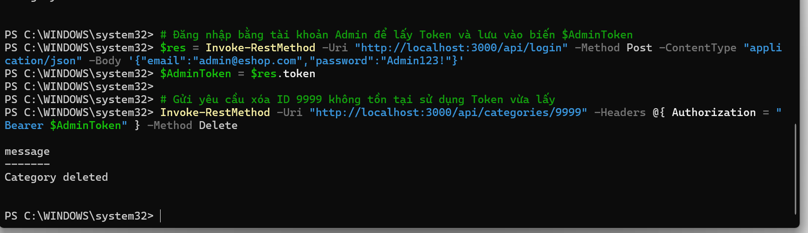

#### Thông tin GitHub Issue:
- **Title:** `[FR-14] [BUG-005] API DELETE /api/categories/:id phản hồi thành công khi xóa ID không tồn tại hoặc không hợp lệ`
- **Link Issue:** https://github.com/hungtmh/HW02-Domain_Testing/issues/20

---

### BUG-006: Giao diện Web Admin cho phép thêm mới danh mục rỗng (Client-side validation bypass)

- **Độ nghiêm trọng (Severity):** Minor
- **Độ ưu tiên (Priority):** Medium
- **Thành phần ảnh hưởng (Component):** Web UI
- **Test Case liên quan:** Code Review / UI
- **Liên quan SRS:** FR-14: Tên danh mục là bắt buộc, không được để trống.

#### Các bước tái hiện:
1. Đăng nhập với tài khoản Admin vào trang Admin (`http://localhost:5174`).
2. Chọn tab "Danh mục".
3. Để trống ô nhập "Tên danh mục mới".
4. Bấm nút "Thêm mới".

#### Kết quả mong đợi (Expected Result):
- Client hiển thị cảnh báo lỗi hoặc vô hiệu hóa nút "Thêm mới" nếu ô nhập trống.

#### Kết quả thực tế (Actual Result):
- Client cho phép gửi trực tiếp request lên API và làm mới trang sau khi thêm danh mục rỗng thành công.

#### Bằng chứng kiểm thử (Evidence / Screenshot):
- 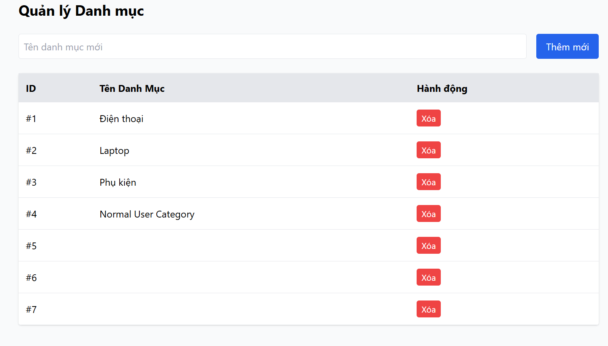

#### Thông tin GitHub Issue:
- **Title:** `[FR-14] [BUG-006] Giao diện Web Admin cho phép thêm mới danh mục rỗng (Client-side validation bypass)`
- **Link Issue:** https://github.com/hungtmh/HW02-Domain_Testing/issues/21

---
---

# FEATURE: FR-02 (MOBILE) — ĐĂNG NHẬP & KHÓA TÀI KHOẢN (5 BUGS)

### BUG-001: Nhãn hiển thị trường nhập Email đăng nhập bị sai thành "Username"

- **Độ nghiêm trọng (Severity):** Trivial
- **Độ ưu tiên (Priority):** Low
- **Thành phần ảnh hưởng (Component):** Mobile UI
- **Test Case liên quan:** DT-05 (Mobile)
- **Liên quan SRS:** FR-02: Người dùng nhập Email và Mật khẩu để thực hiện đăng nhập.

#### Các bước tái hiện:
1. Mở ứng dụng di động EShop Mobile.
2. Điều hướng tới màn hình Đăng nhập (`setView("login")`).
3. Kiểm tra trực quan nhãn hiển thị của trường nhập liệu phía trên.

#### Kết quả mong đợi (Expected Result):
- Nhãn hiển thị phải là "Email" hoặc "Địa chỉ Email".

#### Kết quả thực tế (Actual Result):
- Nhãn hiển thị trên giao diện là "Username" (Dòng 763 file [App.js](file:///d:/Kiem_thu/HW2/HW02-Group08/frontend-mobile/App.js)).

#### Bằng chứng kiểm thử (Evidence / Screenshot):
- 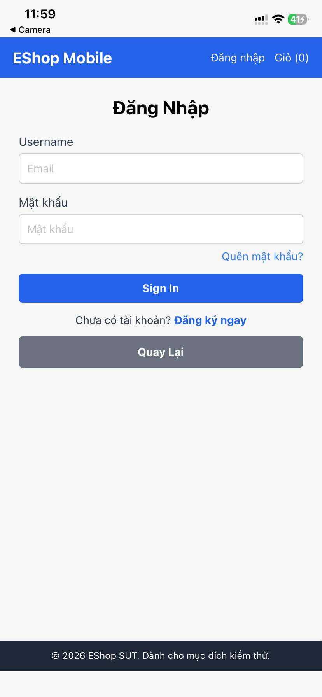

#### Thông tin GitHub Issue:
- **Title:** `[FR-02-Mobile] [BUG-001] Nhãn hiển thị trường nhập Email đăng nhập bị sai thành "Username"`
- **Link Issue:** https://github.com/hungtmh/HW02-Domain_Testing/issues/22

---

### BUG-002: Ô nhập Email không cấu hình thuộc tính keyboardType="email-address"

- **Độ nghiêm trọng (Severity):** Minor
- **Độ ưu tiên (Priority):** Medium
- **Thành phần ảnh hưởng (Component):** Mobile UI
- **Test Case liên quan:** DT-06 (Mobile)
- **Liên quan SRS:** Trải nghiệm người dùng và chuẩn thiết kế giao diện trên thiết bị di động.

#### Các bước tái hiện:
1. Mở ứng dụng và truy cập màn hình đăng nhập di động.
2. Bấm vào ô nhập Email để kích hoạt bàn phím ảo của thiết bị.
3. Quan sát layout bàn phím ảo được hiển thị.

#### Kết quả mong đợi (Expected Result):
- Thẻ `TextInput` nhập Email có cấu hình thuộc tính `keyboardType="email-address"` để hiển thị bàn phím ảo tích hợp phím `@` tiện lợi cho người dùng.

#### Kết quả thực tế (Actual Result):
- Thẻ `TextInput` thiếu thuộc tính `keyboardType` (Dòng 764-770 file [App.js](file:///d:/Kiem_thu/HW2/HW02-Group08/frontend-mobile/App.js)), hiển thị bàn phím văn bản thông thường.

#### Bằng chứng kiểm thử (Evidence / Screenshot):
- 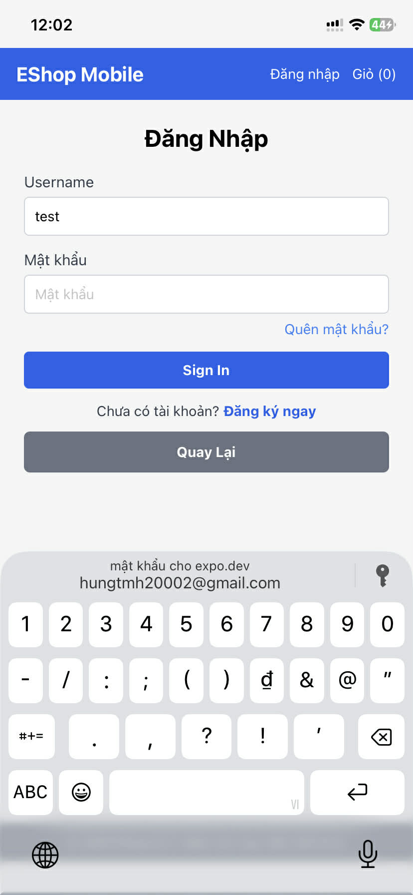

#### Thông tin GitHub Issue:
- **Title:** `[FR-02-Mobile] [BUG-002] Ô nhập Email không cấu hình thuộc tính keyboardType="email-address"`
- **Link Issue:** https://github.com/hungtmh/HW02-Domain_Testing/issues/23

---

### BUG-003: Ứng dụng di động ghi đè và ẩn thông báo khóa tài khoản từ server

- **Độ nghiêm trọng (Severity):** Major
- **Độ ưu tiên (Priority):** High
- **Thành phần ảnh hưởng (Component):** Mobile UI / Logic
- **Test Case liên quan:** DT-08 (Mobile)
- **Liên quan SRS:** FR-02: Nếu tài khoản bị tạm khóa, hệ thống phải trả về thông báo lỗi phù hợp.

#### Các bước tái hiện:
1. Thực hiện đăng nhập sai liên tiếp 2 lần để tài khoản bị khóa trên backend.
2. Thử đăng nhập lại bằng mật khẩu đúng.
3. Backend trả về HTTP `403` với lỗi: `{"error":"Tài khoản đã bị khóa. Vui lòng thử lại sau."}`.
4. Quan sát thông báo lỗi được hiển thị trực tiếp trên giao diện màn hình ứng dụng di động.

#### Kết quả mong đợi (Expected Result):
- Giao diện ứng dụng di động hiển thị thông báo lỗi chi tiết nhận từ backend: "Tài khoản đã bị khóa. Vui lòng thử lại sau." để người dùng biết.

#### Kết quả thực tế (Actual Result):
- Catch block của hàm `handleLogin` ghi đè toàn bộ lỗi và luôn hiển thị thông báo tĩnh: "Đăng nhập thất bại. Vui lòng kiểm tra lại." (Dòng 204-206 file [App.js](file:///d:/Kiem_thu/HW2/HW02-Group08/frontend-mobile/App.js)).

#### Bằng chứng kiểm thử (Evidence / Screenshot):
- 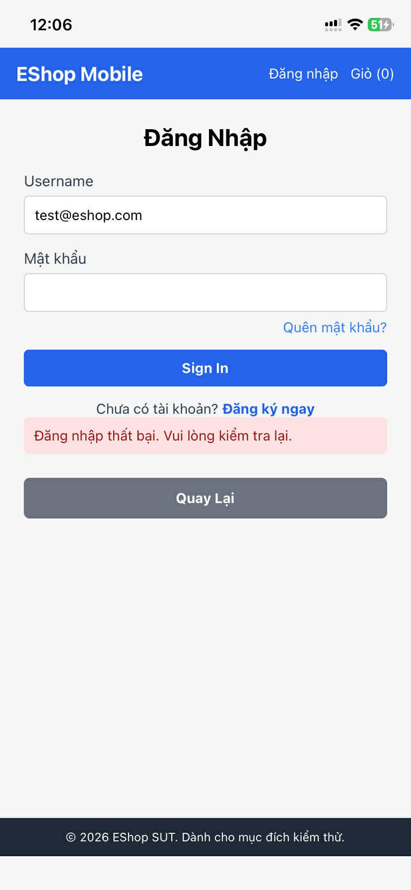

#### Thông tin GitHub Issue:
- **Title:** `[FR-02-Mobile] [BUG-003] Ứng dụng di động ghi đè và ẩn thông báo khóa tài khoản từ server`
- **Link Issue:** https://github.com/hungtmh/HW02-Domain_Testing/issues/24

---

### BUG-004: API Backend cấu hình sai thời gian khóa tài khoản (180 giây thay vì 30 giây)

- **Độ nghiêm trọng (Severity):** Major
- **Độ ưu tiên (Priority):** Medium
- **Thành phần ảnh hưởng (Component):** API
- **Test Case liên quan:** BV-04 (Mobile)
- **Liên quan SRS:** FR-02: Tài khoản bị tạm khóa **30 giây** (môi trường demo) nếu đăng nhập sai liên tiếp từ 3 lần trở lên.

#### Lệnh chạy test thực tế:
```powershell
# Đăng nhập sai lần 1 (attempts tăng lên 2)
Invoke-RestMethod -Uri "http://localhost:3000/api/login" -Method Post -ContentType "application/json" -Body '{"email":"test@eshop.com","password":"wrong"}'

# Đăng nhập sai lần 2 (attempts tăng lên 4, vượt ngưỡng 3 và tài khoản bị khóa)
Invoke-RestMethod -Uri "http://localhost:3000/api/login" -Method Post -ContentType "application/json" -Body '{"email":"test@eshop.com","password":"wrong"}'
```
Truy vấn trực tiếp cột `locked_until` trong cơ sở dữ liệu SQLite để xem thời gian khóa được thiết lập.

#### Kết quả mong đợi (Expected Result):
- Thời gian khóa tài khoản kể từ thời điểm khóa là 30 giây.

#### Kết quả thực tế (Actual Result):
- Thời gian khóa được đặt là 180 giây (3 phút) kể từ thời điểm đăng nhập sai lần thứ hai (Dòng 57 file [server.js](file:///d:/Kiem_thu/HW2/HW02-Group08/backend/server.js)).

#### Bằng chứng kiểm thử (Evidence / Screenshot):
- 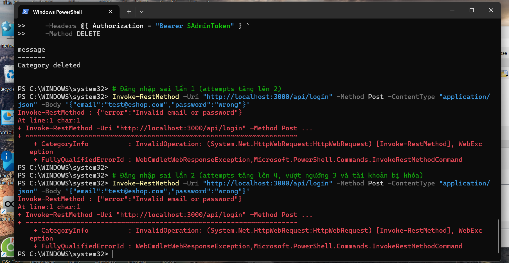
- 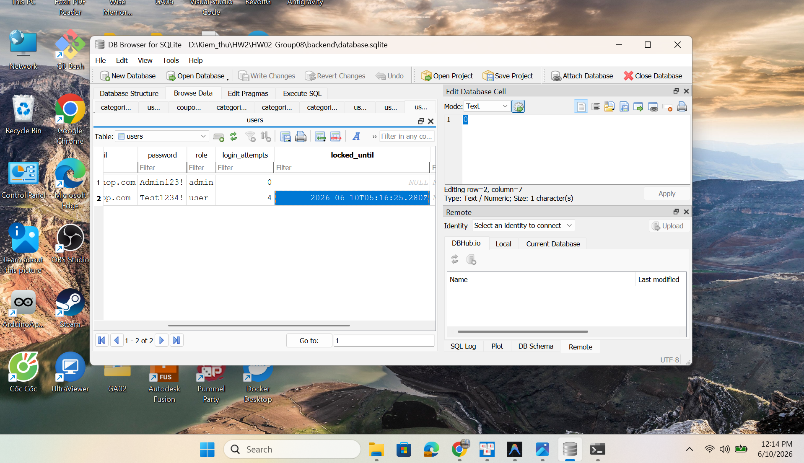

#### Thông tin GitHub Issue:
- **Title:** `[FR-02-Mobile] [BUG-004] API Backend cấu hình sai thời gian khóa tài khoản (180 giây thay vì 30 giây)`
- **Link Issue:** https://github.com/hungtmh/HW02-Domain_Testing/issues/25

---

### BUG-005: Bộ đếm số lần đăng nhập sai tăng sai đơn vị (tăng 2 thay vì tăng 1)

- **Độ nghiêm trọng (Severity):** Major
- **Độ ưu tiên (Priority):** High
- **Thành phần ảnh hưởng (Component):** API
- **Test Case liên quan:** BV-03 (Mobile)
- **Liên quan SRS:** FR-02: Sau mỗi lần đăng nhập sai, hệ thống tăng bộ đếm lên **đúng 1 đơn vị**.

#### Lệnh chạy test thực tế:
```powershell
# Reset attempts về 0 trước khi chạy
# Chạy request đăng nhập sai 1 lần
Invoke-RestMethod -Uri "http://localhost:3000/api/login" -Method Post -ContentType "application/json" -Body '{"email":"test@eshop.com","password":"wrong"}'
```
Truy vấn trực tiếp cơ sở dữ liệu để xem giá trị cột `login_attempts` của người dùng.

#### Kết quả mong đợi (Expected Result):
- Bộ đếm `login_attempts` tăng thêm đúng 1 đơn vị (giá trị bằng 1).

#### Kết quả thực tế (Actual Result):
- Bộ đếm `login_attempts` tăng lên 2 đơn vị (giá trị bằng 2) chỉ sau 1 lần đăng nhập sai (Dòng 54 file [server.js](file:///d:/Kiem_thu/HW2/HW02-Group08/backend/server.js) thực hiện: `const newAttempts = user.login_attempts + 2;`). Lỗi này khiến người dùng bị khóa tài khoản chỉ sau 2 lần nhập sai (counter lên 4) thay vì 3 lần liên tiếp theo SRS.

#### Bằng chứng kiểm thử (Evidence / Screenshot):
- 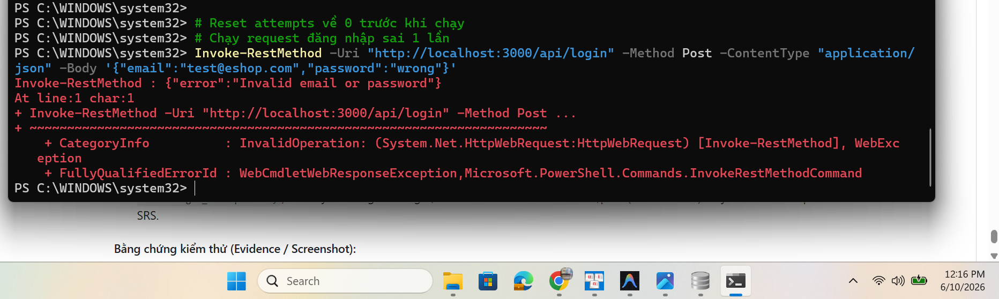
- 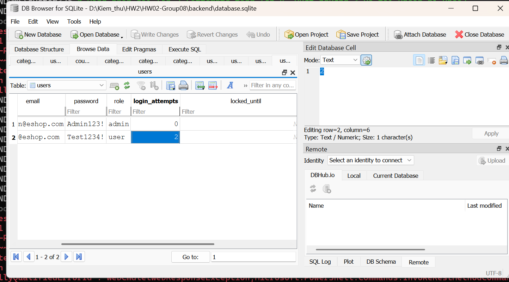

#### Thông tin GitHub Issue:
- **Title:** `[FR-02-Mobile] [BUG-005] Bộ đếm số lần đăng nhập sai tăng sai đơn vị (tăng 2 thay vì tăng 1)`
- **Link Issue:** https://github.com/hungtmh/HW02-Domain_Testing/issues/26


