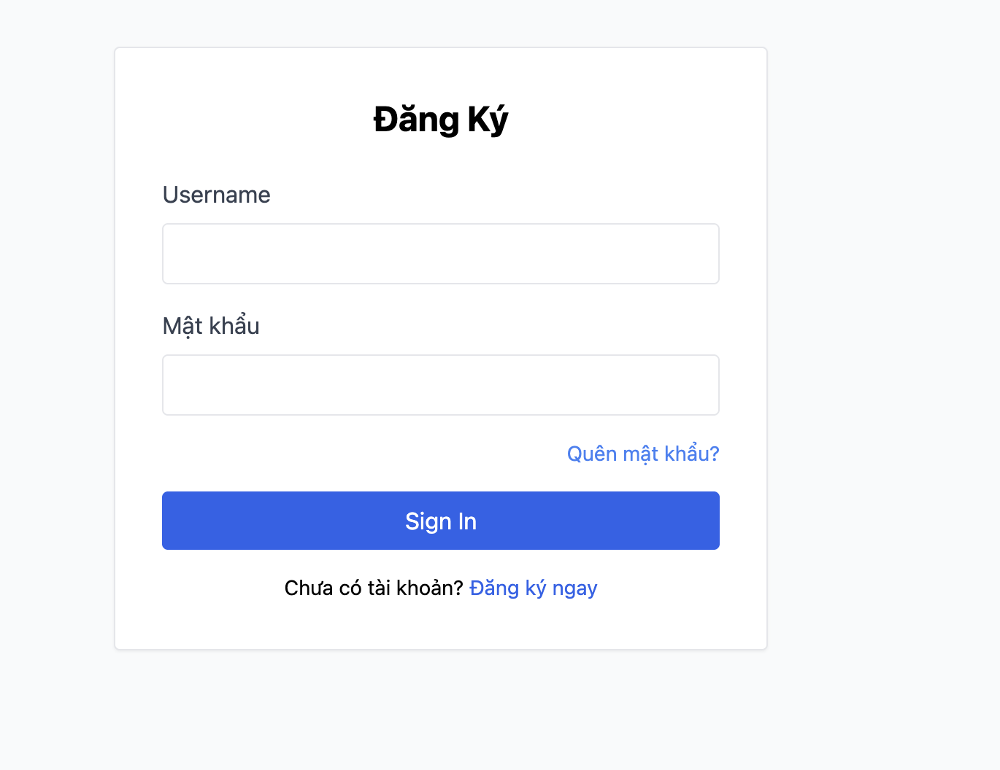
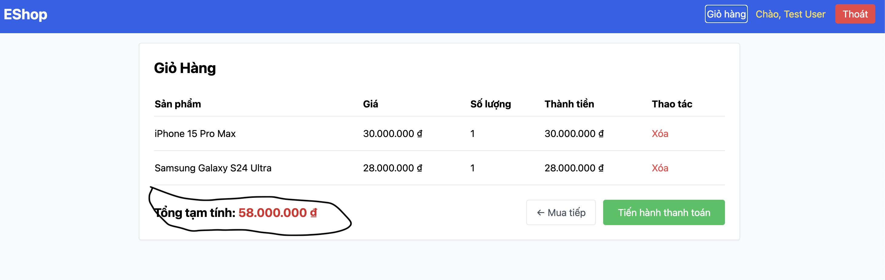
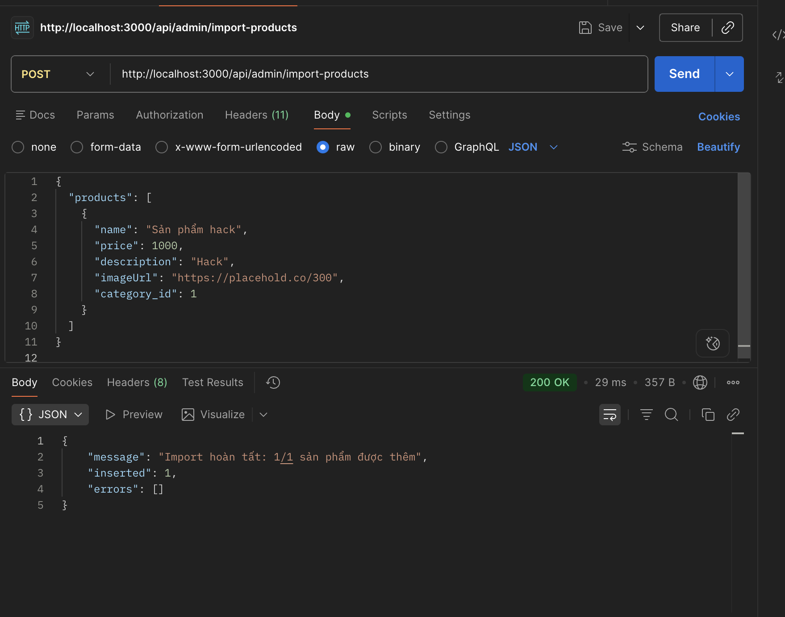
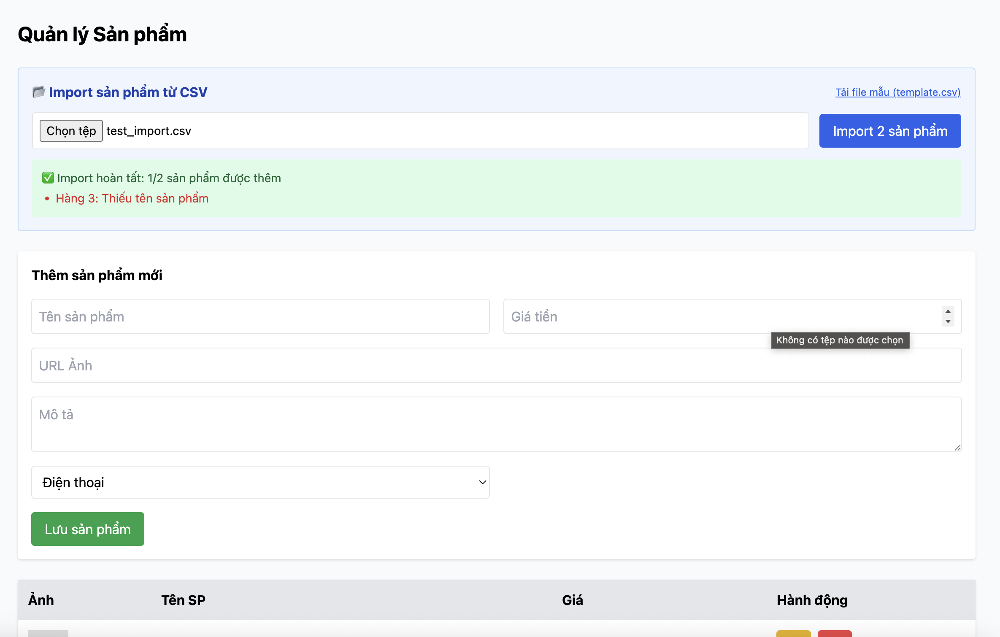
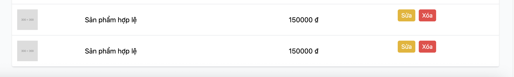
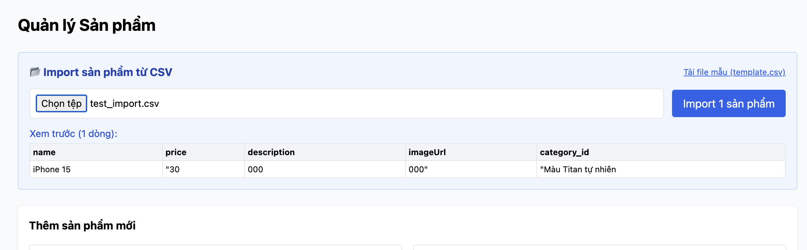
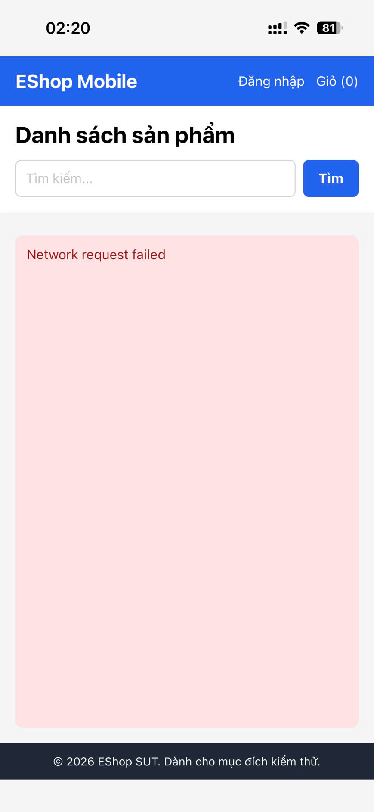
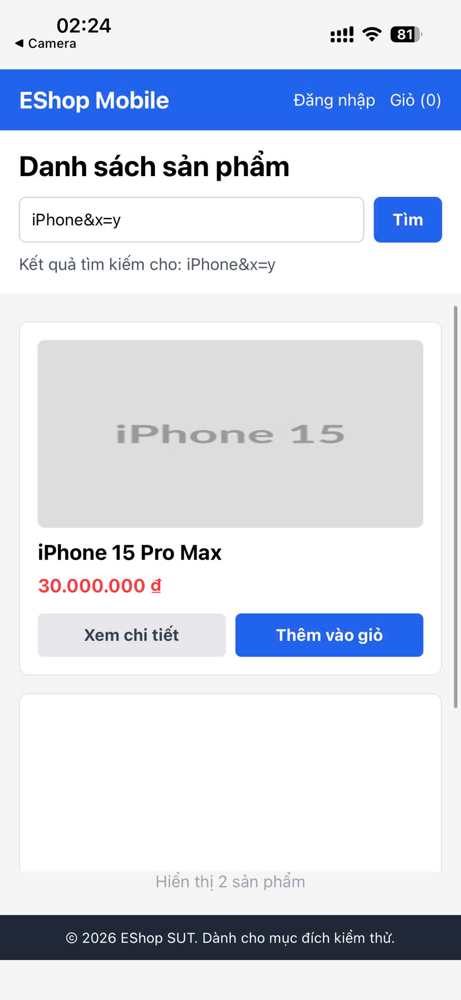
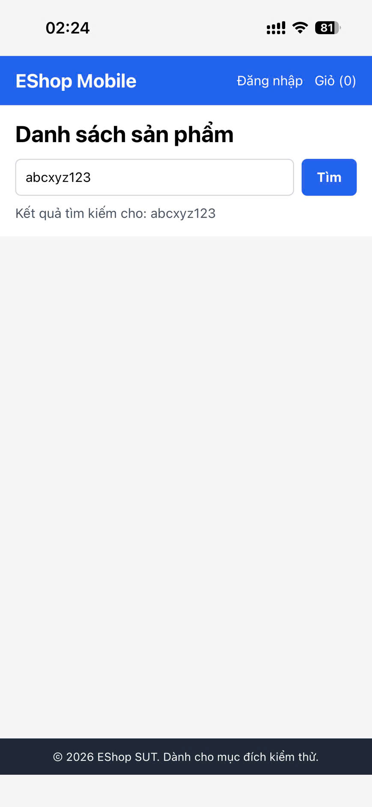
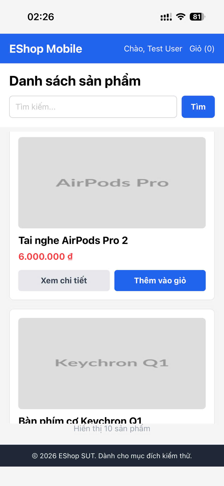

# Consolidated Bug Report - EShop Testing

**Họ và tên:** Nguyễn Tấn Thắng  
**Nhóm:** Nhóm 08  
**MSSV:** 23127259  
**Ngày cập nhật:** 2026-07-06  
**SUT:** Web Client + Web Admin + Mobile App + API Backend

**Evidence run:** 2026-07-05 20:13 ICT, test data prefix `live_hw02_1783257224503`. Ảnh/video bug trong các thư mục evidence là minh chứng từ thao tác UI/API trực tiếp trên EShop SUT. Riêng FR-07 BUG-003 dùng video `.mov`; PDF dùng ảnh preview để hiển thị ổn định.

---

# Bug Report - FR-02 Login and Account Lockout

## BUG-FR02-001: Failed login counter increases by 2 instead of 1

- **Severity:** Major
- **Priority:** High
- **Component:** API Backend
- **Related test cases:** FR02-TC04, FR02-TC05, FR02-TC06

**Expected:** After one wrong password, `login_attempts = 1`; after two wrong passwords, `login_attempts = 2` and the account is not locked yet.

**Actual:** After one wrong password, `login_attempts = 2`; after two wrong passwords, `login_attempts = 4` and `locked_until` is created.

**Evidence:**

---

## BUG-FR02-002: Account lockout duration is 180 seconds instead of 30 seconds

- **Severity:** Medium
- **Priority:** Medium
- **Component:** API Backend
- **Related test cases:** FR02-TC07

**Expected:** Account is locked for about 30 seconds.

**Actual:** Account is locked for about 180 seconds because backend uses `Date.now() + 180000`.

**Evidence:**

---

## BUG-FR02-003: Login email field does not use `type="email"`

- **Severity:** Minor
- **Priority:** Medium
- **Component:** Frontend Web Login
- **Related test cases:** FR02-TC03

**Expected:** Login email field uses HTML5 `type="email"`.

**Actual:** Login form uses label `Username` and input `type="text"`.

**Evidence:**

---

# Bug Report - FR-07 Shopping Cart

## BUG-FR07-001: Adding same product creates duplicate rows

- **Severity:** Major
- **Priority:** High
- **Component:** Cart API / Frontend Cart Context
- **Related test cases:** FR07-TC03

**Expected:** Adding the same product twice produces one row with `quantity = 2`.

**Actual:** Cart creates duplicate rows for the same product.

**Evidence:**

---

## BUG-FR07-002: Cart quantity has no `+/-` controls

- **Severity:** Major
- **Priority:** High
- **Component:** Frontend Web Cart
- **Related test cases:** FR07-TC04

**Expected:** Quantity column has `+` and `-` controls.

**Actual:** Quantity is shown as plain text.

**Evidence:**

---

## BUG-FR07-003: Delete cart item does not show confirmation dialog

- **Severity:** Medium
- **Priority:** Medium
- **Component:** Frontend Web Cart
- **Related test cases:** FR07-TC05

**Expected:** Clicking `Xóa` shows a confirmation dialog before removing the item.

**Actual:** The item is removed immediately without a confirm dialog.

**Video Evidence:**

<video controls src="./FR-07_bugs/BUG-003.mov" width="720"></video>

[Open video evidence: BUG-003.mov](./FR-07_bugs/BUG-003.mov)

**PDF Preview:**

---

## BUG-FR07-004: Cart total label is wrong

- **Severity:** Medium
- **Priority:** Medium
- **Component:** Frontend Web Cart
- **Related test cases:** FR07-TC07

**Expected:** Total label is `Tổng cộng`.

**Actual:** UI shows `Tổng tạm tính`.

**Evidence:**

---

## BUG-FR07-005: Empty cart has no illustration

- **Severity:** Minor
- **Priority:** Low
- **Component:** Frontend Web Cart
- **Related test cases:** FR07-TC01

**Expected:** Empty cart has an illustration/icon and a clear message.

**Actual:** Empty cart only shows text and a continue shopping link.

**Evidence:**

---

# Bug Report - FR-16 Product Import from CSV

## BUG-FR16-001: Normal user can call admin product import API

- **Severity:** Critical
- **Priority:** High
- **Component:** API Backend / Access Control
- **Related test cases:** FR16-TC04

**Expected:** Normal user token is rejected with HTTP 403 and no product is inserted.

**Actual:** Normal user token receives HTTP 200 and the product is inserted.

**Evidence:**

---

## BUG-FR16-002: Product import is not atomic when a row is invalid

- **Severity:** Major
- **Priority:** High
- **Component:** API Backend / Database
- **Related test cases:** FR16-TC05

**Expected:** If any row is invalid, the whole import is rejected and rolled back.

**Actual:** API reports `inserted = 1/2`; the valid row is still inserted even though another row has an error.

**Evidence:**

---

## BUG-FR16-003: Product import accepts negative price

- **Severity:** Major
- **Priority:** High
- **Component:** API Backend Validation
- **Related test cases:** FR16-TC06

**Expected:** Product with `price <= 0` is rejected.

**Actual:** Product with negative price is inserted.

**Evidence:**

---

## BUG-FR16-004: CSV parser does not support quoted commas

- **Severity:** Medium
- **Priority:** Medium
- **Component:** Web Admin CSV Import
- **Related test cases:** FR16-TC07

**Expected:** CSV fields wrapped in double quotes can contain commas.

**Actual:** Admin parser uses `line.split(",")`, so quoted commas break the column mapping.

**Evidence:**

---

# Bug Report - Mobile Product Listing/Search

## BUG-MOB-001: Mobile API URL is hard-coded

- **Severity:** Medium
- **Priority:** Medium
- **Component:** Mobile App Config
- **Related test cases:** MOB-TC05

**Expected:** API URL is configurable by environment/device.

**Actual:** `API_URL` is hard-coded to a LAN IP, making product listing/search fail on other devices or emulators.

**Evidence:**

---

## BUG-MOB-002: Search query is not URL-encoded

- **Severity:** Major
- **Priority:** High
- **Component:** Mobile Product Search
- **Related test cases:** MOB-TC04

**Expected:** Search keyword with special characters is URL-encoded.

**Actual:** Search query is concatenated directly into the URL.

**Evidence:**

---

## BUG-MOB-003: Product search has no empty state

- **Severity:** Medium
- **Priority:** Medium
- **Component:** Mobile Product Listing
- **Related test cases:** MOB-TC03

**Expected:** No-result search shows a clear empty state message.

**Actual:** Empty result does not show a proper empty state.

**Evidence:**

---

## BUG-MOB-004: Product images use `resizeMode="stretch"`

- **Severity:** Minor
- **Priority:** Low
- **Component:** Mobile Product Listing / Detail
- **Related test cases:** MOB-TC07

**Expected:** Product images preserve their aspect ratio.

**Actual:** Product images are stretched and can appear distorted.

**Evidence:**

---

## GitHub Issues

Các issue thật trên GitHub chưa được tạo riêng cho từng bug tại thời điểm đóng gói, nên report giữ trạng thái `TBD` khi cần đối chiếu issue URL. Evidence chính thức vẫn nằm trong các thư mục `reports/*_bugs/`.
