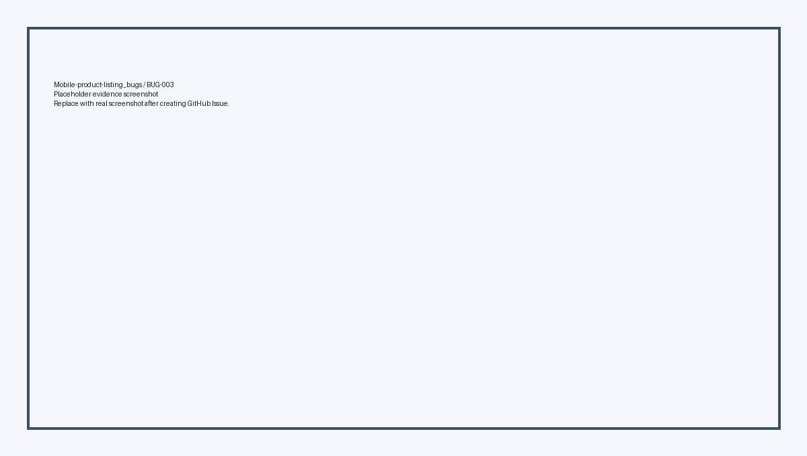

# Consolidated Bug Report - EShop Testing

**Họ và tên:** Nguyễn Tấn Thắng  
**Nhóm:** Nhóm 08  
**MSSV:** 23127259  
**SUT:** Web Client + Web Admin + Mobile App + API Backend  

---

# FEATURE: FR-02 - LOGIN AND ACCOUNT LOCKOUT (2 BUGS)

### BUG-FR02-001: Failed login counter tăng 2 thay vì 1

- **Severity:** Major
- **Priority:** High
- **Component:** API Backend
- **Test Case liên quan:** DT-FR02-03, DT-FR02-04, BV-FR02-02, BV-FR02-03

#### Expected Result:
- Mỗi lần login sai chỉ tăng `login_attempts` đúng 1.

#### Actual Result:
- `backend/server.js` dùng `user.login_attempts + 2`, dẫn đến khóa sớm sau 2 lần sai.

#### Evidence / Screenshot:
- 

#### GitHub Issue:
- **Title:** `[FR-02] [BUG-FR02-001] Failed login counter increases by 2 instead of 1`
- **Link Issue:** TBD

---

### BUG-FR02-002: Thời gian khóa là 180 giây thay vì 30 giây

- **Severity:** Medium
- **Priority:** Medium
- **Component:** API Backend
- **Test Case liên quan:** BV-FR02-06

#### Expected Result:
- Tài khoản bị khóa 30 giây.

#### Actual Result:
- Code dùng `Date.now() + 180000`, khóa 180 giây.

#### Evidence / Screenshot:
- 

#### GitHub Issue:
- **Title:** `[FR-02] [BUG-FR02-002] Account lockout duration is 180 seconds instead of 30 seconds`
- **Link Issue:** TBD

---

# FEATURE: FR-07 - SHOPPING CART (5 BUGS)

### BUG-FR07-001: Thêm cùng sản phẩm tạo dòng trùng

- **Severity:** Major
- **Priority:** High
- **Component:** Frontend Web Cart

#### Expected Result:
- Sản phẩm trùng được gộp và tăng quantity.

#### Actual Result:
- `addToCart` append item mới, tạo dòng duplicate.

#### Evidence / Screenshot:
- 

#### GitHub Issue:
- **Title:** `[FR-07] [BUG-FR07-001] Adding the same product creates duplicate cart rows`
- **Link Issue:** TBD

---

### BUG-FR07-002: Không có nút +/- chỉnh quantity

- **Severity:** Major
- **Priority:** High
- **Component:** Frontend Web Cart

#### Expected Result:
- Cột quantity có nút `+/-`.

#### Actual Result:
- Quantity chỉ là text.

#### Evidence / Screenshot:
- 

#### GitHub Issue:
- **Title:** `[FR-07] [BUG-FR07-002] Cart quantity cannot be adjusted`
- **Link Issue:** TBD

---

### BUG-FR07-003: Xóa sản phẩm không có confirm dialog

- **Severity:** Medium
- **Priority:** Medium
- **Component:** Frontend Web Cart

#### Expected Result:
- Có confirm dialog trước khi xóa.

#### Actual Result:
- Click `Xóa` gọi `removeFromCart(index)` trực tiếp.

#### Evidence / Screenshot:
- 

#### GitHub Issue:
- **Title:** `[FR-07] [BUG-FR07-003] Delete cart item does not show confirmation dialog`
- **Link Issue:** TBD

---

### BUG-FR07-004: Nhãn tổng tiền sai

- **Severity:** Medium
- **Priority:** Medium
- **Component:** Frontend Web Cart

#### Expected Result:
- Nhãn tổng tiền là `Tổng cộng`.

#### Actual Result:
- UI hiển thị `Tổng tạm tính`.

#### Evidence / Screenshot:
- 

#### GitHub Issue:
- **Title:** `[FR-07] [BUG-FR07-004] Cart total label should be "Tổng cộng"`
- **Link Issue:** TBD

---

### BUG-FR07-005: Empty cart thiếu hình minh họa

- **Severity:** Minor
- **Priority:** Low
- **Component:** Frontend Web Cart

#### Expected Result:
- Empty cart có hình minh họa/icon và message.

#### Actual Result:
- Chỉ có text và link.

#### Evidence / Screenshot:
- 

#### GitHub Issue:
- **Title:** `[FR-07] [BUG-FR07-005] Empty cart has no illustration`
- **Link Issue:** TBD

---

# FEATURE: FR-16 - PRODUCT IMPORT FROM CSV (3 BUGS)

### BUG-FR16-001: User thường gọi được API import admin

- **Severity:** Critical
- **Priority:** High
- **Component:** API Backend / Access Control

#### Expected Result:
- User thường bị HTTP 403.

#### Actual Result:
- API chỉ kiểm token, không kiểm `role = admin`.

#### Evidence / Screenshot:
- 

#### GitHub Issue:
- **Title:** `[FR-16] [BUG-FR16-001] Normal user can call admin product import API`
- **Link Issue:** TBD

---

### BUG-FR16-002: Import không rollback khi có dòng lỗi

- **Severity:** Major
- **Priority:** High
- **Component:** API Backend / Database

#### Expected Result:
- Có bất kỳ dòng lỗi nào thì toàn bộ import rollback.

#### Actual Result:
- API insert từng dòng độc lập, batch lỗi vẫn insert một phần.

#### Evidence / Screenshot:
- 

#### GitHub Issue:
- **Title:** `[FR-16] [BUG-FR16-002] Product import is not atomic`
- **Link Issue:** TBD

---

### BUG-FR16-003: Import cho phép giá âm

- **Severity:** Major
- **Priority:** High
- **Component:** API Backend Validation

#### Expected Result:
- Reject `price <= 0`.

#### Actual Result:
- Backend không validate `price`.

#### Evidence / Screenshot:
- 

#### GitHub Issue:
- **Title:** `[FR-16] [BUG-FR16-003] Product import accepts negative price`
- **Link Issue:** TBD

---

# FEATURE: MOBILE PRODUCT LISTING/SEARCH (4 BUGS)

### BUG-MOB-001: Mobile app hard-code API URL

- **Severity:** Medium
- **Priority:** Medium
- **Component:** Mobile App Config

#### Expected Result:
- API URL có thể cấu hình theo môi trường.

#### Actual Result:
- Source hard-code `http://192.168.10.13:3000/api`.

#### Evidence / Screenshot:
- 

#### GitHub Issue:
- **Title:** `[Mobile] [BUG-MOB-001] Product listing uses hard-coded API URL`
- **Link Issue:** TBD

---

### BUG-MOB-002: Search query không được encode

- **Severity:** Medium
- **Priority:** Medium
- **Component:** Mobile Search

#### Expected Result:
- Query dùng `encodeURIComponent`.

#### Actual Result:
- Source nội suy trực tiếp `?search=${query}`.

#### Evidence / Screenshot:
- 

#### GitHub Issue:
- **Title:** `[Mobile] [BUG-MOB-002] Search query is not URL encoded`
- **Link Issue:** TBD

---

### BUG-MOB-003: Không có empty state khi search không có kết quả

- **Severity:** Medium
- **Priority:** Medium
- **Component:** Mobile Product Listing

#### Expected Result:
- Có message khi không có sản phẩm phù hợp.

#### Actual Result:
- Không có `ListEmptyComponent` hoặc no-result message.

#### Evidence / Screenshot:
- 

#### GitHub Issue:
- **Title:** `[Mobile] [BUG-MOB-003] Product search has no empty state`
- **Link Issue:** TBD

---

### BUG-MOB-004: Ảnh sản phẩm mobile có thể bị méo

- **Severity:** Minor
- **Priority:** Low
- **Component:** Mobile Product Card

#### Expected Result:
- Ảnh giữ đúng tỷ lệ.

#### Actual Result:
- Image dùng `resizeMode="stretch"`.

#### Evidence / Screenshot:
- 

#### GitHub Issue:
- **Title:** `[Mobile] [BUG-MOB-004] Product image can be distorted`
- **Link Issue:** TBD
