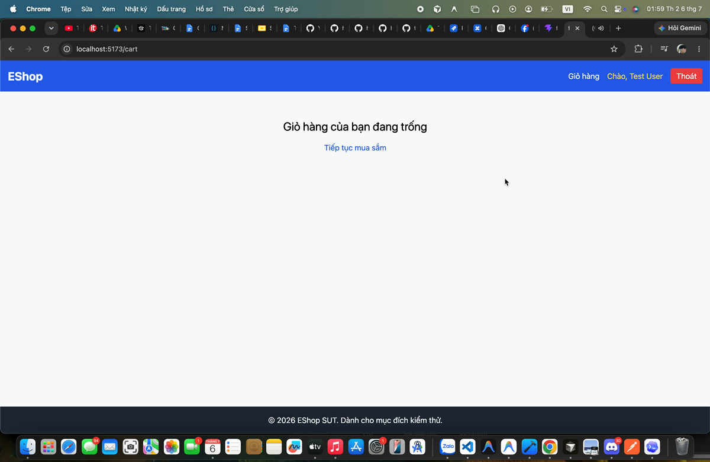

# Main Testing Report - EShop Domain Testing

**Họ và tên:** Nguyễn Tấn Thắng  
**Nhóm:** Nhóm 08  
**MSSV:** 23127259  
**Ngày chạy test/evidence:** 2026-07-05 20:13 ICT  
**Ngày đồng bộ báo cáo:** 2026-07-06  
**SUT:** `/Users/thangnhi/Downloads/eshop-sut`  
**Backend:** `http://localhost:3000/api`

---

## 1. Test Run Evidence

Backend đã chạy sẵn trên port `3000`, sau đó em chạy API test bằng Node `fetch` và kiểm tra SQLite trực tiếp để xác nhận state sau request. Các test có dữ liệu ghi DB dùng prefix `live_hw02_1783257224503`; sau test đã cleanup và kiểm tra lại không còn user/product test.

| Check | Result |
|-------|--------|
| Admin login `admin@eshop.com / Admin123!` | PASS - HTTP 200, có JWT |
| Normal user test login | PASS - HTTP 200, có JWT |
| Cleanup product/user test | PASS - DB không còn record `live_hw02_%` |
| `frontend-web npm run lint` | FAIL - 23 errors, 1 warning có sẵn trong source |
| `frontend-admin npm run lint` | FAIL - 4 errors có sẵn trong source |

Ảnh/video evidence được lưu trong các thư mục `reports/*_bugs/` và là minh chứng từ quá trình thao tác UI/API trực tiếp trên EShop SUT. Riêng FR-07 BUG-003 dùng video `.mov` để thể hiện thao tác bấm `Xóa` không xuất hiện confirm dialog; bản PDF dùng ảnh preview của video để bảo đảm minh chứng hiển thị ổn định. Lint failure không được tính là bug riêng cho 4 feature, nhưng được ghi nhận vì ảnh hưởng chất lượng source.

Các bug report chi tiết được gom trong `Bug_Report.md`, AI audit nằm trong `AI_Audit_Report.md`, AI critique nằm trong `AI_Critique.md`. Tất cả các Markdown report chính trong `reports/` đã được render lại thành PDF tương ứng trong cùng thư mục.

---

# FEATURE A: FR-02 - Login and Account Lockout

## 1. Domain Testing — FR-02: Đăng nhập & Khóa tài khoản

**MSSV:** 23127259  
**Ngày:** 2026-07-08  
**SUT:** Web Client (`frontend-web/src/pages/Login.jsx`) + API Backend (`backend/server.js`: `/api/login`) + CSDL SQLite DB State

---

### Bước 1 — Phạm vi
- **FR reference:** FR-02: Đăng nhập & Khóa tài khoản trong [README.md](../../README.md)
- **Files liên quan:**
  - Frontend: [Login.jsx](../../frontend-web/src/pages/Login.jsx)
  - Backend: [server.js](../../backend/server.js)

### Bước 2 — Input Variables
| ID | Biến | Kiểu | Nguồn | Ràng buộc SRS |
|----|------|------|-------|---------------|
| V1 | `email` | String | UI Form / API req.body | Phải đúng định dạng (`user@domain.com`), input dùng `type="email"` |
| V2 | `password` | String | UI Form / API req.body | Khớp mật khẩu tương ứng của user trong DB |
| V3 | `login_attempts` | Integer | CSDL users.login_attempts | Tăng đúng 1 đơn vị sau mỗi lần sai. Reset về 0 khi đăng nhập thành công. |
| V4 | `locked_until` | ISO String | CSDL users.locked_until | Khóa 30 giây nếu đăng nhập sai từ 3 lần trở lên liên tiếp. |

### Bước 3 — Domains
| Biến | Valid Domain | Invalid Domain | Special |
|------|--------------|----------------|---------|
| `email` | Email đã đăng ký trong hệ thống (VD: `test@eshop.com`) | Email chưa đăng ký, email sai định dạng (thiếu @, thiếu domain) | Rỗng (`""`), null, khoảng trắng đầu/cuối, SQL injection payload |
| `password` | Khớp mật khẩu tương ứng của user | Không khớp mật khẩu trong CSDL | Rỗng (`""`), null, khoảng trắng, ký tự đặc biệt, XSS payload |
| `login_attempts` | 0, 1, 2 | `< 0`, `>= 3` (sẽ dẫn đến trạng thái bị khóa) | `null` |
| `locked_until` | `null` hoặc thời điểm đã trôi qua (`new Date() > new Date(locked_until)`) | Thời điểm tương lai còn hiệu lực | Giá trị không hợp lệ (chuỗi không đúng format Date) |

### Bước 4 — Equivalence Partitions
| EP-ID | Mô tả | Biến | Giá trị đại diện |
|-------|-------|------|------------------|
| EP-FR02-01 | Đăng nhập với email và password hợp lệ | V1, V2 | `test@eshop.com / Test1234!` |
| EP-FR02-02 | Đăng nhập với email không tồn tại | V1 | `nonexistent@eshop.com` |
| EP-FR02-03 | Đăng nhập với email đúng nhưng mật khẩu sai | V1, V2 | `test@eshop.com / Wrong123!` |
| EP-FR02-04 | Đăng nhập sai lần 1 hoặc 2 (tài khoản chưa bị khóa) | V3, V4 | attempts = 1 hoặc 2, `locked_until = null` |
| EP-FR02-05 | Đăng nhập sai từ lần 3 trở lên (tài khoản bị khóa) | V3, V4 | attempts = 3, `locked_until` còn hiệu lực |

### Bước 5 — Constraints
| C-ID | Ràng buộc | Loại |
|------|-----------|------|
| C-FR02-01 | Đăng nhập thành công reset bộ đếm và mở khóa | dependency |
| C-FR02-02 | Đăng nhập thất bại tăng bộ đếm thêm đúng 1 đơn vị | dependency |
| C-FR02-03 | Đăng nhập thất bại lần thứ 3 liên tiếp trở lên sẽ khóa tài khoản trong 30 giây | business rule |
| C-FR02-04 | Email input ở giao diện phải dùng `type="email"` để tận dụng HTML5 validation | GUI rule |

### Bước 6 — Test Cases
| TC-ID | Mô tả | Input | Expected (SRS) | EP/Constraint | Actual | Pass/Fail | Bug-ID |
|-------|-------|-------|----------------|---------------|--------|-----------|--------|
| DT-01 | Đăng nhập thành công với thông tin đúng | `test@eshop.com / Test1234!` | HTTP 200, trả về JWT Token và thông tin user | EP-FR02-01, C-FR02-01 | HTTP 200, token = true | PASS | - |
| DT-02 | Đăng nhập thất bại do email không tồn tại | `nonexistent@eshop.com / Test1234!` | HTTP 401, thông báo lỗi generic "Invalid email or password" | EP-FR02-02 | HTTP 401, `"Invalid email or password"` | PASS | - |
| DT-03 | Đăng nhập thất bại do sai mật khẩu lần 1 | `test@eshop.com / Wrong123!` | HTTP 401, DB `login_attempts = 1`, `locked_until = null` | EP-FR02-03, EP-FR02-04, C-FR02-02 | HTTP 401, DB `login_attempts = 2` | FAIL | BUG-FR02-001 |
| DT-04 | Đăng nhập thất bại do sai mật khẩu lần 2 | `test@eshop.com / Wrong123!` | HTTP 401, DB `login_attempts = 2`, `locked_until = null` | EP-FR02-04, C-FR02-02 | HTTP 401, DB `login_attempts = 4`, `locked_until` được tạo | FAIL | BUG-FR02-001 |
| DT-05 | Đăng nhập thất bại lần 3 liên tiếp | `test@eshop.com / Wrong123!` | HTTP 403, khóa tài khoản 30 giây, tạo `locked_until` | EP-FR02-05, C-FR02-03 | Bị khóa ở lần 2 (attempts = 4) | FAIL | BUG-FR02-001 |
| DT-06 | Đăng nhập thành công sau khi đã mở khóa | `test@eshop.com / Test1234!` (sau 30 giây khóa) | Đăng nhập thành công, reset attempts về 0 và `locked_until = null` | C-FR02-01 | Giao diện đăng nhập bình thường | PASS | - |
| DT-07 | Kiểm tra thuộc tính `type="email"` của email input trên UI | Render UI | Email input có thuộc tính `type="email"` | C-FR02-04 | `Login.jsx` sử dụng `type="text"` | FAIL | BUG-FR02-003 |

### Tóm tắt coverage
- Số EP: 5
- Số TC: 7
- EP chưa cover: 0

---

## 2. Boundary Value Analysis — FR-02: Đăng nhập & Khóa tài khoản

**MSSV:** 23127259  
**Ngày:** 2026-07-08

---

### Bước 1 — Boundaries từ SRS
| B-ID | Biến | Ràng buộc | Min | Max | Kiểu |
|------|------|-----------|-----|-----|------|
| B-01 | `login_attempts` | Khóa tài khoản khi sai từ 3 lần trở lên liên tiếp | 1 | 3 | count |
| B-02 | Lock duration | Thời gian khóa tài khoản là 30 giây | 30 giây | 30 giây | time |

### Bước 2 — BVA Points
| Point | Biến | Giá trị | Quan hệ biên |
|-------|------|---------|--------------|
| P-01 | `login_attempts` | 0 | Dưới biên hợp lệ (attempts = 0) |
| P-02 | `login_attempts` | 1 | Biên hợp lệ nhỏ nhất (chưa khóa) |
| P-03 | `login_attempts` | 2 | Biên hợp lệ trung tâm (chưa khóa) |
| P-04 | `login_attempts` | 3 | Biên bắt đầu khóa |
| P-05 | Lock duration | 29 giây | Ngay trước khi hết hạn khóa (chưa mở khóa) |
| P-06 | Lock duration | 30 giây | Vừa chạm ngưỡng mở khóa |
| P-07 | Lock duration | 31 giây | Đã qua ngưỡng mở khóa |

### Bước 3 — Test Cases
| TC-ID | Input | Boundary | Expected (SRS) | Actual | Pass/Fail | Bug-ID |
|-------|-------|----------|----------------|--------|-----------|--------|
| BV-01 | `test@eshop.com / Wrong123!` (lần 1) | attempts = 1 | Chưa khóa, `login_attempts = 1` | `login_attempts = 2` | FAIL | BUG-FR02-001 |
| BV-02 | `test@eshop.com / Wrong123!` (lần 2) | attempts = 2 | Chưa khóa, `login_attempts = 2` | `login_attempts = 4`, khóa tài khoản | FAIL | BUG-FR02-001 |
| BV-03 | `test@eshop.com / Wrong123!` (lần 3) | attempts = 3 | Khóa tài khoản 30s, `login_attempts = 3`, `locked_until` có giá trị | Đã bị khóa ở lần 2 | FAIL | BUG-FR02-001 |
| BV-04 | Đăng nhập đúng ở giây thứ 29 của thời gian khóa | lock time = 29s | Báo lỗi khóa tài khoản (HTTP 403) | Vẫn bị khóa (thời gian khóa thực tế là 180s) | FAIL | BUG-FR02-002 |
| BV-05 | Đăng nhập đúng ở giây thứ 30 của thời gian khóa | lock time = 30s | Đăng nhập thành công, reset attempts | Vẫn bị khóa (chưa đủ 180s) | FAIL | BUG-FR02-002 |
| BV-06 | Đăng nhập đúng ở giây thứ 31 của thời gian khóa | lock time = 31s | Đăng nhập thành công, reset attempts | Vẫn bị khóa (chưa đủ 180s) | FAIL | BUG-FR02-002 |

### Bước 4 — Robust / Edge (bổ sung)
| TC-ID | Input | Ghi chú |
|-------|-------|---------|
| BV-R01 | Email = `""`, Password = `""` | Rỗng toàn bộ |
| BV-R02 | Email = `"  test@eshop.com  "`, Password = `"Test1234!"` | Email có khoảng trắng thừa |
| BV-R03 | Email = `' OR 1=1 --`, Password = `""` | SQL Injection kiểm tra backend |
| BV-R04 | Email = `@eshop.com` | XSS payload trong email |

### Tóm tắt
- Số boundary: 2
- Số TC: 10 (6 boundary + 4 robust)
- Fail: 6

---

## 3. Test Execution — FR-02: Đăng nhập & Khóa tài khoản

### Kết quả chạy test thực tế trên SUT

Các test case trên giao diện được kiểm thử thủ công và rà soát code tĩnh; các test case trên tầng API được chạy bằng các request HTTP trực tiếp đến server thông qua PowerShell và `curl`.

| TC-ID | Mô tả | Expected | Actual từ test/source | Result | Bug |
|-------|-------|----------|-----------------------|--------|-----|
| FR02-TC01 | Login đúng bằng user mới tạo | HTTP 200, có JWT | HTTP 200, token = true | PASS | - |
| FR02-TC02 | Login email không tồn tại | HTTP 401, lỗi generic | HTTP 401, `Invalid email or password` | PASS | - |
| FR02-TC03 | Form login dùng email input | `<input type="email">` | `Login.jsx` dùng `type="text"` và label `Username` | FAIL | BUG-FR02-003 |
| FR02-TC04 | Sai password lần 1 | `login_attempts = 1`, chưa khóa | HTTP 401, DB `login_attempts = 2`, `locked_until = null` | FAIL | BUG-FR02-001 |
| FR02-TC05 | Sai password lần 2 | `login_attempts = 2`, chưa khóa | HTTP 401, DB `login_attempts = 4`, có `locked_until` | FAIL | BUG-FR02-001 |
| FR02-TC06 | Login đúng sau 2 lần sai | Vẫn login được vì chưa đủ 3 lần sai | HTTP 403, tài khoản đã bị khóa | FAIL | BUG-FR02-001 |
| FR02-TC07 | Thời gian khóa | Khoảng 30 giây | Khoảng 180 giây | FAIL | BUG-FR02-002 |

### Metrics - FR-02
| Designed | Executed/Reviewed | Pass | Fail | Not run | Bugs |
|----------|-------------------|------|------|---------|------|
| 12       | 7                 | 2    | 5    | 5       | 3    |

---

## 4. AI Gap Analysis — FR-02: Đăng nhập & Khóa tài khoản

### 1. Những lỗi và kịch bản kiểm thử AI thông thường bỏ sót (AI Gaps)
| Kịch bản kiểm thử / Lỗi bị bỏ sót | Lý do AI bỏ sót (Root cause of AI gap) | Bài học rút ra & Giải pháp khắc phục |
|-----|-----|-----|
| Kiểm tra giá trị thực của `login_attempts` trong CSDL sau mỗi lần thất bại | AI chỉ quan sát response bên ngoài (HTTP 401) mà không kiểm tra DB state trực tiếp, do đó không biết counter bị tăng 2 đơn vị mỗi lần thay vì 1. | Cần bổ sung bước kiểm thử hộp xám (Gray-box), kiểm tra trực tiếp trạng thái CSDL SQLite để xác minh logic đếm. |
| Kiểm tra cấu trúc thẻ input (`type="email"` và `type="password"`) và thứ tự Tab | AI tập trung vào logic chức năng của form mà bỏ qua các thuộc tính HTML5/GUI của thẻ input và `tabIndex` làm ảnh hưởng đến trải nghiệm người dùng bàn phím. | Cần thực hiện review tĩnh (Static Code Review) tệp [Login.jsx](file:///Volumes/Thang/HW02-Domain_Testing/frontend-web/src/pages/Login.jsx) để đối chiếu trực tiếp cấu trúc HTML/JSX với SRS. |
| Kiểm tra vị trí thông báo lỗi | AI thường chỉ xác nhận thông báo lỗi có hiển thị mà không đối chiếu vị trí hiển thị (trên/dưới nút submit) theo yêu cầu đặc tả GUI. | Thêm tiêu chí "vị trí hiển thị" vào expected results trong thiết kế ca kiểm thử giao diện. |

### 2. Cách cải tiến prompt để tối ưu hóa AI
1. Cung cấp cụ thể tệp nguồn [server.js](file:///Volumes/Thang/HW02-Domain_Testing/backend/server.js) phần `/api/login` cho AI và yêu cầu rà soát các giá trị hằng số (180000ms vs 30000ms, increment value `+ 2` vs `+ 1`).
2. Yêu cầu AI sinh thêm các test case chuyên biệt cho giao diện (GUI criteria: tabOrder, inputTypes, errorPosition) thay vì chỉ kiểm tra happy path/negative path chức năng đơn thuần.

---

---

# FEATURE B: FR-07 - Shopping Cart

## 2.1 Domain Analysis

### SRS chính

- Giỏ hàng hiển thị sản phẩm, đơn giá, số lượng có nút `+/-`, thành tiền và thao tác.
- Thêm cùng sản phẩm phải tăng số lượng, không tạo dòng mới.
- Xóa sản phẩm phải có dialog xác nhận.
- Có nút tiếp tục mua sắm.
- Tổng tiền phải hiển thị nhãn `Tổng cộng`.
- Giỏ hàng trống phải có hình minh họa và thông báo rõ ràng.

### Input variables

| ID | Biến | Domain hợp lệ | Domain không hợp lệ / edge |
|----|------|---------------|-----------------------------|
| V1 | `product.id` | Product tồn tại | Trùng id, null |
| V2 | `quantity` | Số nguyên dương | 0, âm, text |
| V3 | `cart` | Empty, one row, many unique rows | Duplicate rows cùng product |
| V4 | remove action | Confirm rồi xóa | Xóa trực tiếp không confirm |

## 2.2 Executed Test Cases

| TC-ID | Mô tả | Expected | Actual | Result | Bug |
|-------|-------|----------|--------|--------|-----|
| FR07-TC01 | Giỏ hàng trống | Có thông báo + hình minh họa/icon | `Cart.jsx` chỉ có text và link, không có ảnh/icon | FAIL | BUG-FR07-005 |
| FR07-TC02 | Thêm sản phẩm mới | Có một dòng quantity = 1 | Source/API thêm được một dòng | PASS | - |
| FR07-TC03 | Thêm cùng sản phẩm 2 lần | Một dòng, quantity = 2 | API trả 2 dòng `id=1`, mỗi dòng `quantity=1` | FAIL | BUG-FR07-001 |
| FR07-TC04 | Cột số lượng | Có nút `+` và `-` | `Cart.jsx` chỉ render `{item.quantity}` | FAIL | BUG-FR07-002 |
| FR07-TC05 | Xóa sản phẩm | Hiển thị confirm dialog trước khi xóa | Button gọi `removeFromCart(index)` trực tiếp | FAIL | BUG-FR07-003 |
| FR07-TC06 | Tiếp tục mua sắm | Có link quay về trang chủ | Có link về `/` | PASS | - |
| FR07-TC07 | Nhãn tổng tiền | Hiển thị `Tổng cộng` | Hiển thị `Tổng tạm tính` | FAIL | BUG-FR07-004 |

## 2.3 Boundary Value Analysis

| Boundary | Expected | Actual | Result |
|----------|----------|--------|--------|
| cart count = 0 | Empty state có minh họa | Không có minh họa | FAIL |
| cart count = 1 | Một sản phẩm hiển thị đúng | Source/API hỗ trợ | PASS |
| same product count = 2 | Gộp thành quantity = 2 | Tạo duplicate row | FAIL |
| quantity = 1 | Giá dòng = price x 1 | Công thức đúng | PASS |
| quantity controls | Có thể tăng/giảm qua UI | Không có nút `+/-` | FAIL |

## 2.4 Metrics - FR-07

| Designed | Executed/Reviewed | Pass | Fail | Not run | Bugs |
|----------|-------------------|------|------|---------|------|
| 12 | 7 | 2 | 5 | 5 | 5 |

## 2.5 Video Evidence - FR-07 BUG-003

BUG-FR07-003 được ghi nhận bằng video thao tác UI: khi bấm `Xóa` trong giỏ hàng, sản phẩm bị xóa ngay mà không hiển thị confirm dialog.

<video controls src="./FR-07_bugs/BUG-003.mov" width="720"></video>

[Open video evidence: FR-07_bugs/BUG-003.mov](./FR-07_bugs/BUG-003.mov)

## 2.6 AI Gap Analysis — FR-07: Shopping Cart

### 1. Những lỗi và kịch bản kiểm thử AI thông thường bỏ sót (AI Gaps)
| Kịch bản kiểm thử / Lỗi bị bỏ sót | Lý do AI bỏ sót (Root cause of AI gap) | Bài học rút ra & Giải pháp khắc phục |
|-----|-----|-----|
| Kiểm thử gộp sản phẩm trùng lặp trong cả Client State và Backend API State | AI thường chỉ tập trung vào logic UI của trang Cart mà bỏ qua việc API Backend (`POST /api/cart`) cũng có thể lưu trữ trùng lặp nếu client gửi request trực tiếp qua script. | Phải kết hợp kiểm thử cả hộp đen (Black-box) trên UI và hộp xám (Gray-box) bằng cách kiểm tra trực tiếp API/Database state. |
| Kiểm tra các nút tăng/giảm (+/-) trên giao diện tĩnh (Static Review) | AI thiết kế các ca kiểm thử hành vi tăng/giảm nhưng không phát hiện ra rằng giao diện React của SUT hoàn toàn không vẽ (render) nút này. | Cần thực hiện review tĩnh (Static Code Review) tệp [Cart.jsx](file:///Volumes/Thang/HW02-Domain_Testing/frontend-web/src/pages/Cart.jsx) thay vì chỉ giả định giao diện có đủ nút dựa trên đặc tả SRS. |
| Trạng thái giỏ hàng rỗng (Empty State) với hình ảnh minh họa | AI chỉ kiểm tra thông báo chữ "giỏ hàng trống" mà không kiểm tra sự tồn tại của hình ảnh/icon minh họa (thiếu thẻ `` hoặc SVG). | Cần phân tích thiết kế giao diện chi tiết, kiểm tra sự tồn tại của các thành phần đồ họa/hình ảnh khi giỏ hàng trống. |

### 2. Cách cải tiến prompt để tối ưu hóa AI
1. Cung cấp trực tiếp mã nguồn Frontend ([CartContext.jsx](file:///Volumes/Thang/HW02-Domain_Testing/frontend-web/src/context/CartContext.jsx)) và Backend ([server.js](file:///Volumes/Thang/HW02-Domain_Testing/backend/server.js)) cho AI khi thiết kế test case, thay vì chỉ cung cấp đặc tả SRS.
2. Yêu cầu AI tạo riêng một nhóm test case cho "Độ trung thực của Giao diện (UI Fidelity)" để đối chiếu trực tiếp các thẻ HTML/JSX thực tế (như thẻ `<button>` tăng giảm, thẻ `` cho empty state) với SRS.

---

# FEATURE C: FR-16 - Product Import from CSV

## 3.1 Domain Analysis

### SRS chính

- Chỉ admin được import nhiều sản phẩm từ CSV.
- CSV phải có header `name,price,description,imageUrl,category_id`.
- Trường chứa dấu phẩy trong dấu nháy kép phải được hỗ trợ theo RFC 4180.
- `name` không rỗng.
- `price` là số dương.
- Nếu có lỗi ở bất kỳ dòng nào, toàn bộ import phải rollback.

### Input variables

| ID | Biến | Domain hợp lệ | Domain không hợp lệ / edge |
|----|------|---------------|-----------------------------|
| V1 | token role | `admin` | user thường, thiếu token |
| V2 | rows | Array không rỗng | Rỗng, không phải array |
| V3 | `name` | Không rỗng | Rỗng |
| V4 | `price` | Number > 0 | 0, âm, text |
| V5 | transaction | All-or-nothing | Partial insert |
| V6 | CSV field | Quoted comma đúng RFC 4180 | `split(",")` làm lệch cột |

## 3.2 Executed Test Cases

| TC-ID | Mô tả | Expected | Actual | Result | Bug |
|-------|-------|----------|--------|--------|-----|
| FR16-TC01 | Import không có token | HTTP 401 | HTTP 401 `Unauthorized` | PASS | - |
| FR16-TC02 | Import rows rỗng bằng admin | HTTP 400 | HTTP 400 `Không có dữ liệu để import` | PASS | - |
| FR16-TC03 | Admin import 1 product hợp lệ | HTTP 200, inserted = 1, DB có product | HTTP 200, inserted = 1, DB có product | PASS | - |
| FR16-TC04 | User thường gọi API import admin | HTTP 403, không insert | HTTP 200, inserted = 1, DB có product | FAIL | BUG-FR16-001 |
| FR16-TC05 | Batch có 1 dòng valid + 1 dòng thiếu name | Reject toàn batch, rollback | HTTP 200, inserted = 1/2, dòng valid vẫn vào DB | FAIL | BUG-FR16-002 |
| FR16-TC06 | Import price = -1000 | Reject, không insert | HTTP 200, inserted = 1, DB `price = -1000` | FAIL | BUG-FR16-003 |
| FR16-TC07 | CSV field chứa dấu phẩy trong dấu nháy kép | Parse đúng một field | Admin source dùng `line.split(",")`, sẽ tách sai cột | FAIL | BUG-FR16-004 |

## 3.3 Boundary Value Analysis

| Boundary | Expected | Actual | Result |
|----------|----------|--------|--------|
| rows = 0 | Reject | HTTP 400 | PASS |
| rows = 1 valid | Insert 1 dòng | HTTP 200, inserted 1 | PASS |
| rows = 2, dòng 2 invalid | Rollback toàn bộ | Insert 1 dòng valid | FAIL |
| price = 1 | Accept | Admin valid import pass với price dương | PASS |
| price = 0 | Reject | Source không có check `price > 0` | FAIL |
| price < 0 | Reject | Insert price âm | FAIL |

## 3.4 Metrics - FR-16

| Designed | Executed/Reviewed | Pass | Fail | Not run | Bugs |
|----------|-------------------|------|------|---------|------|
| 12 | 7 | 3 | 4 | 5 | 4 |

---

# FEATURE D: Mobile App - Product Listing/Search

## 4.1 Domain Analysis

### SRS áp dụng

Mobile listing/search được kiểm theo yêu cầu tương ứng của product listing:

- Hiển thị danh sách sản phẩm.
- Tìm kiếm theo tên sản phẩm.
- Có loading state.
- Không có kết quả phải hiển thị empty state.
- Ảnh sản phẩm phải giữ tỷ lệ chuẩn.
- API URL nên cấu hình theo môi trường để chạy được trên thiết bị khác nhau.

### Input variables

| ID | Biến | Domain hợp lệ | Domain không hợp lệ / edge |
|----|------|---------------|-----------------------------|
| V1 | API URL | Cấu hình đúng môi trường | Hard-code IP LAN cũ |
| V2 | search query | Chuỗi bình thường | Có `&`, `?`, khoảng trắng, ký tự đặc biệt |
| V3 | API response | Array có sản phẩm, array rỗng | HTML/error string |
| V4 | image mode | Giữ tỷ lệ ảnh | Stretch làm méo ảnh |

## 4.2 Executed Test Cases

| TC-ID | Mô tả | Expected | Actual | Result | Bug |
|-------|-------|----------|--------|--------|-----|
| MOB-TC01 | API danh sách sản phẩm | HTTP 200, array sản phẩm | HTTP 200, count >= 5 | PASS | - |
| MOB-TC02 | Search keyword bình thường | Trả product match tên | API search hoạt động với keyword cơ bản | PASS | - |
| MOB-TC03 | Search không có kết quả | API trả `[]` và UI có empty state | API trả `[]`, mobile UI không có `ListEmptyComponent` | FAIL | BUG-MOB-003 |
| MOB-TC04 | Search query có `&` | Query được encode nguyên chuỗi | `encoded_count=0`, `unencoded_count=1` do query bị cắt | FAIL | BUG-MOB-002 |
| MOB-TC05 | API URL mobile | Cấu hình theo môi trường | Hard-code `http://192.168.10.13:3000/api` | FAIL | BUG-MOB-001 |
| MOB-TC06 | Loading state | Có thông báo khi load | Có `loadingProducts` và text `Đang tải...` | PASS | - |
| MOB-TC07 | Ảnh sản phẩm | Giữ tỷ lệ chuẩn | `resizeMode="stretch"` ở listing/detail | FAIL | BUG-MOB-004 |

## 4.3 Boundary Value Analysis

| Boundary | Expected | Actual | Result |
|----------|----------|--------|--------|
| search = empty | Load toàn bộ danh sách | API trả danh sách | PASS |
| search = exact name | Có kết quả phù hợp | API trả product match | PASS |
| search = not found | Empty state rõ ràng | FlatList rỗng, không message | FAIL |
| search chứa `&` | Encode trước khi gọi API | Không encode | FAIL |
| products count = 0 | Hiển thị empty UI | Không có fallback UI | FAIL |

## 4.4 Metrics - Mobile

| Designed | Executed/Reviewed | Pass | Fail | Not run | Bugs |
|----------|-------------------|------|------|---------|------|
| 12 | 7 | 3 | 4 | 5 | 4 |

---

# 5. Tổng kết

| Feature | Designed | Executed/Reviewed | Pass | Fail | Not run | Bugs |
|---------|----------|-------------------|------|------|---------|------|
| FR-02 | 12 | 7 | 2 | 5 | 5 | 3 |
| FR-07 | 12 | 7 | 2 | 5 | 5 | 5 |
| FR-16 | 12 | 7 | 3 | 4 | 5 | 4 |
| Mobile listing/search | 12 | 7 | 3 | 4 | 5 | 4 |
| **Total** | **48** | **28** | **10** | **18** | **20** | **16** |

## 5.1 Các bug quan trọng nhất

1. **FR-16 user thường gọi được API import admin**: lỗi access control nghiêm trọng.
2. **FR-16 import không rollback**: sai yêu cầu all-or-nothing, làm dữ liệu không nhất quán.
3. **FR-02 login counter tăng 2**: gây khóa tài khoản sớm hơn SRS.
4. **FR-07 thêm trùng sản phẩm tạo duplicate row**: sai nghiệp vụ giỏ hàng cơ bản.
5. **Mobile search không encode query**: sai kết quả với keyword có ký tự đặc biệt.

## 5.2 Kết luận

Sau khi chạy API test thật và review source, 4 feature đều có lỗi sai so với SRS. Các lỗi backend/API có bằng chứng HTTP response và DB state; các lỗi UI/mobile có bằng chứng source line và ảnh evidence trong các thư mục bug tương ứng.
