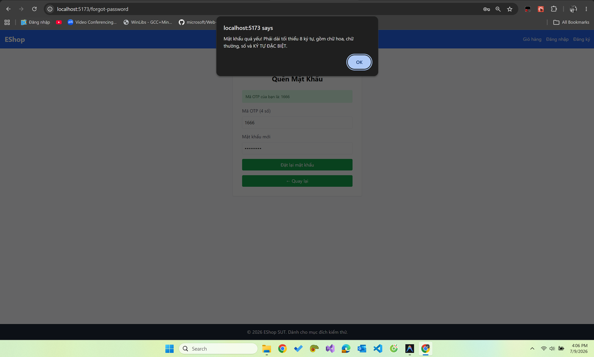
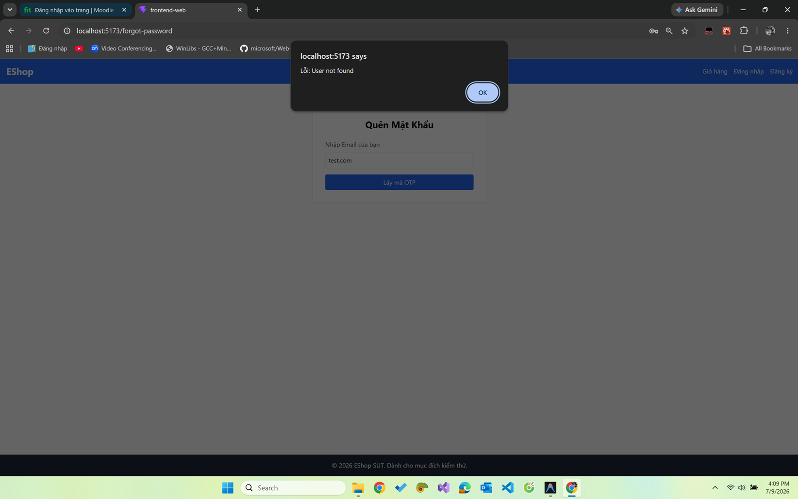
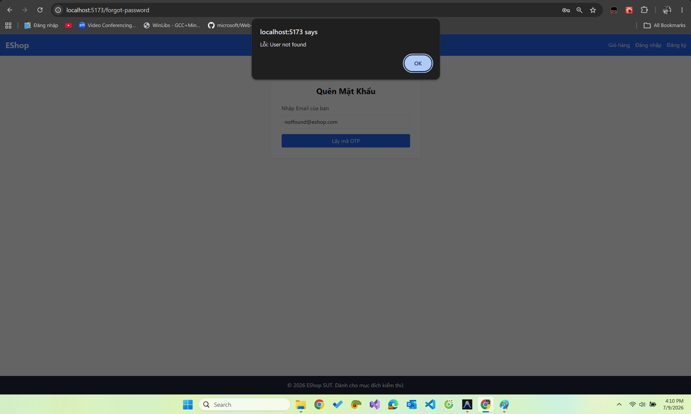
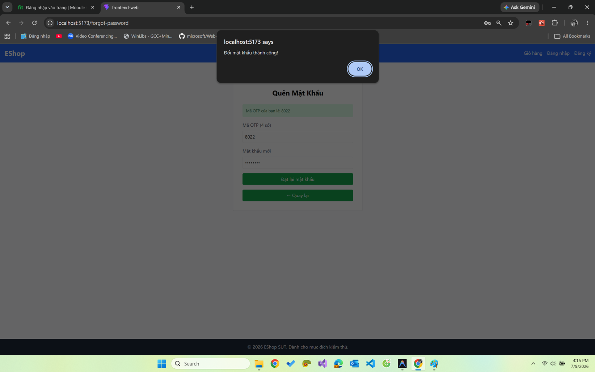
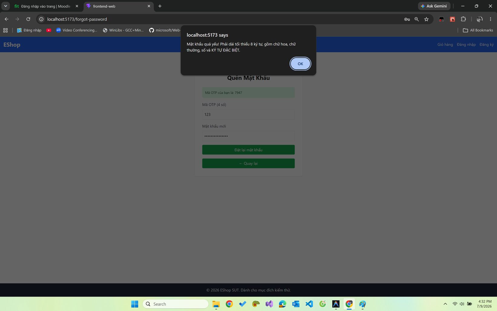
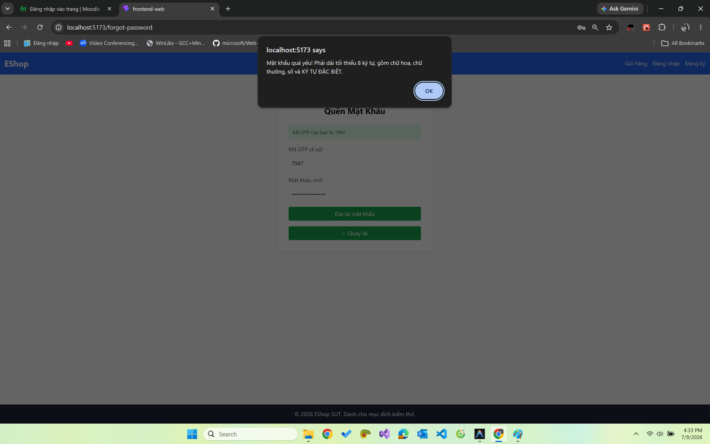
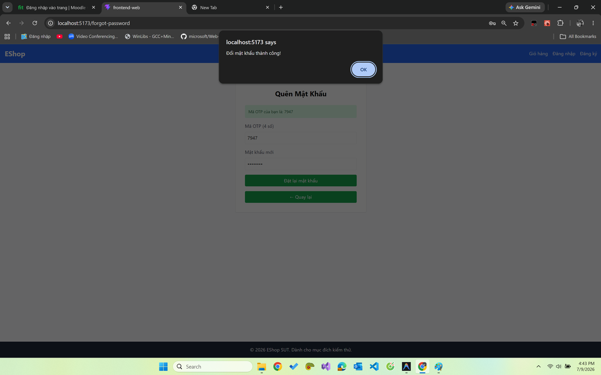

<!-- File: FR-03_TestReport.md -->

​

# BÁO CÁO KIỂM THỬ: FR-03 (Quên mật khẩu & Đặt lại mật khẩu)

​

## 1. Phân hoạch tương đương (Equivalence Partitioning & Domain Analysis)

​
Dựa trên việc đối chiếu đặc tả (README) và giao diện thực tế (UI thực thi trên frontend), ta có các phân hoạch sau:
​

### 1.1. Biến `email` (UI - Bước 1)

- **Nguồn:** Trường nhập liệu ở Bước 1.
- **Ràng buộc UI thật:** Thẻ `<input type="text">` (chấp nhận mọi chuỗi, không validate format HTML5).
- **Ràng buộc Đặc tả:** Email hợp lệ, duy nhất, đã tồn tại trong hệ thống.
- **VEC-email-1:** Chuỗi đúng định dạng email và tồn tại trong DB (VD: `test@eshop.com`).
- **IEC-email-1:** Chuỗi sai định dạng email (VD: `test.com`).
- **IEC-email-2:** Chuỗi đúng định dạng nhưng không tồn tại trong DB (VD: `notfound@eshop.com`).
- **IEC-email-3:** Bỏ trống.
- **Ghi chú Inconsistency:** Giao diện vi phạm FR-22 (dùng `type="text"`, thiếu dấu `*`).
  ​

### 1.2. Biến `resetToken` (UI - Bước 2)

- **Nguồn:** Trường nhập OTP.
- **Ràng buộc UI thật:** Giao diện ghi rõ "Mã OTP (4 số)". Backend sinh mã 4 chữ số. Field `type="text"`, KHÔNG có `maxLength`/`pattern`.
- **VEC-otp-1:** Chuỗi 4 chữ số hợp lệ đúng với mã đã sinh (VD: `1234`).
- **IEC-otp-1:** Chuỗi 4 chữ số nhưng không khớp mã đã sinh (VD: `9999`).
- **IEC-otp-2:** Chứa ký tự chữ hoặc ký tự đặc biệt (VD: `123a`).
- **IEC-otp-3:** Bỏ trống.
- **Ghi chú Inconsistency:** Đặc tả yêu cầu 6 chữ số, nhưng UI ép nhập 4 chữ số (thiết kế test theo UI 4 số, Expected đòi hệ thống hành xử theo spec 6 số).
  ​

### 1.3. Biến `newPassword` (UI - Bước 2)

- **Nguồn:** Trường Mật khẩu mới.
- **Ràng buộc UI thật:** Regex frontend `^(?=.*[a-z])(?=.*[A-Z])(?=.*\d)(?=.*\s)[A-Za-z\d\s]{8,}$` → bắt buộc có khoảng trắng, chữ hoa, chữ thường, số, và **CẤM** ký tự đặc biệt.
- **VEC-pwd-1:** Thỏa mãn regex của UI (VD: `Password 123`).
- **IEC-pwd-1:** Chứa ký tự đặc biệt, không có khoảng trắng — pass chuẩn đặc tả nhưng UI coi là invalid (VD: `Test@1234`).
- **IEC-pwd-2:** Dưới 8 ký tự (VD: `P w 1`).
- **IEC-pwd-3:** Thiếu chữ hoa (VD: `password 123`).
- **IEC-pwd-4:** Thiếu chữ thường (VD: `PASSWORD 123`).
- **IEC-pwd-5:** Thiếu chữ số (VD: `Password abc`).
- **IEC-pwd-6:** Bỏ trống.
- **Ghi chú Inconsistency:** Logic kiểm tra của UI hoàn toàn ngược lại với đặc tả FR-01/FR-03 (cấm ký tự đặc biệt và ép dùng khoảng trắng).
  ​

### 1.4. Biến `confirmPassword` (UI - Bước 2)

- **Nguồn:** Lẽ ra phải là trường "Xác nhận mật khẩu mới".
- **Ghi chú Inconsistency:** Trường này **hoàn toàn bị thiếu** trên giao diện → không thể phân hoạch/thực thi kiểm tra 2 mật khẩu khớp nhau. (Chuyển thành Bug Blocker.)
  ​

---

​

## 2. Phân tích giá trị biên (Boundary Value Analysis)

​

### 2.1. Biến `resetToken` (Độ dài)

- **Biên (theo UI):** 4 ký tự.
- **Điểm biên:** `length = 3` (OFF) | `length = 4` (ON) | `length = 5` (OFF).
  ​

### 2.2. Biến `newPassword` (Độ dài)

- **Biên:** Tối thiểu 8 ký tự.
- **Điểm biên:** `length = 7` (OFF) | `length = 8` (ON) | `length = 9` (Valid).
  ​

---

​

## 3. Bảng thiết kế Test Case (Test Case DESIGN)

​
| Test Case ID | Mục đích (Objective) | Tiền điều kiện (Pre-conditions) | Các bước (Steps) | Dữ liệu đầu vào (Input) | Kết quả mong đợi CHUẨN (Expected — spec-correct) | Loại Input (Valid/Invalid) | Ưu tiên (Priority) |
| --------------| -----------------------------------------------------------------------| ---------------------------------| -----------------------------------------------------------------------------------------------| ----------------------------------------------------------------------------------------------------------------| ------------------------------------------------------------------------------------| ----------------------------| --------------------|
| FR03-TC-A01 | Luồng chuẩn đặt lại mật khẩu thành công | Có tài khoản `test@eshop.com` | 1. Nhập email (B1) 2. Nhập OTP và Pass mới chuẩn đặc tả (B2) 3. Nhập xác nhận Pass (B2) | `email`=`test@eshop.com` `resetToken`=[OTP 6 số đúng] `newPassword`=`Test1234!` `confirm`=`Test1234!` | Ở Bước 2, đổi pass thành công, hệ thống chuyển hướng về trang Đăng nhập. | Valid | High |
| FR03-TC-B01 | Lỗi email sai định dạng | Đang ở trang Quên pass (B1) | Nhập email sai định dạng & Submit | `email`=`test.com` | Trình duyệt báo lỗi HTML5 (Vui lòng nhập định dạng email). | Invalid | Medium |
| FR03-TC-B02 | Email không tồn tại trong DB | Đang ở B1 | Nhập email không tồn tại & Submit | `email`=`notfound@eshop.com` | Thông báo CHUNG CHUNG không tiết lộ tài khoản tồn tại hay không (xem BUG-FR03-12). | Invalid | High |
| FR03-TC-B03 | Mã OTP nhập vào sai | Đã qua B1, đang ở B2 | Nhập OTP sai & Submit | `resetToken`=`9999` (sai) | Hệ thống từ chối, báo lỗi mã OTP không đúng. | Invalid | High |
| FR03-TC-B04 | Pass mới theo luật UI thực tế (có khoảng trắng, không ký tự đặc biệt) | Đã qua B1, đang ở B2 | Nhập pass theo UI & Submit | `newPassword`=`Password 123` | **Hệ thống báo lỗi** yêu cầu phải có ký tự đặc biệt theo chuẩn FR-01. | Valid (theo UI) | High |
| FR03-TC-B05 | Pass mới chuẩn đặc tả nhưng UI từ chối | Đã qua B1, đang ở B2 | Nhập pass chuẩn đặc tả & Submit | `newPassword`=`Test@1234` | **Hệ thống chấp nhận**, đặt lại mật khẩu thành công. | Invalid (theo UI) | High |
| FR03-TC-B06 | Pass thiếu chữ hoa | Đang ở B2 | Nhập pass & Submit | `newPassword`=`test 1234` | Hệ thống từ chối, báo lỗi mật khẩu chưa đủ mạnh. | Invalid | Medium |
| FR03-TC-B07 | Pass thiếu chữ thường | Đang ở B2 | Nhập pass & Submit | `newPassword`=`TEST 1234` | Hệ thống từ chối, báo lỗi mật khẩu chưa đủ mạnh. | Invalid | Medium |
| FR03-TC-B08 | Pass thiếu số | Đang ở B2 | Nhập pass & Submit | `newPassword`=`Password ABC` | Hệ thống từ chối, báo lỗi mật khẩu chưa đủ mạnh. | Invalid | Medium |
| FR03-TC-B09 | Email bỏ trống (bổ sung coverage IEC-email-3) | Đang ở B1 | Bỏ trống email & Submit | `email`=`` (rỗng)                                                                                              | Không cho submit (`required` chặn) / báo lỗi bắt buộc nhập email.                  | Invalid                    | High               |
| FR03-TC-B10  | OTP chứa ký tự chữ (bổ sung coverage IEC-otp-2)                       | Đang ở B2                       | Nhập OTP có chữ & Submit                                                                      | `resetToken`=`123a`                                                                                            | Hệ thống từ chối, báo mã OTP chỉ gồm chữ số.                                       | Invalid                    | Medium             |
| FR03-TC-B11  | OTP bỏ trống (bổ sung coverage IEC-otp-3)                             | Đang ở B2                       | Bỏ trống OTP & Submit                                                                         | `resetToken`=`` (rỗng) | Không cho submit (`required` chặn) / báo lỗi bắt buộc nhập OTP. | Invalid | Medium |
| FR03-TC-B12 | Mật khẩu mới bỏ trống (bổ sung coverage IEC-pwd-6) | Đang ở B2 | Bỏ trống Pass mới & Submit | `newPassword`=`` (rỗng)                                                                                        | Không cho submit (`required`chặn) / báo lỗi bắt buộc nhập mật khẩu.                | Invalid                    | Medium             |
| FR03-TC-C01  | BVA: OTP length = 3                                                   | Đang ở B2                       | Nhập OTP 3 số                                                                                 | `resetToken`=`123`                                                                                            | Hệ thống báo lỗi mã OTP phải đủ 6 chữ số.                                          | Invalid                    | Medium             |
| FR03-TC-C02  | BVA: OTP length = 4 (Biên UI)                                         | Đang ở B2                       | Nhập OTP 4 số                                                                                 |`resetToken`=`1234`                                                                                           | Hệ thống báo lỗi mã OTP phải đủ 6 chữ số (vì spec đòi 6).                          | Valid (theo UI)            | High               |
| FR03-TC-C03  | BVA: OTP length = 5                                                   | Đang ở B2                       | Nhập OTP 5 số                                                                                 |`resetToken`=`12345`                                                                                          | Hệ thống báo lỗi mã OTP phải đủ 6 chữ số.                                          | Invalid                    | Medium             |
| FR03-TC-C04  | BVA: Pass length = 7 (OFF)                                            | Đang ở B2                       | Nhập Pass 7 ký tự                                                                             |`newPassword`=`Pass 12`                                                                                       | Báo lỗi độ dài mật khẩu phải tối thiểu 8 ký tự.                                    | Invalid                    | High               |
| FR03-TC-C05  | BVA: Pass length = 8 (ON)                                             | Đang ở B2                       | Nhập Pass 8 ký tự                                                                             |`newPassword`=`Pass 123`                                                                                      | (Thiếu ký tự đặc biệt) Báo lỗi định dạng mật khẩu.                                 | Valid (theo UI)            | High               |
| FR03-TC-C06  | BVA: Pass length = 9                                                  | Đang ở B2                       | Nhập Pass 9 ký tự                                                                             |`newPassword`=`Pass 1234` | (Thiếu ký tự đặc biệt) Báo lỗi định dạng mật khẩu. | Valid (theo UI) | Medium |
​

---

​

## 4. Khung thực thi (Test EXECUTION Skeleton)

​
| Test Case ID | Kết quả thực tế (Actual) | Trạng thái (Pass/Fail/Blocked) | Ngày chạy | Người test | Bug ID liên quan | Minh chứng |
| --------------| --------------------------------------------------------------------------------------------------------------------------------------------------------------------------------------------------------------------------| --------------------------------| ------------| ---------------| -------------------------| --------------------------------------------|
| FR03-TC-A01 | Không có trường Confirm Password trên giao diện; mật khẩu đúng định dạng chuẩn (`Test1234!`) bị regex frontend chặn (báo alert 'mật khẩu quá yếu'); OTP 6 số không khớp do backend chỉ sinh 4 số. | Blocked | 2026-07-08 | Ninh Văn Khải | BUG-FR03-01, 02, 03, 11 |  |
| FR03-TC-B01 | Email dùng `type="text"` nên HTML5 không chặn ở client; request gửi thẳng lên backend và nhận alert "Lỗi: User not found" thay vì báo lỗi định dạng ở client. | Fail | 2026-07-08 | Ninh Văn Khải | BUG-FR03-06 |  |
| FR03-TC-B02 | Alert hiển thị "Lỗi: User not found" báo rõ tài khoản không tồn tại, gây lộ thông tin tài khoản (Account enumeration). | Fail | 2026-07-08 | Ninh Văn Khải | BUG-FR03-12, 07 |  |
| FR03-TC-B03 | Nhập sai OTP (`9999`) và mật khẩu đúng chuẩn (`Test@1234`) nhưng do lỗi regex frontend chặn mật khẩu trước, hệ thống hiển thị alert "Mật khẩu quá yếu!..." thay vì báo lỗi OTP. Lỗi chồng lỗi (mật khẩu chặn trước OTP). | Fail | 2026-07-08 | Ninh Văn Khải | BUG-FR03-07, 14 |  |
| FR03-TC-B04 | Mật khẩu "Password 123" qua được regex frontend (cho phép khoảng trắng, cấm ký tự đặc biệt) và đổi mật khẩu thành công, báo alert "Đổi mật khẩu thành công!" (sai đặc tả). | Fail | 2026-07-08 | Ninh Văn Khải | BUG-FR03-02 |  |
| FR03-TC-B05 | Mật khẩu đúng chuẩn đặc tả (`Test@1234`) bị regex frontend chặn (đòi khoảng trắng, cấm ký tự đặc biệt), hiển thị alert "Mật khẩu quá yếu!..." và từ chối đổi mật khẩu. | Fail | 2026-07-08 | Ninh Văn Khải | BUG-FR03-02 |  |
| FR03-TC-B06 | `test 1234` thiếu chữ hoa → regex chặn → alert 'quá yếu' | Pass | 2026-07-08 | Ninh Văn Khải | BUG-FR03-07 (alert) | - |
| FR03-TC-B07 | `TEST 1234` thiếu chữ thường → regex chặn → alert 'quá yếu' | Pass | 2026-07-08 | Ninh Văn Khải | BUG-FR03-07 (alert) | - |
| FR03-TC-B08 | `Password ABC` thiếu số → regex chặn → alert 'quá yếu' | Pass | 2026-07-08 | Ninh Văn Khải | BUG-FR03-07 (alert) | - |
| FR03-TC-B09 | Bỏ trống email → thuộc tính `required` chặn submit (chưa gọi API) | Pass | 2026-07-08 | Ninh Văn Khải | — | - |
| FR03-TC-B10 | Nhập OTP chứa chữ (`123a`) và mật khẩu đúng chuẩn (`Test@1234`), nhưng bị regex mật khẩu ở frontend chặn trước và báo alert "Mật khẩu quá yếu!..." thay vì báo lỗi OTP. Lỗi chồng lỗi. | Fail | 2026-07-08 | Ninh Văn Khải | BUG-FR03-15, 14 |  |
| FR03-TC-B11 | Bỏ trống OTP → `required` chặn submit | Pass | 2026-07-08 | Ninh Văn Khải | — | - |
| FR03-TC-B12 | Bỏ trống Pass mới → `required` chặn submit | Pass | 2026-07-08 | Ninh Văn Khải | — | - |
| FR03-TC-C01 | Nhập OTP 3 số (`123`) và mật khẩu đúng chuẩn (`Test@1234`), nhưng bị regex mật khẩu ở frontend chặn trước và báo alert "Mật khẩu quá yếu!..." thay vì báo lỗi OTP không đủ chữ số. Lỗi chồng lỗi. | Fail | 2026-07-08 | Ninh Văn Khải | BUG-FR03-15, 03 |  |
| FR03-TC-C02 | Nhập OTP 4 số khớp mã backend sinh (`7947`) và mật khẩu đúng chuẩn (`Test@1234`), nhưng vẫn bị regex frontend chặn và báo alert "Mật khẩu quá yếu!..." khiến không thể đổi mật khẩu. Lỗi chồng lỗi. | Fail | 2026-07-08 | Ninh Văn Khải | BUG-FR03-03 |  |
| FR03-TC-C03 | Nhập OTP 5 số (`12345`) và mật khẩu đúng chuẩn (`Test@1234`), nhưng bị regex mật khẩu ở frontend chặn trước và báo alert "Mật khẩu quá yếu!..." thay vì báo lỗi OTP không đủ chữ số. Lỗi chồng lỗi. | Fail | 2026-07-08 | Ninh Văn Khải | BUG-FR03-15 |  |
| FR03-TC-C04 | `Pass 12` (7 ký tự) < 8 → regex chặn → alert (min 8) | Pass | 2026-07-08 | Ninh Văn Khải | BUG-FR03-07 (alert) | - |
| FR03-TC-C05 | Mật khẩu mới "Pass 123" (8 ký tự, có khoảng trắng, thiếu ký tự đặc biệt) vượt qua regex frontend và đổi mật khẩu thành công, báo alert "Đổi mật khẩu thành công!" (sai đặc tả). | Fail | 2026-07-08 | Ninh Văn Khải | BUG-FR03-02 |  |
| FR03-TC-C06 | Mật khẩu mới "Pass 1234" (9 ký tự, có khoảng trắng, thiếu ký tự đặc biệt) vượt qua regex frontend và đổi mật khẩu thành công, báo alert "Đổi mật khẩu thành công!" (sai đặc tả). | Fail | 2026-07-08 | Ninh Văn Khải | BUG-FR03-02 |  |
​

---

​

## 5. Báo cáo Lỗi (Defect / Bug Report)

​
| Bug ID | Test case liên quan | Tiêu đề (Title) | Tiền điều kiện & Môi trường | Các bước tái hiện (đánh số) | Kết quả mong đợi | Kết quả thực tế | Severity | Priority | Trạng thái | Bằng chứng (ảnh/log) | |
| -------------| ------------------------------------------------------------------------------| --------------------------------------------------------------------------------------------------------------------------------------------| -----------------------------| --------------------------------------------------------------------------------------| -------------------------------------------------------------------------| ------------------------------------------------------------------------------------------------------------------------------------| ----------| ----------| ------------| ----------------------------------------------| -----|
| BUG-FR03-01 | FR03-TC-A01 | Thiếu trường Xác nhận mật khẩu mới | Web (UI) | 1. Nhập email lấy OTP 2. Ở Bước 2 quan sát form nhập | Phải có trường "Xác nhận mật khẩu mới" | Hoàn toàn không có trường này trên giao diện | Critical | High | Open | `` | |
| BUG-FR03-02 | FR03-TC-A01, FR03-TC-B04, FR03-TC-B05, FR03-TC-C02, FR03-TC-C05, FR03-TC-C06 | Regex mật khẩu bị sai (cấm ký tự đặc biệt, bắt buộc khoảng trắng) | Web (UI) | 1. Tới Bước 2 2. Nhập `Test@1234` vào Pass mới 3. Bấm Đặt lại mật khẩu | Đặt lại mật khẩu thành công | Báo lỗi mật khẩu yếu. (Nhập `Test 1234` thì lại thành công) | Critical | High | Open | `` | |
| BUG-FR03-03 | FR03-TC-A01, FR03-TC-C02 | Sinh OTP 4 số thay vì 6 số (Cùng cụm lỗi "lỗ hổng OTP" với BUG-FR03-11; và BUG-FR03-10, BUG-FR03-13 ở phụ lục) | Web (UI) | 1. Nhập email yêu cầu OTP 2. Xem kết quả trả về | Hệ thống phải sinh mã 6 số ngẫu nhiên | Mã sinh ra và hiển thị là 4 số (`Math.random() * 9000`) | High | Medium | Open | `` | |
| BUG-FR03-06 | FR03-TC-B01 | Thiếu validate Type Email & dấu `*` trường bắt buộc | Web (UI) | 1. Vào trang Quên mật khẩu | Trường Email phải dùng `type="email"`, có dấu `*` | Trường dùng `type="text"`, không có dấu `*` | Medium | Medium | Open | `` | |
| BUG-FR03-07 | FR03-TC-B03 | Dùng alert() thay vì render lỗi trên UI | Web (UI) | 1. Gây lỗi ở Bước 1 hoặc Bước 2 | Báo lỗi xuất hiện trên UI | Lỗi bật lên thành popup `alert()` của trình duyệt | Medium | Low | Open | `` | |
| BUG-FR03-11 | FR03-TC-A01 | OTP bị trả trong response API và hiển thị thẳng lên UI (Cùng cụm lỗi "lỗ hổng OTP" với BUG-FR03-03; và BUG-FR03-10, BUG-FR03-13 ở phụ lục) | Web (UI) | 1. Nhập email hợp lệ (B1) 2. Bấm "Lấy mã OTP" 3. Quan sát màn hình | OTP chỉ gửi qua email/kênh riêng, KHÔNG hiển thị cho người dùng trên UI | Response `/api/forgot-password` trả `resetToken`; frontend in "Mã OTP của bạn là: ..." ngay trên màn hình → vô hiệu hóa cơ chế OTP | Critical | High | Open | `` | |
| BUG-FR03-14 | FR03-TC-B03, FR03-TC-B10, FR03-TC-C01, FR03-TC-C02, FR03-TC-C03 | Bắt lỗi chung chung: mọi lỗi ở Bước 2 đều báo "Mã OTP không đúng" | Web (UI) | 1. Ở B2 gây lỗi bất kỳ (pass bị backend từ chối / lỗi mạng) 2. Quan sát thông báo | Thông báo đúng bản chất lỗi | Luôn hiện "Mã OTP không đúng hoặc có lỗi xảy ra" | Medium | Medium | Open | `` | |
| BUG-FR03-15 | FR03-TC-B10, FR03-TC-C01, FR03-TC-C03 | Field OTP không giới hạn `maxLength`/`pattern` dù label ghi "4 số" | Web (UI) | 1. Ở B2 nhập `123abc!@#` vào ô OTP | Ô OTP chỉ cho nhập tối đa 4 chữ số | `type="text"`, không `maxLength`/`pattern` → nhận mọi ký tự & độ dài | Medium | Medium | Open | `` | |

​

---

​

## 6. Tóm tắt Kiểm thử (Test Summary)

​

- **Thống kê Test Case:**
  - Thiết kế (Designed): 19
  - Đã chạy (Executed): 19
  - Passed: 7
  - Failed: 11
  - Blocked: 1
- **Thống kê Báo cáo lỗi:**
  - **Critical:** 3 (Regex mật khẩu sai, Thiếu trường Xác nhận mật khẩu mới, OTP lộ trên UI/API response)
  - **High:** 1 (Sinh sai số lượng OTP)
  - **Medium:** 5 (Thiếu nút Quay lại, Sai type email, Báo lỗi bằng alert, Bắt lỗi chung chung, Trường OTP thiếu maxLength)
  - **Low:** 5 (Step Indicator, Sai màu nút Đặt lại mật khẩu, Dùng sai thẻ HTML H1, Label không liên kết input, Nút Quay lại trùng màu nút chính)
  - **Tổng cộng:** 14 Bugs
- **Đánh giá rủi ro & Khuyến nghị:**
  - **Rủi ro bảo mật (nghiêm trọng nhất):** OTP bị trả về trong response API và in thẳng lên màn hình (BUG-11) → bất kỳ ai biết email đều đổi được mật khẩu, vô hiệu hóa toàn bộ cơ chế OTP. Kết hợp account enumeration (BUG-FR03-12 ở phụ lục), OTP 4 số + không hết hạn + không lockout (BUG-03/10/13) tạo thành chuỗi tấn công chiếm tài khoản.
  - **Rủi ro chức năng:** Người dùng không thể tạo mật khẩu đúng chuẩn (regex sai) và thiếu trường Xác nhận mật khẩu → luồng reset gần như tê liệt.
  - **Khuyến nghị sửa ngay:** 1. KHÔNG trả `resetToken` trong response; gửi OTP qua email. Sửa `ForgotPassword.jsx:L16-L17`. 2. Trả thông báo chung chung ở forgot-password để chống dò tài khoản. 3. Thêm giới hạn số lần thử + cột `reset_token_expiry` và validate thời hạn ở backend. 4. Sửa regex tại `ForgotPassword.jsx:L26` thành: `/^(?=.*[a-z])(?=.*[A-Z])(?=.*\d)(?=.*[@$!%*?&])[A-Za-z\d@$!%*?&]{8,}$/`. 5. Thêm input "Xác nhận mật khẩu"; đổi thông báo lỗi theo đúng bản chất; thêm `maxLength`/`pattern` cho OTP; gắn `id`/`htmlFor`.
    ​

---

​

## Phụ lục A — Lỗi tầng API/Backend (ngoài phạm vi chấm chức năng UI)

Các lỗi dưới đây phát hiện qua kiểm chứng code/DB/script, nằm ngoài phạm vi kiểm thử chức năng qua UI của HW02; đưa vào đây để tham khảo, không tính vào thống kê bug chức năng.

| Bug ID      | Tiêu đề (Title)                                                                                                                               | Tiền điều kiện & Môi trường | Các bước tái hiện (đánh số)                                                                   | Kết quả mong đợi                                                | Kết quả thực tế                                                                         | Severity | Priority | Trạng thái | Nguyên nhân gốc (tham khảo code)     | Bằng chứng (ảnh/log)                                                   |
| ----------- | --------------------------------------------------------------------------------------------------------------------------------------------- | --------------------------- | --------------------------------------------------------------------------------------------- | --------------------------------------------------------------- | --------------------------------------------------------------------------------------- | -------- | -------- | ---------- | ------------------------------------ | ---------------------------------------------------------------------- |
| BUG-FR03-10 | Lỗ hổng bảo mật: OTP không có thời hạn hết hạn (Cùng cụm lỗi "lỗ hổng OTP" với BUG-FR03-03, BUG-FR03-11 ở bảng chính, và BUG-FR03-13)         | Môi trường API              | 1. Tạo OTP 2. Chờ 1 ngày rồi dùng                                                          | OTP phải hết hạn                                                | Backend lưu `reset_token` vĩnh viễn cho đến khi bị ghi đè                               | High     | High     | Suspected  | `server.js:L87-L98`                  | **(Kiểm chứng qua code/DB)** ``    |
| BUG-FR03-12 | [Security] Account enumeration qua chức năng quên mật khẩu                                                                                    | Môi trường API              | 1. Nhập email KHÔNG tồn tại & submit 2. Nhập email tồn tại & submit 3. So sánh phản hồi | Thông báo CHUNG CHUNG, không tiết lộ email có tồn tại hay không | Phản hồi phân biệt rõ (tồn tại → OTP; không tồn tại → báo lỗi) → lộ danh sách tài khoản | High     | High     | Suspected  | `ForgotPassword.jsx:L20` (+ backend) | ``                           |
| BUG-FR03-13 | [Security] Không giới hạn số lần thử OTP (brute-force) (Cùng cụm lỗi "lỗ hổng OTP" với BUG-FR03-03, BUG-FR03-11 ở bảng chính, và BUG-FR03-10) | Môi trường API              | 1. Lấy OTP 2. Gửi liên tục nhiều `resetToken` sai                                          | Khóa sau N lần sai và/hoặc OTP hết hạn nhanh                    | OTP 4 số (10.000 tổ hợp) + không hết hạn + không lockout → dò cạn dễ dàng               | High     | High     | Suspected  | `server.js` (reset-password)         | **(Kiểm chứng qua script/API)** `` |

​

## Phụ lục B — Inconsistency đặc tả (readme) vs UI thật

​
| Biến | Readme yêu cầu | UI thật thực hiện | Ảnh hưởng tới test | Ghi chú/Finding |
| -------------------| ------------------------------| -------------------------------------------| ------------------------------------------------------------------| -------------------------------|
| `email` | `type="email"`, có dấu `*` | `type="text"`, không có dấu `*` | Sai định dạng có thể bị backend bắt thay vì HTML5 bắt ở frontend | Ghi nhận BUG Medium (BUG-06). |
| `resetToken` | OTP 6 chữ số ngẫu nhiên | Sinh và yêu cầu nhập 4 chữ số | Test case phải bám theo 4 số của UI | Ghi nhận BUG High (BUG-03). |
| `newPassword` | Có ký tự đặc biệt, >=8 ký tự | Bắt buộc khoảng trắng, cấm ký tự đặc biệt | Pass chuẩn bị từ chối, pass sai thành công | Blocker (BUG-02). |
| `confirmPassword` | Bắt buộc phải có và khớp | Hoàn toàn biến mất khỏi form | Không thể thiết kế test case qua UI | Blocker (BUG-01). |
| Step Indicator | Có hiển thị "Bước 1 / 2" | Không có bất kỳ text nào | Thiếu chức năng điều hướng | Ghi nhận BUG (BUG-04). |
​

## Phụ lục C — Reserved cho bài API Testing

​

> Các case dưới đây KHÔNG tính cho HW02 (Functional qua UI). Dành cho bài API Testing riêng.
> ​

- Gọi thẳng `POST /api/reset-password` bypass frontend regex (kiểm chứng backend có validate mật khẩu độc lập không).
- Brute-force `resetToken` bằng script để chứng minh BUG-FR03-13.
- Gọi `POST /api/forgot-password` với email không tồn tại để chứng minh account enumeration (BUG-FR03-12).
- Kiểm tra thời hạn `reset_token` qua API sau một khoảng thời gian (BUG-FR03-10).
