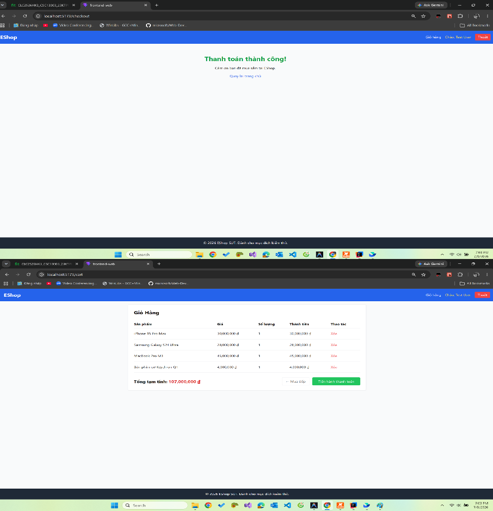
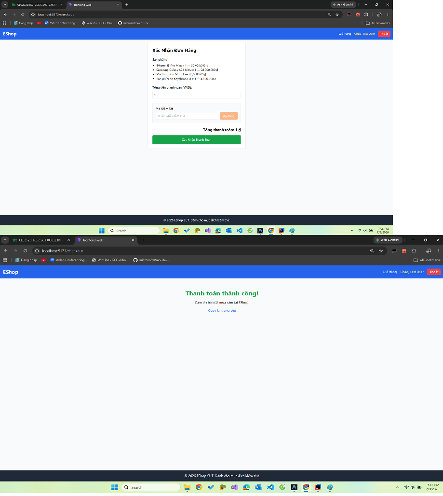
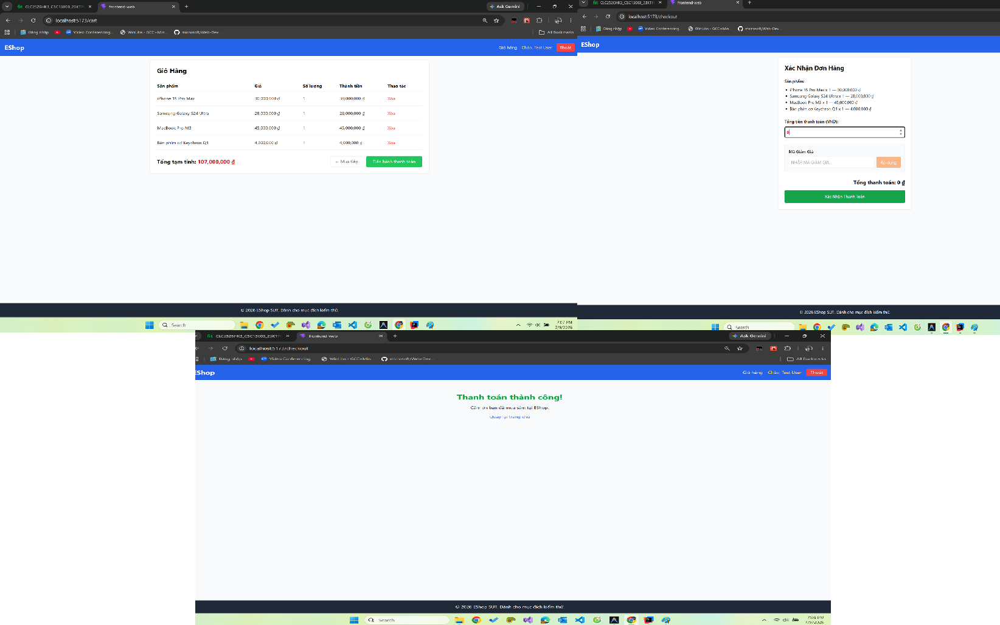
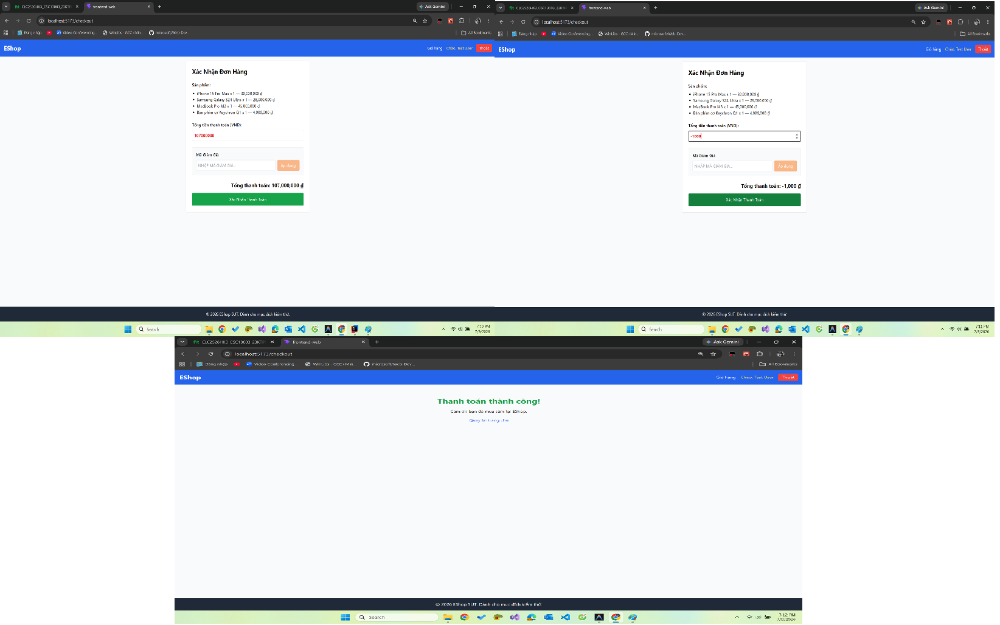
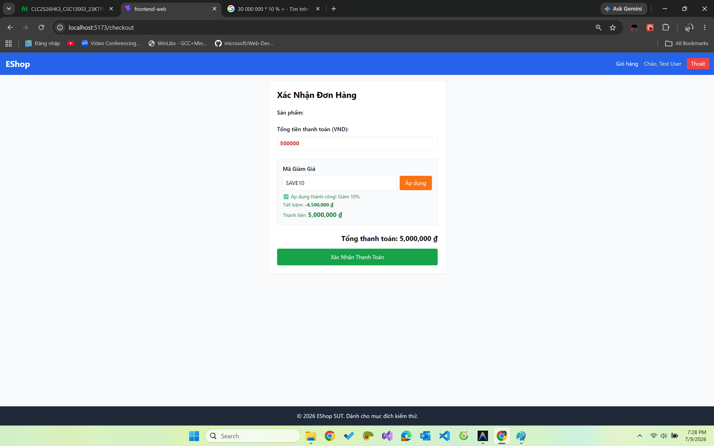
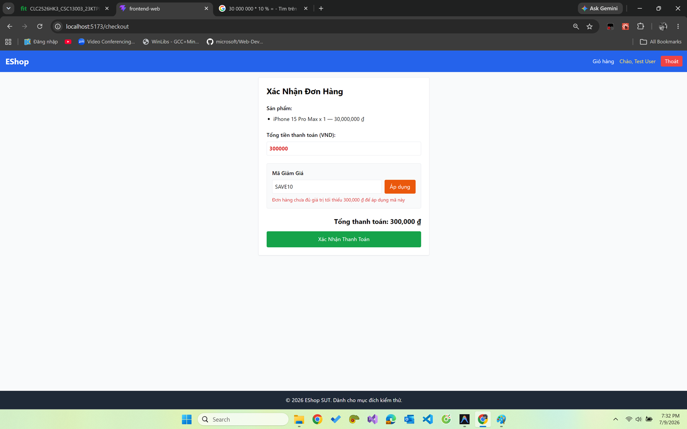
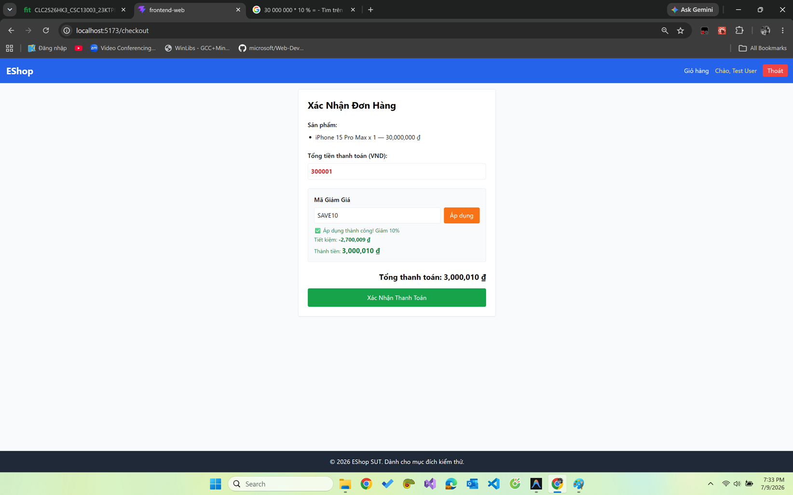

<!-- File: FR-08_TestReport.md -->

# BÁO CÁO KIỂM THỬ: FR-08 & FR-09 (Thanh Toán & Mã Giảm Giá)

## 1. Phân hoạch tương đương (Equivalence Partitioning & Domain Analysis)

Dựa trên việc đối chiếu đặc tả (README) và giao diện thực tế (UI), ta có các phân hoạch sau:

**1.1. Biến `total_amount` (UI - Trang Thanh Toán):**

- **Nguồn:** Trường tổng tiền trên giao diện.
- **Ràng buộc UI thật:** Giao diện render thẻ `<input type="number">` (biến `editableTotal` trong `Checkout.jsx`), cho phép người dùng **tự do chỉnh sửa tổng tiền** trực tiếp.
- **Ràng buộc Đặc tả:** FR-08 yêu cầu "Tính tự động từ giỏ hàng và không cho phép người dùng chỉnh sửa trực tiếp".
- **VEC-TA-1:** Số tiền hợp lệ, khớp với tổng giỏ hàng (VD: 500000).
- **IEC-TA-1:** Số tiền bằng 0.
- **IEC-TA-2:** Số tiền âm (VD: -1000).
- **IEC-TA-3:** Số tiền giả mạo tăng cao (VD: 999999999) - do UI cho phép nhập.
- **Ghi chú Inconsistency:** Giao diện cho phép người dùng nhập/sửa `total_amount` là sai hoàn toàn so với đặc tả.

**1.2. Biến `code` (UI - Nhập mã giảm giá):**

- **Nguồn:** Trường nhập mã giảm giá.
- **VEC-CODE-1:** Mã tồn tại, hợp lệ và còn hạn (VD: `SAVE10`).
- **IEC-CODE-1:** Mã không tồn tại (VD: `NONEXIST`).
- **IEC-CODE-2:** Mã đã hết hạn (VD: `EXPIRED`).
- **IEC-CODE-3:** Bỏ trống.

**1.3. Điều kiện `min_order_amount` (Áp dụng Coupon):**

- **Mô tả:** Tổng đơn hàng phải >= ngưỡng tối thiểu của coupon (VD: `SAVE10` yêu cầu 300.000đ).
- **VEC-MIN-1:** Tổng tiền đơn hàng thỏa mãn điều kiện (VD: 500000).
- **IEC-MIN-1:** Tổng tiền đơn hàng nhỏ hơn điều kiện (VD: 150000).
- **Ghi chú Inconsistency:** Backend dùng logic `>` thay vì `>=` như đặc tả. Cụ thể, `total_amount > coupon.min_order_amount`. Ta thiết kế biên theo UI/Backend thực tế, nhưng Expected phải theo `>=` của spec.

---

## 2. Phân tích giá trị biên (Boundary Value Analysis)

**2.1. Biên của `total_amount` so với `min_order_amount` (Ví dụ mã SAVE10, min=300.000):**

- **Biên (Theo Code Thực Tế):** Logic backend hiện tại là `total_amount > 300000`.
- **Điểm biên:**
  - `total_amount = 299999` (OFF)
  - `total_amount = 300000` (ON)
  - `total_amount = 300001` (OFF)

**2.2. Biên của `max_uses_per_user` (Ví dụ mã VIP100, max=2):**

- **Biên:** Tối đa 2 lần.
- **Điểm biên:**
  - `usage_count = 1` (OFF - Hợp lệ)
  - `usage_count = 2` (ON - Không hợp lệ)
  - `usage_count = 3` (OFF - Không hợp lệ)

---

## 3. Bảng thiết kế Test Case (Test Case DESIGN)

| Test Case ID | Mục đích (Objective)                     | Tiền điều kiện (Pre-conditions)                | Các bước (Steps)                                              | Dữ liệu đầu vào (Input)                    | Kết quả mong đợi CHUẨN (Expected — spec-correct)          | Loại Input (Valid/Invalid) | Ưu tiên (Priority) |
| ------------ | ---------------------------------------- | ---------------------------------------------- | ------------------------------------------------------------- | ------------------------------------------ | --------------------------------------------------------- | -------------------------- | ------------------ |
| FR08-TC-A01  | Checkout thành công với giỏ hàng hợp lệ  | User đã đăng nhập, giỏ hàng có SP trị giá 500k | Vào trang Thanh toán, bấm Đặt hàng                            | `total_amount` = 500000 (không sửa)        | Tạo đơn hàng thành công, xóa giỏ hàng                     | Valid                      | High               |
| FR08-TC-A02  | Checkout với tổng tiền bị giả mạo qua UI | User có giỏ hàng 500k                          | Vào Thanh toán, sửa `<input>` tổng tiền thành 1, bấm Đặt hàng | `total_amount` = 1 (sửa tay trên UI)       | Hệ thống từ chối thanh toán, báo lỗi tổng tiền không khớp | Invalid                    | High               |
| FR08-TC-A03  | Checkout với tổng tiền = 0               | User có giỏ hàng                               | Sửa tổng tiền thành 0, bấm Đặt hàng                           | `total_amount` = 0                         | Hệ thống từ chối thanh toán                               | Invalid                    | Medium             |
| FR08-TC-A04  | Checkout với tổng tiền âm                | User có giỏ hàng                               | Sửa tổng tiền thành -1000, bấm Đặt hàng                       | `total_amount` = -1000                     | Hệ thống từ chối thanh toán                               | Invalid                    | Medium             |
| FR08-TC-A05  | Áp dụng mã hợp lệ, thỏa mãn điều kiện    | Giỏ hàng = 500k                                | Nhập mã `SAVE10` (min 300k), bấm Áp dụng                      | `code` = `SAVE10`, `total_amount` = 500000 | Áp dụng thành công, trừ đi 10% (50k)                      | Valid                      | High               |
| FR08-TC-A06  | Áp dụng mã không tồn tại                 | Giỏ hàng = 500k                                | Nhập mã `NONEXIST`, bấm Áp dụng                               | `code` = `NONEXIST`                        | Báo lỗi mã không tồn tại                                  | Invalid                    | Medium             |
| FR08-TC-A07  | Áp dụng mã đã hết hạn                    | Giỏ hàng = 500k                                | Nhập mã `EXPIRED`, bấm Áp dụng                                | `code` = `EXPIRED`                         | Báo lỗi mã giảm giá đã hết hạn                            | Invalid                    | Medium             |
| FR08-TC-B01  | BVA: total_amount = 299.999 (Dưới biên)  | Giỏ hàng = 299.999đ                            | Nhập mã `SAVE10`, bấm Áp dụng                                 | `total_amount` = 299999                    | Báo lỗi đơn hàng chưa đủ giá trị tối thiểu 300k           | Invalid                    | Medium             |
| FR08-TC-B02  | BVA: total_amount = 300.000 (Tại biên)   | Giỏ hàng = 300.000đ                            | Nhập mã `SAVE10`, bấm Áp dụng                                 | `total_amount` = 300000                    | **Áp dụng thành công** (Do spec ghi `>=`)                 | Valid                      | High               |
| FR08-TC-B03  | BVA: total_amount = 300.001 (Trên biên)  | Giỏ hàng = 300.001đ                            | Nhập mã `SAVE10`, bấm Áp dụng                                 | `total_amount` = 300001                    | Áp dụng thành công                                        | Valid                      | Medium             |

---

## 4. Khung thực thi (Test EXECUTION Skeleton)

| Test Case ID | Kết quả thực tế (Actual)                                                                                             | Trạng thái (Pass/Fail/Blocked) | Ngày chạy  | Người test    | Bug ID liên quan | Minh chứng                                 |
| ------------ | -------------------------------------------------------------------------------------------------------------------- | ------------------------------ | ---------- | ------------- | ---------------- | ------------------------------------------ |
| FR08-TC-A01  | Đơn hàng tạo thành công, hiện 'Thanh toán thành công!'. NHƯNG giỏ hàng KHÔNG được xóa (hàm clearCart không được gọi) | Fail                           | 2026-07-09 | Ninh Văn Khải | BUG-FR08-07      |  |
| FR08-TC-A02  | Sửa input tổng tiền = 1 → API nhận số giả mạo → thanh toán thành công đơn 1đ                                         | Fail                           | 2026-07-09 | Ninh Văn Khải | BUG-FR08-01, 02  |  |
| FR08-TC-A03  | Sửa input = 0 → API chấp nhận → thanh toán thành công đơn 0đ                                                         | Fail                           | 2026-07-09 | Ninh Văn Khải | BUG-FR08-01, 02  |  |
| FR08-TC-A04  | Sửa input = -1000 → API chấp nhận → thanh toán thành công đơn giá âm                                                 | Fail                           | 2026-07-09 | Ninh Văn Khải | BUG-FR08-01, 02  |  |
| FR08-TC-A05  | Nhập SAVE10, total 500k → discount bị tính âm làm final = 5 triệu. UI hiện 'Thành tiền 5.000.000 đ'                  | Fail                           | 2026-07-09 | Ninh Văn Khải | BUG-FR08-06      |  |
| FR08-TC-A06  | Nhập NONEXIST → apply-coupon trả 404 lỗi → hiển thị 'Mã giảm giá không tồn tại...'                                   | Pass                           | 2026-07-09 | Ninh Văn Khải | —                | -                                          |
| FR08-TC-A07  | Nhập EXPIRED → apply-coupon trả lỗi hết hạn → hiển thị 'mã đã hết hạn' (nếu đơn đủ min order)                        | Pass                           | 2026-07-09 | Ninh Văn Khải | —                | -                                          |
| FR08-TC-B01  | total 299999 + SAVE10 → backend báo chưa đủ giá trị tối thiểu 300k                                                   | Pass                           | 2026-07-09 | Ninh Văn Khải | —                | -                                          |
| FR08-TC-B02  | total 300000 + SAVE10 → backend từ chối báo chưa đủ tối thiểu (do dùng `>`)                                          | Fail                           | 2026-07-09 | Ninh Văn Khải | BUG-FR08-04      |  |
| FR08-TC-B03  | total 300001 + SAVE10 → qua ngưỡng, nhưng discount tính sai làm giá x10 (từ 300.001 -> 3.000.010)                    | Fail                           | 2026-07-09 | Ninh Văn Khải | BUG-FR08-06      |  |

---

## 5. Báo cáo Lỗi (Defect / Bug Report) - Phân tích tĩnh (Static Analysis)

| Bug ID      | Test case liên quan                   | Tiêu đề (Title)                                                                  | Tiền điều kiện & Môi trường | Các bước tái hiện (đánh số)                                                                       | Kết quả mong đợi                                                | Kết quả thực tế                                                      | Severity | Priority | Trạng thái | Bằng chứng (ảnh/log)                         |
| ----------- | ------------------------------------- | -------------------------------------------------------------------------------- | --------------------------- | ------------------------------------------------------------------------------------------------- | --------------------------------------------------------------- | -------------------------------------------------------------------- | -------- | -------- | ---------- | -------------------------------------------- |
| BUG-FR08-01 | FR08-TC-A02, FR08-TC-A03, FR08-TC-A04 | **[Blocker] Cho phép sửa tổng tiền trực tiếp trên UI (editableTotal)**           | Web (UI)                    | 1. Có sản phẩm trong giỏ 2. Vào Thanh toán 3. Sửa số tiền ở trường input 4. Bấm Đặt hàng | Trường tổng tiền phải là text (read-only), không chỉnh sửa được | Trường là `<input type="number">` cho phép sửa tùy ý                 | Critical | High     | Open       | `` |
| BUG-FR08-04 | FR08-TC-B02                           | Logic min_order_amount dùng dấu lớn hơn `>` thay vì `>=`                         | Web (UI)                    | 1. Mua đúng 300k 2. Áp dụng mã SAVE10 (min 300k)                                               | Áp dụng mã thành công                                           | Báo lỗi chưa đủ giá trị tối thiểu                                    | Medium   | Medium   | Open       | `` |
| BUG-FR08-06 | FR08-TC-A05, FR08-TC-B03              | **[Blocker] Công thức tính percent sai lệch (âm giá trị làm tăng x10 giá tiền)** | Web (UI)                    | 1. Áp mã % (vd SAVE10 - 10%) 2. Bấm áp dụng                                                    | Giá được giảm 10%                                               | Tính discount âm nên cộng thêm tiền vào đơn thành gấp 10 lần giá trị | Critical | High     | Open       | `` |
| BUG-FR08-07 | FR08-TC-A01                           | Không xóa giỏ hàng (clearCart) sau khi thanh toán thành công                     | Web (UI)                    | 1. Đặt hàng thành công 2. Xem lại giỏ hàng                                                     | Giỏ hàng trống                                                  | Giỏ hàng vẫn còn nguyên sản phẩm đã đặt                              | Medium   | Medium   | Open       | `` |

---

## 6. Tóm tắt Kiểm thử (Test Summary)

- **Thống kê Test Case:**
  - Thiết kế (Designed): 10
  - Đã chạy (Executed): 10
  - Passed: 3
  - Failed: 7
  - Blocked: 0

- **Thống kê Báo cáo lỗi:**
  - **Critical:** 2 (Bypass thay đổi giá trên UI, Công thức discount sai)
  - **High:** 0
  - **Medium:** 2 (Sai dấu `>=` thành `>`, Không xóa giỏ hàng)
  - **Low:** 0
  - **Tổng cộng:** 4 Bugs

- **Đánh giá rủi ro & Khuyến nghị:**
  - **Rủi ro CỰC KỲ NGHIÊM TRỌNG:** Lỗ hổng cho phép thay đổi `total_amount` trên UI cộng với việc Backend không tính toán lại giá trị khiến hệ thống hoàn toàn thất thoát tài chính. Một hacker có thể mua hàng nghìn sản phẩm với giá 1 VNĐ.
  - **Khuyến nghị sửa ngay:**
    1. `Checkout.jsx`: Xóa `<input type="number">` cho tổng tiền, chỉ hiển thị số đã tính (read-only span/div).
    2. `server.js`: API `/api/checkout` và `/api/apply-coupon` tuyệt đối không nhận `total_amount` từ req.body. Backend phải lấy danh sách sản phẩm trong giỏ hàng hiện tại, join với bảng products để tính ra tổng tiền thực tế.

---

### Phụ lục A — Inconsistency đặc tả (readme) vs UI thật

| Biến           | Readme yêu cầu               | UI thật thực hiện              | Ảnh hưởng tới test                                          | Ghi chú/Finding        |
| -------------- | ---------------------------- | ------------------------------ | ----------------------------------------------------------- | ---------------------- |
| `total_amount` | Tính tự động, KHÔNG được sửa | UI cung cấp input để sửa tự do | Có thể test exploit thay đổi giá trị trực tiếp ngay trên UI | Ghi nhận BUG Critical. |
| Logic Coupon   | `>= min_order_amount`        | Dùng `>` cho min_order         | Tại điểm biên sẽ ra kết quả Fail so với Spec                | Ghi nhận BUG Medium.   |

### Phụ lục B — Lỗi tầng API/Backend (ngoài phạm vi chấm chức năng UI)

Các lỗi dưới đây phát hiện qua phân tích code/API, nằm ngoài phạm vi kiểm thử chức năng qua UI của HW02; đưa vào đây để tham khảo, không tính vào thống kê bug chức năng.

| Bug ID | Test case liên quan | Tiêu đề (Title) | Tiền điều kiện & Môi trường | Các bước tái hiện (đánh số) | Kết quả mong đợi | Kết quả thực tế | Severity | Priority | Trạng thái | Bằng chứng (ảnh/log) |
| -------------| ---------------------------------------| ----------------------------------------------------------------------------------| -----------------------------| ---------------------------------------------------------------------------------------------------| -----------------------------------------------------------------| ----------------------------------------------------------------------| ----------| ----------| ------------| ----------------------------------------------|
| BUG-FR08-02 | FR08-TC-A02, FR08-TC-A03, FR08-TC-A04 | **[Blocker] Backend API checkout không xác thực total_amount** | Web / API | 1. Sửa tổng tiền thành 1 VND 2. Bấm Đặt hàng | API phải tự tính lại tổng từ giỏ hàng và từ chối nếu không khớp | API tạo thành công đơn hàng triệu đồng với giá 1 VND | Critical | High | Open | `` |
| BUG-FR08-03 | - | **[Blocker] Backend API apply-coupon không xác thực total_amount** | Web / API | 1. Sửa tổng tiền vượt ngưỡng coupon 2. Áp dụng mã | Từ chối vì tổng thực tế giỏ hàng chưa đủ | Chấp nhận áp dụng mã dựa trên số giả mạo | Critical | High | Open | - |
| BUG-FR08-05 | - | Lỗi không giới hạn usage_count đối với Guest Checkout (nếu có) | Web / API | 1. Checkout không đăng nhập (nếu app cho phép) 2. Dùng mã VIP100 | Guest cũng bị từ chối nếu dùng quá giới hạn (hoặc cấm dùng mã) | API bỏ qua hàm check `usage_count` nếu `user_id` bị null | High | Medium | Open | - |

### Phụ lục C — Reserved cho bài API Testing

_(Các case Postman gọi bypass frontend không được tính vào bài HW02)_

| Test Case ID | Mục đích (Objective)                      | API Endpoint             | Body/Params                                            | Expected                           |
| ------------ | ----------------------------------------- | ------------------------ | ------------------------------------------------------ | ---------------------------------- |
| FR08-API-01  | Gửi `total_amount` âm                     | `POST /api/checkout`     | `{"total_amount": -50000}`                             | HTTP 400 - Từ chối                 |
| FR08-API-02  | Guest không truyền `user_id` apply coupon | `POST /api/apply-coupon` | `{"code": "VIP100", "total_amount": 500000}` (no auth) | Không cho phép apply hoặc giới hạn |
