<!-- File: FR-15_TestReport.md -->

​

# BÁO CÁO KIỂM THỬ: FR-15 — Quản lý Sản phẩm (Tạo / Cập nhật qua Admin Panel)

​

## 1. Phân hoạch tương đương (Equivalence Partitioning & Domain Analysis)

​
Dựa trên việc đối chiếu đặc tả (README) và giao diện thực tế (UI thực thi trên frontend), ta có các phân hoạch sau:
​
**1.1. Biến `name` (UI - Tên sản phẩm):**

- **Nguồn:** Trường nhập tên sản phẩm trên form Admin (`productForm.name`).
- **Ràng buộc UI thật:** Thẻ `<input type="text">` có thuộc tính `required` của HTML5. Không giới hạn độ dài (`maxLength`). Không tự động trim khoảng trắng. Không có nhãn hiển thị và ký hiệu `*` bắt buộc.
- **Ràng buộc Đặc tả:** Bắt buộc, tối đa 255 ký tự. Phải có dấu `*` bên cạnh nhãn.
- **VEC-name-1:** Chuỗi ký tự hợp lệ, độ dài từ 1 đến 255 ký tự (VD: `"Bàn phím cơ"`).
- **VEC-name-2:** Chuỗi ký tự chứa ký tự đặc biệt hoặc số, độ dài từ 1 đến 255 ký tự (VD: `"Chuột chơi game G-102 @!"`).
- **IEC-name-1:** Chuỗi rỗng `""` (Bỏ trống) — bị chặn bởi `required` của HTML5 ở frontend.
- **IEC-name-2:** Chuỗi chỉ chứa các khoảng trắng `"   "` — vượt qua được kiểm tra `required` ở frontend.
- **IEC-name-3:** Chuỗi có độ dài vượt quá 255 ký tự (VD: chuỗi 256 ký tự) — không bị chặn ở frontend do thiếu `maxLength`.
- **Ghi chú Inconsistency:** Giao diện thiếu nhãn hiển thị và ký hiệu `*` bắt buộc (vi phạm FR-22), thiếu giới hạn độ dài `maxLength` ở frontend (vi phạm FR-15).
  ​
  **1.2. Biến `price` (UI - Giá tiền):**
- **Nguồn:** Trường nhập giá tiền trên form Admin (`productForm.price`).
- **Ràng buộc UI thật:** Thẻ `<input type="number">` nhưng không có thuộc tính `min` và `required`. Không có nhãn hiển thị và ký hiệu `*` bắt buộc.
- **Ràng buộc Đặc tả:** Bắt buộc, phải là số dương (> 0). Phải có dấu `*` bên cạnh nhãn. Định dạng phân cách hàng nghìn.
- **VEC-price-1:** Số nguyên dương lớn hơn 0 (VD: `150000`).
- **IEC-price-1:** Bỏ trống (chuỗi rỗng `""`) — vượt qua được frontend do thiếu `required`.
- **IEC-price-2:** Giá trị bằng 0 — vượt qua được frontend do thiếu `min="1"`.
- **IEC-price-3:** Giá trị số âm (VD: `-50000`) — vượt qua được frontend do thiếu `min="1"`.
- **IEC-price-4:** Số thực thập phân (VD: `99.99` hoặc `1500.5`) — vượt qua được frontend (backend lưu dạng REAL mặc dù schema khai báo INTEGER).
- **Ghi chú Inconsistency:** Giao diện thiếu nhãn hiển thị và ký hiệu `*` bắt buộc (vi phạm FR-22). Giá hiển thị trên danh sách sản phẩm thiếu định dạng phân cách hàng nghìn (vi phạm FR-21). Frontend hoàn toàn thiếu kiểm tra giá trị âm/trống cho trường Giá tiền (vi phạm FR-15).
  ​
  **1.3. Biến `category_id` (UI - Danh mục):**
- **Nguồn:** Thẻ `<select>` chọn danh mục.
- **Ràng buộc UI thật:** Chọn một trong các option danh mục được load từ cơ sở dữ liệu.
- **Ràng buộc Đặc tả:** Bắt buộc, phải chọn từ danh mục có sẵn. Phải có dấu `*` bên cạnh nhãn.
- **VEC-cat-1:** Danh mục hợp lệ được chọn từ danh sách dropdown (VD: `1`).
- **Ghi chú Inconsistency:** Giao diện thiếu nhãn hiển thị và ký hiệu `*` bắt buộc (vi phạm FR-22).
  ​
  **1.4. Các trường tùy chọn (`imageUrl`, `description`):**
- **Nguồn:** Trường "URL Ảnh" (`imageUrl`) và "Mô tả" (`description`).
- **Ràng buộc UI thật & Đặc tả:** Tùy chọn, không bắt buộc.
- **VEC-opt-1:** Có nhập giá trị hợp lệ.
- **VEC-opt-2:** Để trống.
  ​

---

​

## 2. Phân tích giá trị biên (Boundary Value Analysis)

​
**2.1. Biến `name` (Độ dài tên sản phẩm):**

- **Biên đặc tả:** `length ∈ [1, 255]`.
- **Điểm biên:**
  - `length = 0` (Below biên dưới, OFF - Không hợp lệ)
  - `length = 1` (Biên dưới, ON - Hợp lệ)
  - `length = 2` (Above biên dưới - Hợp lệ)
  - `length = 254` (Below biên trên - Hợp lệ)
  - `length = 255` (Biên trên, ON - Hợp lệ)
  - `length = 256` (Above biên trên, OFF - Không hợp lệ)
    ​
    **2.2. Biến `price` (Giá trị số nguyên):**
- **Biên đặc tả:** `price ≥ 1` (Giá phải là số dương (> 0). Đối với số nguyên, giá trị dương nhỏ nhất là 1).
- **Điểm biên:**
  - `price = -1` (Không hợp lệ)
  - `price = 0` (Biên đặc tả nghiệp vụ, OFF - Không hợp lệ)
  - `price = 1` (Biên dưới, ON - Hợp lệ)
  - `price = 2` (Above biên dưới - Hợp lệ)
    ​

---

​

## 3. Bảng thiết kế Test Case (Test Case DESIGN)

​
| Test Case ID | Mục đích (Objective) | Tiền điều kiện (Pre-conditions) | Các bước (Steps) | Dữ liệu đầu vào (Input) | Kết quả mong đợi CHUẨN (Expected — spec-correct) | Loại Input (Valid/Invalid) | Ưu tiên (Priority) |
|---|---|---|---|---|---|---|---|
| FR15-TC-A01 | Thêm sản phẩm mới thành công qua UI với thông tin hợp lệ | Admin đã đăng nhập, ở tab "Sản phẩm", đã có danh mục trong DB | 1. Nhập Tên sản phẩm 2. Nhập Giá tiền 3. Nhập URL Ảnh 4. Nhập Mô tả 5. Chọn Danh mục 6. Bấm "Lưu sản phẩm" | `name` = "Bàn phím cơ AKKO" `price` = 1500000 `imageUrl` = "https://placehold.co/150" `description` = "Bàn phím cơ TKL" `category_id` = 1 | Hệ thống tạo sản phẩm thành công, thông báo thành công, sản phẩm mới hiển thị dưới danh sách với giá định dạng phân cách hàng nghìn "1.500.000 ₫". | Valid | High |
| FR15-TC-A02 | Sửa thông tin sản phẩm thành công và không ảnh hưởng sản phẩm khác | Admin đã đăng nhập, danh sách có ít nhất 2 sản phẩm (SP A và SP B) | 1. Bấm nút "Sửa" ở dòng sản phẩm A 2. Nhập tên sản phẩm mới 3. Bấm "Lưu sản phẩm" | Chọn sản phẩm A, thay đổi `name` thành "Bàn phím cơ AKKO PRO" | Chỉ sản phẩm A bị cập nhật tên thành "Bàn phím cơ AKKO PRO". Sản phẩm B và các sản phẩm khác giữ nguyên thông tin ban đầu. | Valid | High |
| FR15-TC-A03 | Sửa Giá tiền và Danh mục của một sản phẩm và lưu thành công | Admin đã đăng nhập, danh sách có ít nhất 2 sản phẩm | 1. Bấm "Sửa" ở sản phẩm A 2. Đổi Giá tiền và Danh mục 3. Bấm "Lưu sản phẩm" | Chọn SP A, đổi `price` = 250000, `category_id` = 2 | Chỉ SP A cập nhật giá và danh mục mới; các SP khác giữ nguyên; danh sách hiển thị giá mới ngay lập tức. | Valid | High |
| FR15-TC-A04 | Thêm sản phẩm có tên chứa ký tự đặc biệt và số (VEC-name-2) | Admin đã đăng nhập, ở tab "Sản phẩm" | 1. Nhập Tên có ký tự đặc biệt/số 2. Nhập Giá hợp lệ 3. Bấm "Lưu sản phẩm" | `name` = "Chuột chơi game G-102 @!" `price` = 350000 | Tạo sản phẩm thành công, tên hiển thị đầy đủ và chính xác các ký tự đặc biệt trong danh sách. | Valid | Medium |
| FR15-TC-A05 | Xóa một sản phẩm khỏi danh sách (chức năng Delete của CRUD) | Admin đã đăng nhập, danh sách có ít nhất 1 sản phẩm | 1. Bấm nút "Xóa" ở dòng sản phẩm cần xóa | Chọn 1 sản phẩm bất kỳ | Sản phẩm bị xóa khỏi CSDL và biến mất khỏi danh sách sau khi tải lại dữ liệu. | Valid | High |
| FR15-TC-A06 | Kiểm tra có hộp thoại xác nhận trước khi Xóa sản phẩm | Admin đã đăng nhập, danh sách có sản phẩm | 1. Bấm nút "Xóa" ở một sản phẩm 2. Quan sát trước khi sản phẩm bị xóa | Bấm "Xóa" ở 1 sản phẩm | Hệ thống hiển thị hộp thoại xác nhận ("Bạn có chắc muốn xóa?") và chỉ xóa khi người dùng đồng ý. | Valid | Medium |
| FR15-TC-B01 | Lỗi thêm sản phẩm để trống Tên sản phẩm | Admin đã đăng nhập, ở tab "Sản phẩm" | 1. Để trống ô "Tên sản phẩm" 2. Nhập Giá tiền hợp lệ 3. Bấm "Lưu sản phẩm" | `name` = "" `price` = 150000 | Trình duyệt chặn submit form và hiển thị cảnh báo yêu cầu nhập tên sản phẩm (HTML5 Validation). | Invalid | High |
| FR15-TC-B02 | Lỗi thêm sản phẩm với tên chỉ chứa khoảng trắng | Admin đã đăng nhập, ở tab "Sản phẩm" | 1. Nhập Tên sản phẩm chỉ chứa khoảng trắng 2. Nhập Giá tiền hợp lệ 3. Bấm "Lưu sản phẩm" | `name` = " " `price` = 150000 | Hệ thống từ chối submit, hiển thị lỗi yêu cầu tên sản phẩm không được rỗng. | Invalid | High |
| FR15-TC-B03 | Lỗi thêm sản phẩm để trống Giá tiền | Admin đã đăng nhập, ở tab "Sản phẩm" | 1. Nhập Tên sản phẩm hợp lệ 2. Để trống ô "Giá tiền" 3. Bấm "Lưu sản phẩm" | `name` = "Sản phẩm mẫu" `price` = "" | Hệ thống chặn submit, hiển thị lỗi yêu cầu nhập giá tiền. | Invalid | High |
| FR15-TC-B04 | Lỗi thêm sản phẩm với giá tiền âm | Admin đã đăng nhập, ở tab "Sản phẩm" | 1. Nhập Tên sản phẩm hợp lệ 2. Nhập giá tiền âm 3. Bấm "Lưu sản phẩm" | `name` = "Sản phẩm mẫu" `price` = -50000 | Hệ thống chặn submit, báo lỗi giá tiền phải lớn hơn 0. | Invalid | High |
| FR15-TC-B05 | Lỗi thêm sản phẩm với giá tiền bằng 0 | Admin đã đăng nhập, ở tab "Sản phẩm" | 1. Nhập Tên sản phẩm hợp lệ 2. Nhập giá tiền bằng 0 3. Bấm "Lưu sản phẩm" | `name` = "Sản phẩm mẫu" `price` = 0 | Hệ thống chặn submit, báo lỗi giá tiền phải lớn hơn 0. | Invalid | High |
| FR15-TC-B06 | Lỗi thêm sản phẩm với Giá tiền là số thập phân (IEC-price-4) | Admin đã đăng nhập, ở tab "Sản phẩm" | 1. Nhập Tên hợp lệ 2. Nhập Giá tiền thập phân 3. Bấm "Lưu sản phẩm" | `name` = "Sản phẩm mẫu" `price` = 99.99 | Hệ thống chặn submit, báo lỗi giá tiền phải là số nguyên (theo đặc tả schema INTEGER). | Invalid | Medium |
| FR15-TC-C01 | BVA: Thêm sản phẩm có Tên sản phẩm = 1 ký tự (Biên dưới) | Admin đã đăng nhập, ở tab "Sản phẩm" | 1. Nhập Tên sản phẩm 1 ký tự 2. Nhập Giá tiền hợp lệ 3. Bấm "Lưu sản phẩm" | `name` = "A" `price` = 10000 | Tạo sản phẩm thành công, hiển thị trong danh sách. | Valid | Medium |
| FR15-TC-C02 | BVA: Thêm sản phẩm có Tên sản phẩm = 255 ký tự (Biên trên) | Admin đã đăng nhập, ở tab "Sản phẩm" | 1. Nhập Tên sản phẩm dài 255 ký tự 2. Nhập Giá tiền hợp lệ 3. Bấm "Lưu sản phẩm" | `name` = "A".repeat(255) `price` = 10000 | Tạo sản phẩm thành công, hiển thị trong danh sách. | Valid | Medium |
| FR15-TC-C03 | BVA: Lỗi thêm sản phẩm có Tên sản phẩm = 256 ký tự (Vượt biên trên) | Admin đã đăng nhập, ở tab "Sản phẩm" | 1. Nhập Tên sản phẩm dài 256 ký tự 2. Nhập Giá tiền hợp lệ 3. Bấm "Lưu sản phẩm" | `name` = "A".repeat(256) `price` = 10000 | Hệ thống báo lỗi tên sản phẩm không được vượt quá 255 ký tự và chặn submit. | Invalid | Medium |
| FR15-TC-C04 | BVA: Thêm sản phẩm có Tên sản phẩm = 2 ký tự (Trên biên dưới) | Admin đã đăng nhập, ở tab "Sản phẩm" | 1. Nhập Tên 2 ký tự 2. Nhập Giá hợp lệ 3. Bấm "Lưu sản phẩm" | `name` = "AB" `price` = 10000 | Tạo sản phẩm thành công, hiển thị trong danh sách. | Valid | Low |
| FR15-TC-C05 | BVA: Thêm sản phẩm có Tên sản phẩm = 254 ký tự (Dưới biên trên) | Admin đã đăng nhập, ở tab "Sản phẩm" | 1. Nhập Tên dài 254 ký tự 2. Nhập Giá hợp lệ 3. Bấm "Lưu sản phẩm" | `name` = "A".repeat(254) `price` = 10000 | Tạo sản phẩm thành công, hiển thị trong danh sách. | Valid | Low |
| FR15-TC-D01 | BVA: Thêm sản phẩm với Giá tiền = 1 (Số dương nhỏ nhất) | Admin đã đăng nhập, ở tab "Sản phẩm" | 1. Nhập Tên sản phẩm hợp lệ 2. Nhập Giá tiền = 1 3. Bấm "Lưu sản phẩm" | `name` = "Sản phẩm giá 1đ" `price` = 1 | Tạo sản phẩm thành công, hiển thị giá "1 ₫". | Valid | Medium |
| FR15-TC-D02 | BVA: Thêm sản phẩm với Giá tiền = 2 | Admin đã đăng nhập, ở tab "Sản phẩm" | 1. Nhập Tên sản phẩm hợp lệ 2. Nhập Giá tiền = 2 3. Bấm "Lưu sản phẩm" | `name` = "Sản phẩm giá 2đ" `price` = 2 | Tạo sản phẩm thành công, hiển thị giá "2 ₫". | Valid | Low |
| FR15-TC-D03 | BVA: Lỗi thêm sản phẩm với Giá tiền = -1 (Dưới biên dưới) | Admin đã đăng nhập, ở tab "Sản phẩm" | 1. Nhập Tên hợp lệ 2. Nhập Giá tiền = -1 3. Bấm "Lưu sản phẩm" | `name` = "Sản phẩm giá -1" `price` = -1 | Hệ thống chặn submit, báo lỗi giá tiền phải lớn hơn 0. | Invalid | Medium |
| FR15-TC-E01 | Thêm sản phẩm không nhập URL ảnh và Mô tả | Admin đã đăng nhập, ở tab "Sản phẩm" | 1. Nhập Tên sản phẩm hợp lệ 2. Nhập Giá tiền hợp lệ 3. Để trống ô "URL Ảnh" và "Mô tả" 4. Bấm "Lưu sản phẩm" | `name` = "Bàn di chuột" `price` = 50000 `imageUrl` = "" `description` = "" | Tạo sản phẩm thành công. Cột ảnh hiển thị ảnh placeholder mặc định. | Valid | Medium |
​

---

​

## 4. Khung thực thi (Test EXECUTION Skeleton)

​
| Test Case ID | Kết quả thực tế (Actual) | Trạng thái (Pass/Fail/Blocked) | Ngày chạy | Người test | Bug ID liên quan | Minh chứng |
|---|---|---|---|---|---|---|
| FR15-TC-A01 | Tạo SP thành công nhưng KHÔNG hiện thông báo (alert); giá hiển thị dạng thô 1500000 ₫ (thiếu phân cách hàng nghìn) | Fail | 2026-07-09 | Ninh Văn Khải | BUG-FR15-05, BUG-FR15-09 | 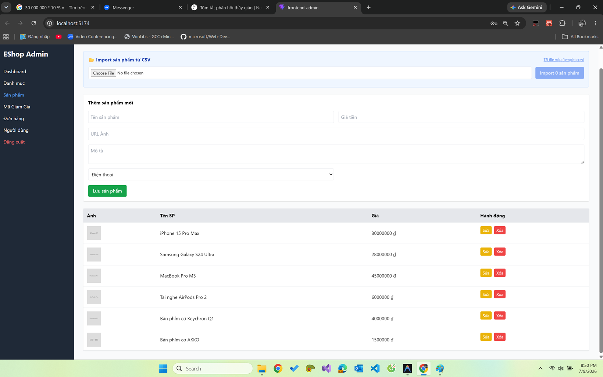 |
| FR15-TC-A02 | Cập nhật tên SP A thành công, nhưng TOÀN BỘ sản phẩm khác trong danh sách cũng bị đổi tên theo SP A (chỉ trở lại đúng sau khi F5) | Fail | 2026-07-09 | Ninh Văn Khải | BUG-FR15-01 | 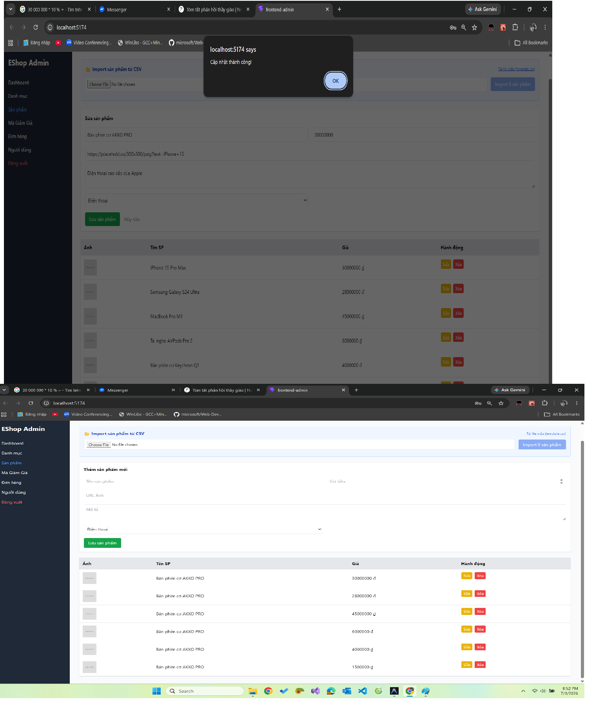 |
| FR15-TC-A03 | Giá & danh mục mới chỉ được ghi ở backend, KHÔNG cập nhật trên danh sách; đồng thời tên toàn bộ SP bị ghi đè theo SP A (lỗi state) | Fail | 2026-07-09 | Ninh Văn Khải | BUG-FR15-01 | 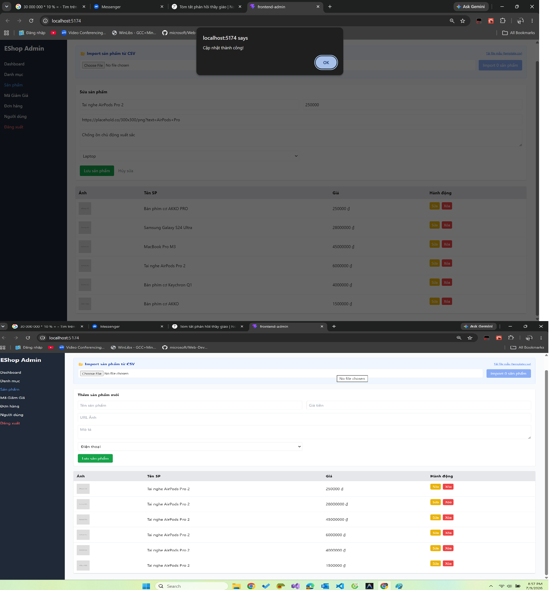 |
| FR15-TC-A04 | Tạo SP thành công, tên chứa ký tự đặc biệt 'G-102 @!' hiển thị đầy đủ và chính xác | Pass | 2026-07-09 | Ninh Văn Khải | — | - |
| FR15-TC-A05 | Bấm 'Xóa' gọi DELETE rồi fetchData(); sản phẩm biến mất khỏi danh sách | Pass | 2026-07-09 | Ninh Văn Khải | — | - |
| FR15-TC-A06 | Bấm 'Xóa' xóa sản phẩm NGAY LẬP TỨC, không có hộp thoại xác nhận nào | Fail | 2026-07-09 | Ninh Văn Khải | BUG-FR15-11 | 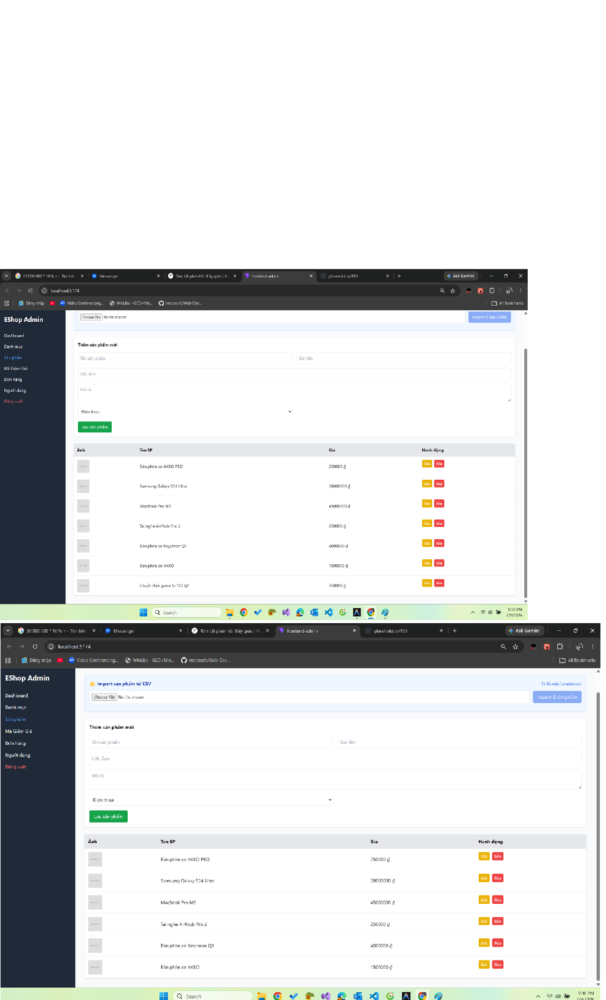 |
| FR15-TC-B01 | Trình duyệt chặn submit do input Tên có thuộc tính required (HTML5) | Pass | 2026-07-09 | Ninh Văn Khải | — | - |
| FR15-TC-B02 | Không bị chặn, SP được tạo với tên chỉ gồm khoảng trắng (required không trim) | Fail | 2026-07-09 | Ninh Văn Khải | BUG-FR15-10 | 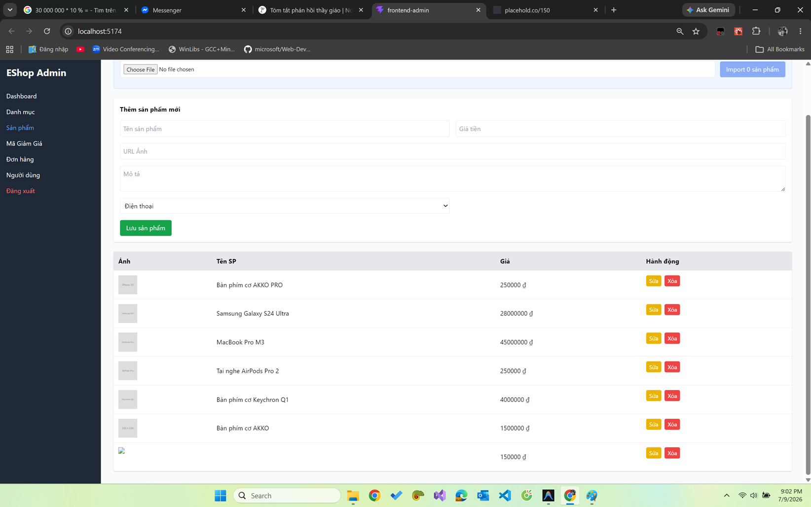 |
| FR15-TC-B03 | Không bị chặn, SP được tạo với giá tiền trống (input thiếu required) | Fail | 2026-07-09 | Ninh Văn Khải | BUG-FR15-03 | 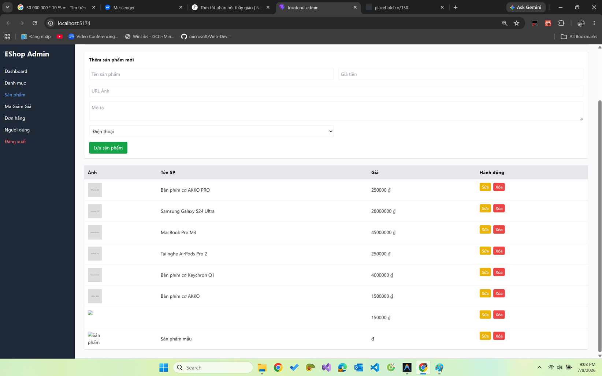 |
| FR15-TC-B04 | Không bị chặn, SP được tạo với giá âm -50000 (input thiếu min='1') | Fail | 2026-07-09 | Ninh Văn Khải | BUG-FR15-03 | 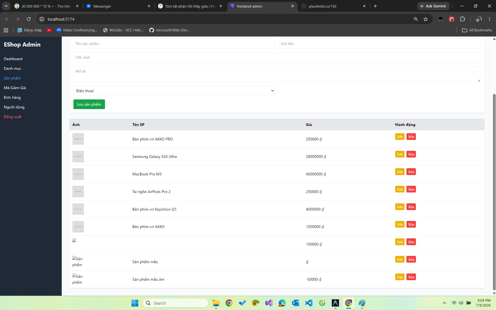 |
| FR15-TC-B05 | Không bị chặn, SP được tạo với giá = 0 (input thiếu min='1') | Fail | 2026-07-09 | Ninh Văn Khải | BUG-FR15-03 | 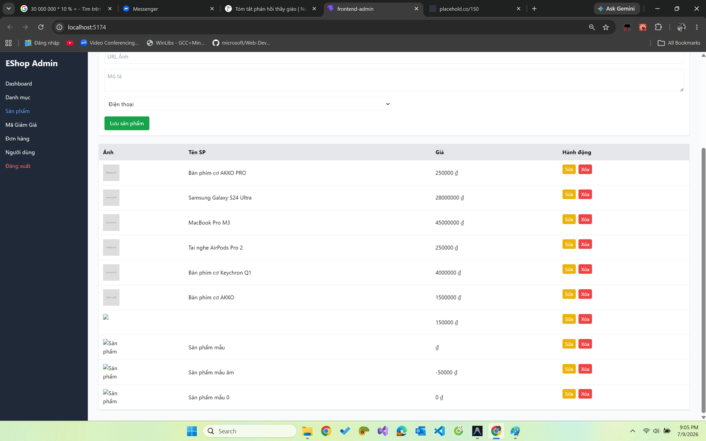 |
| FR15-TC-B06 | Không bị chặn, SP được tạo với giá thập phân 99.99 (input number không validate số nguyên) | Fail | 2026-07-09 | Ninh Văn Khải | BUG-FR15-03 | 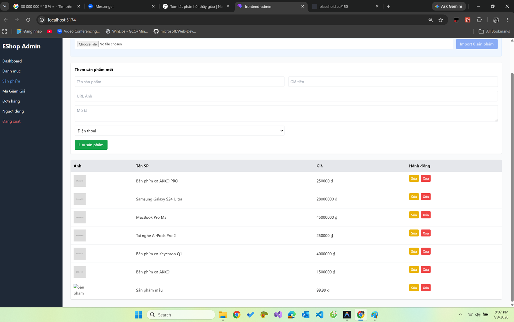 |
| FR15-TC-C01 | Tạo SP thành công với tên 1 ký tự | Pass | 2026-07-09 | Ninh Văn Khải | — | - |
| FR15-TC-C02 | Tạo SP thành công với tên 255 ký tự | Pass | 2026-07-09 | Ninh Văn Khải | — | - |
| FR15-TC-C03 | Không bị chặn, tạo SP thành công với tên > 255 ký tự (input thiếu maxLength) | Fail | 2026-07-09 | Ninh Văn Khải | BUG-FR15-10 | 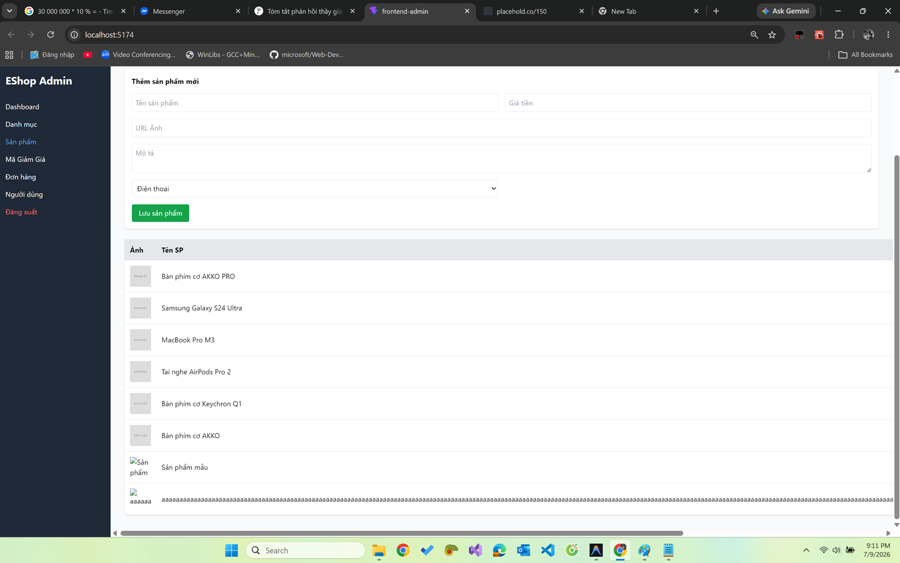 |
| FR15-TC-C04 | Tạo SP thành công với tên 2 ký tự | Pass | 2026-07-09 | Ninh Văn Khải | — | - |
| FR15-TC-C05 | Tạo SP thành công với tên 254 ký tự | Pass | 2026-07-09 | Ninh Văn Khải | — | - |
| FR15-TC-D01 | Tạo SP thành công với giá 1đ (nhưng hiển thị thiếu dấu phân cách — xem BUG-FR15-05) | Pass | 2026-07-09 | Ninh Văn Khải | — | - |
| FR15-TC-D02 | Tạo SP thành công với giá 2đ | Pass | 2026-07-09 | Ninh Văn Khải | — | - |
| FR15-TC-D03 | Không bị chặn, SP được tạo với giá = -1 (input thiếu min='1') | Fail | 2026-07-09 | Ninh Văn Khải | BUG-FR15-03 | 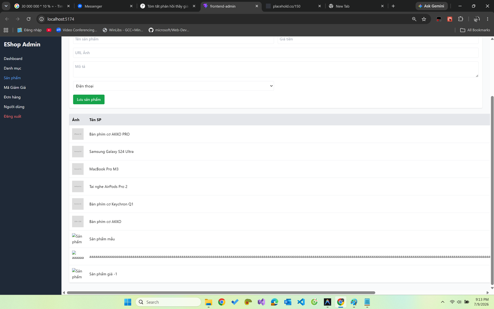 |
| FR15-TC-E01 | Tạo SP thành công; cột ảnh hiển thị ảnh placeholder mặc định khi để trống URL | Pass | 2026-07-09 | Ninh Văn Khải | — | - |
​

---

## 5. Báo cáo Lỗi (Defect / Bug Report)

​
| Bug ID | Test case liên quan | Tiêu đề (Title) | Tiền điều kiện & Môi trường | Các bước tái hiện (đánh số) | Kết quả mong đợi | Kết quả thực tế | Severity | Priority | Trạng thái | Bằng chứng (ảnh/log) |
|---|---|---|---|---|---|---|---|---|---|---|
| BUG-FR15-01 | FR15-TC-A02, FR15-TC-A03 | **[Nghiêm trọng] React State ghi đè tên toàn bộ sản phẩm khi cập nhật** | Web (UI) | 1. Bấm 'Sửa' tại một sản phẩm 2. Đổi thông tin và bấm 'Lưu sản phẩm' | Chỉ sản phẩm được sửa cập nhật; các SP khác giữ nguyên tên | Toàn bộ SP trong danh sách bị đổi tên theo SP vừa sửa (chỉ đúng lại sau F5) | Critical | High | Open | `` |
| BUG-FR15-02 | (toàn form) | **Form thêm/sửa sản phẩm thiếu nhãn (label) và ký hiệu \* bắt buộc** | Web (UI) | 1. Quan sát form 'Thêm sản phẩm mới' / 'Sửa sản phẩm' | Có nhãn rõ ràng kèm dấu `*` đỏ cho các trường bắt buộc (FR-22) | Không có thẻ `<label>`, chỉ dùng `placeholder`; không có dấu `*` | Medium | Medium | Open | `` |
| BUG-FR15-03 | FR15-TC-B03, FR15-TC-B04, FR15-TC-B05, FR15-TC-B06, FR15-TC-D03 | **Thiếu validate Giá tiền ở Frontend (trống / âm / bằng 0 / thập phân)** | Web (UI) | 1. Để trống hoặc nhập -50000, 0, 99.99 vào ô Giá tiền 2. Bấm 'Lưu sản phẩm' | Form chặn submit, báo lỗi giá phải là số nguyên dương > 0 | Form cho submit mọi giá trị (input thiếu `required`, `min='1'`, không chặn thập phân) | High | High | Open | `` |
| BUG-FR15-04 | (quan sát UI) | **Sai chuẩn thẻ tiêu đề trang (dùng h2 thay vì h1)** | Web (UI) | 1. F12 kiểm tra thẻ tiêu đề 'Quản lý Sản phẩm' | Tiêu đề dùng thẻ `<h1>` mô tả nội dung trang (FR-21) | Tiêu đề đang dùng thẻ `<h2>` | Low | Low | Open | `` |
| BUG-FR15-05 | FR15-TC-A01, FR15-TC-D01 | **Thiếu định dạng phân cách hàng nghìn cho giá sản phẩm trong danh sách** | Web (UI) | 1. Xem cột 'Giá' trong danh sách sản phẩm | Giá hiển thị dạng `1.500.000 ₫` (FR-21) | Giá hiển thị số thô `1500000 ₫` | Low | Low | Open | `` |
| BUG-FR15-09 | FR15-TC-A01, FR15-TC-A04 | **Thiếu thông báo thành công (alert) khi tạo sản phẩm mới** | Web (UI) | 1. Điền form thêm mới hợp lệ 2. Bấm 'Lưu sản phẩm' | Hiển thị alert báo tạo thành công | SP được tạo nhưng không có thông báo nào (nhánh create không gọi alert) | Low | Medium | Open | `` |
| BUG-FR15-10 | FR15-TC-B02, FR15-TC-C03 | **Frontend thiếu trim & giới hạn độ dài cho Tên sản phẩm** | Web (UI) | 1. Nhập tên chỉ gồm khoảng trắng ' ' HOẶC dài > 255 ký tự 2. Bấm 'Lưu sản phẩm' | Form chặn, báo lỗi tên rỗng / quá dài | `required` cho qua chuỗi khoảng trắng; input thiếu `maxLength` nên nhận tên > 255 ký tự | Medium | Medium | Open | `` |
| BUG-FR15-11 | FR15-TC-A06 | **Nút 'Xóa' sản phẩm không có hộp thoại xác nhận** | Web (UI) | 1. Bấm nút 'Xóa' ở một sản phẩm | Hiện hộp thoại xác nhận trước khi xóa | Sản phẩm bị xóa ngay lập tức, không xác nhận (rủi ro xóa nhầm) | Medium | Medium | Open | `` |
​

---

## 6. Tóm tắt Kiểm thử (Test Summary)

​

- **Thống kê Test Case:**
  - Thiết kế (Designed): 21
  - Đã chạy (Executed): 21
  - Passed: 10
  - Failed: 11
  - Blocked: 0
    ​
- **Thống kê Báo cáo lỗi (chỉ tính lỗi chức năng qua UI):**
  - **Critical:** 1 (React State ghi đè tên toàn bộ sản phẩm)
  - **High:** 1 (Thiếu validate Giá tiền ở Frontend)
  - **Medium:** 3 (Thiếu nhãn/dấu \* bắt buộc, Thiếu trim/giới hạn tên, Thiếu xác nhận khi Xóa)
  - **Low:** 3 (Sai thẻ tiêu đề h2, Thiếu phân cách hàng nghìn, Thiếu alert tạo SP)
  - **Tổng cộng:** 8 Bugs (UI)
  - _(Các lỗi tầng API/Backend được liệt kê riêng ở Phụ lục B, ngoài phạm vi chấm chức năng qua UI của HW02.)_
    ​
- **Đánh giá rủi ro & Khuyến nghị (phạm vi UI):**
  - **Rủi ro chức năng & UX nghiêm trọng:** Chức năng Sửa sản phẩm bị lỗi React State khiến toàn bộ tên sản phẩm bị ghi đè (BUG-FR15-01), gây sai lệch dữ liệu hiển thị cho admin.
  - **Rủi ro toàn vẹn dữ liệu:** Frontend gần như không validate (Giá âm/trống/0/thập phân, Tên rỗng/quá dài) nên cho phép gửi dữ liệu bẩn lên server; nút Xóa không có xác nhận dễ gây xóa nhầm.
  - **Rủi ro trình bày:** Thiếu nhãn/dấu `*`, thiếu định dạng phân cách hàng nghìn và dùng sai thẻ tiêu đề (vi phạm FR-21, FR-22).
  - **Khuyến nghị sửa (Frontend):** 1. Sửa `handleProductSubmit`: cập nhật state theo đúng `id` sản phẩm thay vì ghi đè `name` cho toàn bộ danh sách. 2. Thêm `required`, `min="1"`, `step="1"` cho input Giá tiền; thêm `maxLength="255"` và trim cho input Tên. 3. Thêm `<label>` + dấu `*` cho các trường bắt buộc; đổi tiêu đề trang từ `<h2>` sang `<h1>`. 4. Áp dụng `.toLocaleString('vi-VN')` khi hiển thị giá; thêm alert xác nhận khi tạo thành công. 5. Thêm hộp thoại xác nhận (`window.confirm`) trước khi xóa sản phẩm.
    ​

---

​

### Phụ lục A — Inconsistency đặc tả (readme) vs UI thật

​
| Đối tượng / Biến | Đặc tả yêu cầu | UI thật thực hiện | Ảnh hưởng tới kiểm thử | Ghi chú / Finding |
|---|---|---|---|---|
| Nhãn và Ký hiệu bắt buộc | Tất cả các trường bắt buộc phải có dấu `*` bên cạnh nhãn (FR-22). | Không hiển thị nhãn, không có dấu `*` bắt buộc. | Không thể kiểm tra sự hiển thị trực quan của dấu `*` trên UI. | Ghi nhận BUG-FR15-02 |
| Ràng buộc Tên sản phẩm | Bắt buộc, tối đa 255 ký tự (FR-15). | Form Admin cho phép nhập chuỗi trống hoặc chuỗi dài tùy ý không giới hạn ký tự. | Test case nhập tên trống (chứa khoảng trắng) hoặc quá dài (>255 ký tự) lọt qua Frontend và ghi vào CSDL. | Ghi nhận BUG-FR15-07 |
| Ràng buộc Giá tiền | Bắt buộc, số dương (> 0) (FR-15). | Input cho phép để trống, cho phép nhập số âm hoặc bằng 0. | Test case giá trị âm, trống hoặc bằng 0 lọt qua Frontend và ghi vào CSDL. | Ghi nhận BUG-FR15-03 |
| Định dạng tiền tệ | Luôn có ký hiệu `₫` với định dạng phân cách hàng nghìn (FR-21). | Giá tiền trong bảng danh sách sản phẩm hiển thị số thô ghép với ký hiệu `₫` (VD: `1500000 ₫`). | Vi phạm định dạng hiển thị tiêu chuẩn. | Ghi nhận BUG-FR15-05 |
| Tiêu đề trang | Mỗi trang/màn hình có đúng 1 thẻ `<h1>` (FR-21). | Tiêu đề "Quản lý Sản phẩm" dùng thẻ `<h2>` trong khi sidebar đã chứa thẻ `<h1>EShop Admin</h1>`. | Nếu sửa tiêu đề thành `<h1>` sẽ dẫn đến việc trang chứa 2 thẻ `<h1>` đồng thời. | Ghi nhận BUG-FR15-04 |
​

### Phụ lục B — Lỗi tầng API/Backend (ngoài phạm vi chấm chức năng UI)

​
Các lỗi dưới đây phát hiện qua phân tích code/API, nằm ngoài phạm vi kiểm thử chức năng qua UI của HW02; đưa vào đây để tham khảo, KHÔNG tính vào thống kê bug chức năng UI.
​
| Bug ID | Test case liên quan | Tiêu đề (Title) | Tiền điều kiện & Môi trường | Các bước tái hiện (đánh số) | Kết quả mong đợi | Kết quả thực tế | Severity | Priority | Trạng thái | Bằng chứng (ảnh/log) |
|---|---|---|---|---|---|---|---|---|---|---|
| BUG-FR15-06 | - | **[Bảo mật] API tạo/sửa/xóa sản phẩm thiếu xác thực & phân quyền** | API | 1. Gửi POST/PUT/DELETE tới `/api/products` không kèm token hoặc dùng token user thường | `401 Unauthorized` / `403 Forbidden` | Thao tác thành công (HTTP 200) mà không cần quyền admin | Critical | High | Open | - |
| BUG-FR15-07 | - | **Thiếu validate dữ liệu phía server-side cho API Products** | API | 1. Gửi POST/PUT tới `/api/products` với `price` = "abc" hoặc số âm | `400 Bad Request`, từ chối ghi dữ liệu bẩn | Backend ghi dữ liệu bẩn vào SQLite (HTTP 200) | High | High | Open | - |
| BUG-FR15-08 | - | **API GET chi tiết sản phẩm ép giá thành string nếu ID chẵn** | API | 1. Gọi `GET /api/products/:id` với ID chẵn | `price` trả về luôn là kiểu số | `price` bị ép thành chuỗi (VD "300000") | Medium | Medium | Open | - |
​

---

​

### Phụ lục C — Reserved cho bài API Testing

​

> **CẢNH BÁO:** Các case dưới đây dùng để gọi trực tiếp các API, bypass giao diện Frontend. Các case này **KHÔNG** tính điểm cho HW02 (Functional qua UI) và được để dành (reserved) cho bài API Testing sau này.
> ​
> | Test Case ID | Mục đích (Objective) | Tiền điều kiện (Pre-conditions) | Các bước (Steps) | Dữ liệu đầu vào (Input) | Kết quả mong đợi CHUẨN (Expected — spec-correct) | Loại Input (Valid/Invalid) | Ưu tiên (Priority) |
> | ----------------| -----------------------------------------------------------------------| --------------------------------------------------------| --------------------------------------------------------------------------------------------| ------------------------------------------------------------------------| -----------------------------------------------------------------------| ----------------------------| --------------------|
> | FR15-API-TC-01 | Gửi POST tạo sản phẩm trực tiếp qua API với price dạng chuỗi số | API Backend đang chạy | Gửi POST request tới `/api/products` | Body: `{"name": "Sản phẩm API", "price": "50000", "category_id": 1}` | Trả về `400 Bad Request` do price sai kiểu dữ liệu (phải là integer). | Invalid | Medium |
> | FR15-API-TC-02 | Gửi POST tạo sản phẩm trực tiếp qua API với price dạng chuỗi chữ | API Backend đang chạy | Gửi POST request tới `/api/products` | Body: `{"name": "Sản phẩm API", "price": "abc", "category_id": 1}` | Trả về `400 Bad Request` do price không phải là số hợp lệ. | Invalid | High |
> | FR15-API-TC-03 | Gửi POST tạo sản phẩm trực tiếp qua API với price số âm | API Backend đang chạy | Gửi POST request tới `/api/products` | Body: `{"name": "Sản phẩm API", "price": -50000, "category_id": 1}` | Trả về `400 Bad Request` do price phải là số dương (>0). | Invalid | High |
> | FR15-API-TC-04 | Gửi POST tạo sản phẩm trực tiếp qua API với price là null | API Backend đang chạy | Gửi POST request tới `/api/products` | Body: `{"name": "Sản phẩm API", "price": null, "category_id": 1}` | Trả về `400 Bad Request` do thiếu trường bắt buộc price. | Invalid | Medium |
> | FR15-API-TC-05 | Gửi POST tạo sản phẩm trực tiếp qua API với name là null | API Backend đang chạy | Gửi POST request tới `/api/products` | Body: `{"name": null, "price": 100000, "category_id": 1}` | Trả về `400 Bad Request` do thiếu trường bắt buộc name. | Invalid | High |
> | FR15-API-TC-06 | Gửi POST tạo sản phẩm trực tiếp qua API với name chỉ có khoảng trắng | API Backend đang chạy | Gửi POST request tới `/api/products` | Body: `{"name": "   ", "price": 100000, "category_id": 1}` | Trả về `400 Bad Request` do tên không được phép rỗng. | Invalid | High |
> | FR15-API-TC-07 | Gửi POST tạo sản phẩm trực tiếp qua API với category_id không tồn tại | API Backend đang chạy | Gửi POST request tới `/api/products` | Body: `{"name": "Sản phẩm API", "price": 100000, "category_id": 9999}` | Trả về `400 Bad Request` do khóa ngoại category_id không hợp lệ. | Invalid | High |
> | FR15-API-TC-08 | Thêm sản phẩm trực tiếp qua API không kèm Token | API Backend đang chạy | Gửi POST request tới `/api/products` không có Header Authorization | Body hợp lệ | Trả về `401 Unauthorized` chặn truy cập. | Invalid | High |
> | FR15-API-TC-09 | Thêm sản phẩm trực tiếp qua API với Token của user thường | API Backend đang chạy, có token của tài khoản customer | Gửi POST request tới `/api/products` kèm Header Authorization của user thường | Body hợp lệ | Trả về `403 Forbidden` chặn truy cập. | Invalid | High |
> | FR15-API-TC-10 | Gọi API import sản phẩm từ CSV với Token của user thường | API Backend đang chạy, có token của tài khoản customer | Gửi POST request tới `/api/admin/import-products` kèm Header Authorization của user thường | Body hợp lệ | Trả về `403 Forbidden` chặn truy cập. | Invalid | High |
> ​
