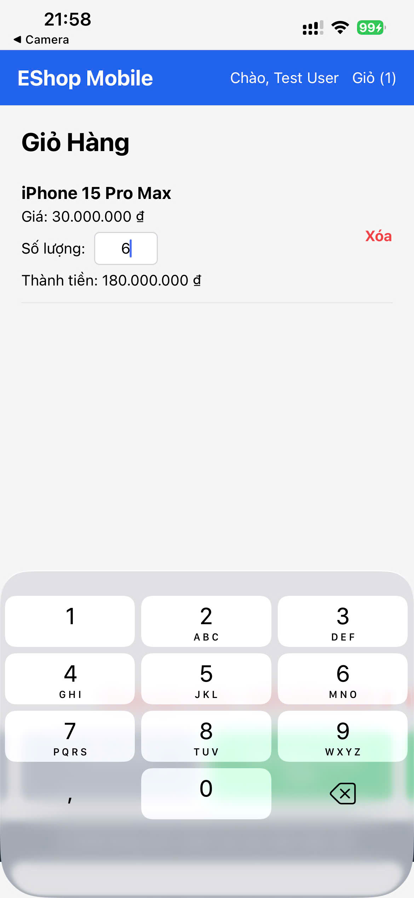
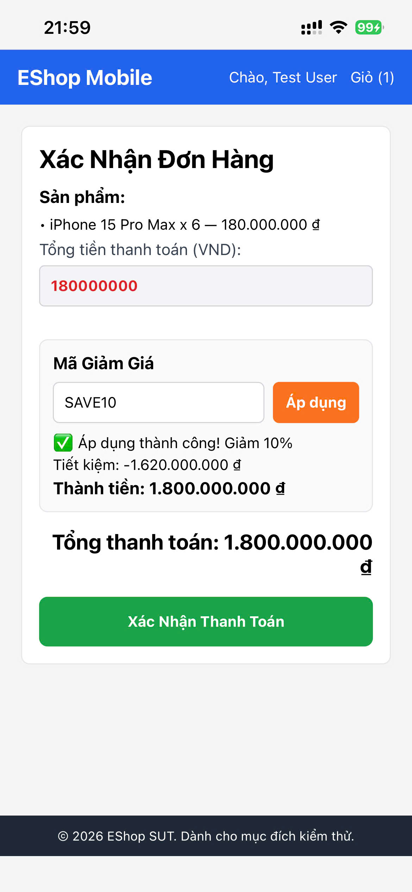
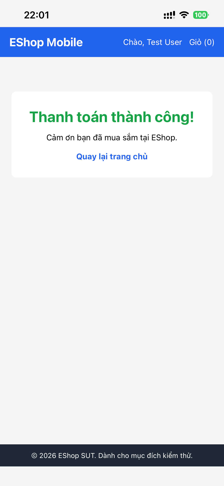
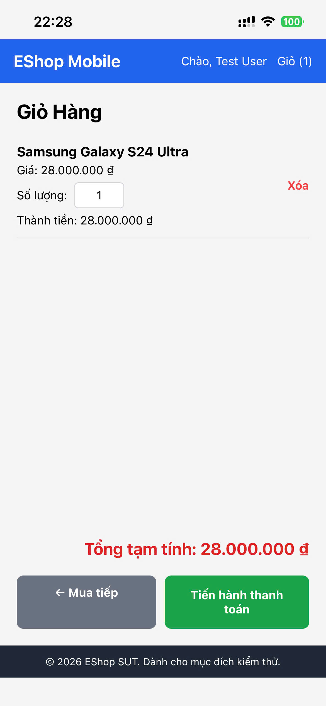
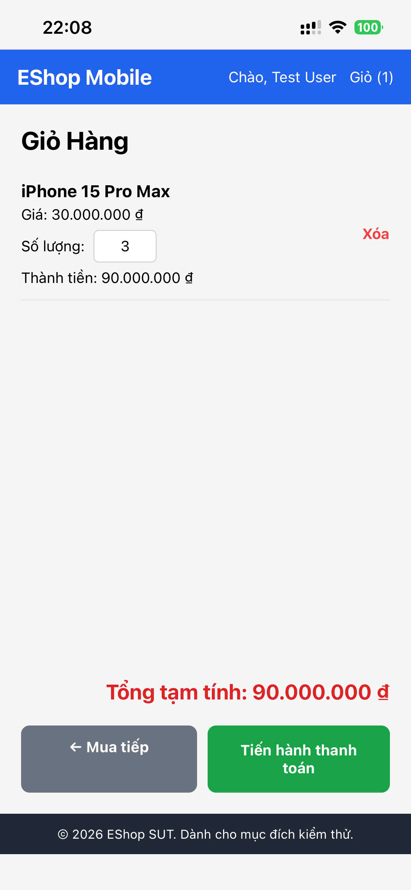
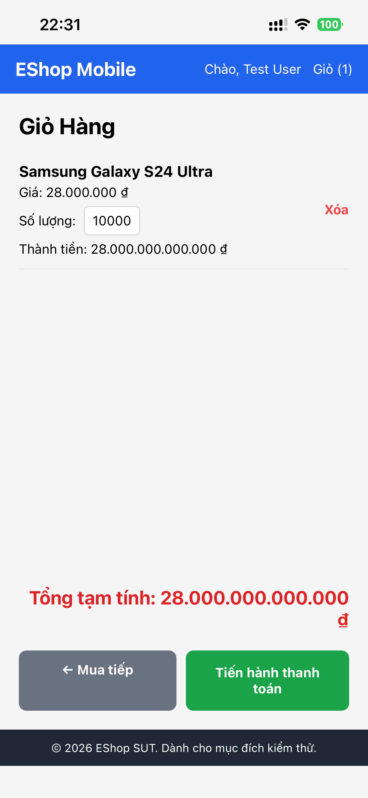
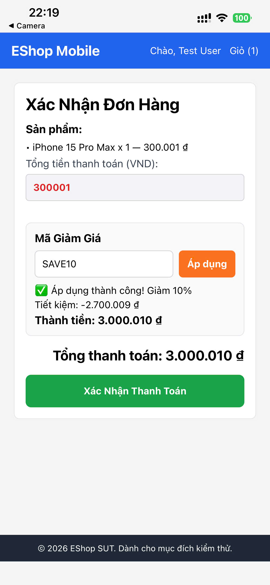
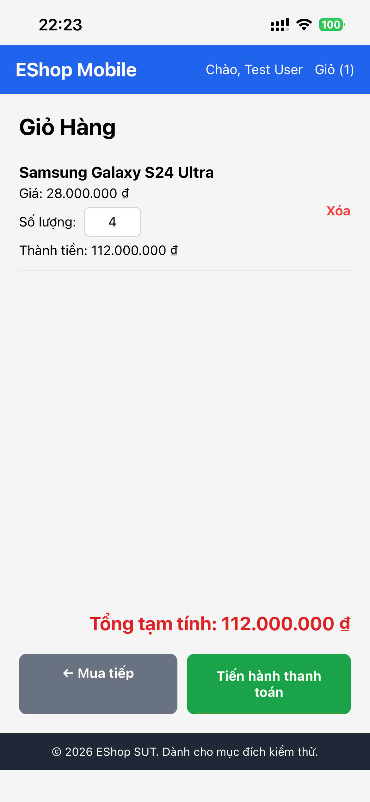
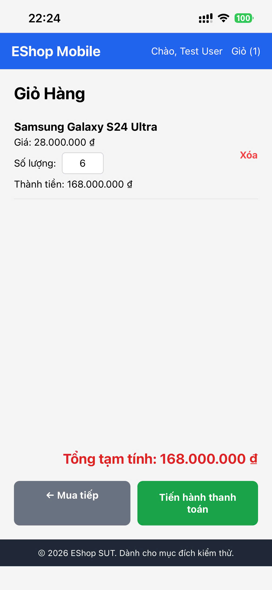
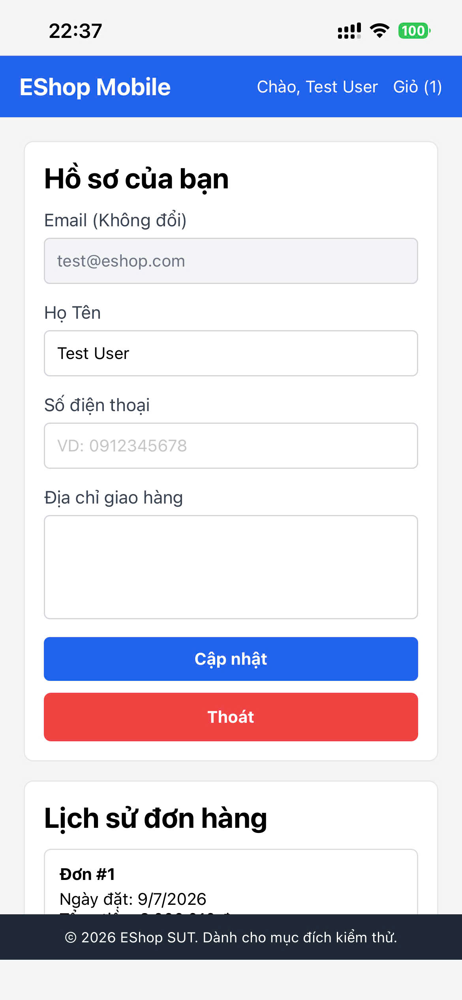

<!-- File: FR-20_TestReport.md -->

​

# BÁO CÁO KIỂM THỬ: FR-20 — Mobile App: Giỏ Hàng & Thanh Toán (Cart & Checkout)

​

## 1. Phân hoạch tương đương (Equivalence Partitioning & Domain Analysis)

​
Dựa trên phân tích mã nguồn (`frontend-mobile/App.js` và `backend/server.js`) cùng tài liệu đặc tả hệ thống, ta xác định các biến đầu vào chính và phân hoạch tương đương như sau:
​

### 1.1. Biến `text` (Số lượng sản phẩm tại ô nhập trong Giỏ hàng)

- **Nguồn:** Trường `<TextInput>` tại hàm `renderCart` (dòng 611-625).
- **Ràng buộc UI thật:** Thẻ có thuộc tính `keyboardType="numeric"`. Không giới hạn độ dài nhập ở frontend. Sự kiện `onChangeText` lấy chuỗi đầu vào chạy qua `parseInt(text, 10)` để ép kiểu thành số nguyên `parsed`. Nếu `Number.isFinite(parsed) && parsed > 0`, hệ thống gán giá trị mới bằng `parsed + 1` (đây là **BUG thiết kế**), ngược lại gán mặc định bằng `1`.
- **Ràng buộc Đặc tả:** Số lượng phải là số nguyên dương lớn hơn 0 và nhỏ hơn giới hạn tồn kho.
- **VEC-qty-1:** Chuỗi chứa số nguyên dương nằm trong khoảng hợp lý [1, 99] (VD: `"5"`).
- **VEC-qty-2:** Chuỗi chứa số nguyên dương lớn nhưng trong giới hạn hợp lý [100, 999999] (VD: `"250"`).
- **IEC-qty-1:** Chuỗi rỗng `""` (xóa toàn bộ ký tự trong ô) — bị ép ngay về `1`.
- **IEC-qty-2:** Chuỗi chỉ chứa các khoảng trắng `"   "` — trả về `NaN` sau khi parse, bị ép về `1`.
- **IEC-qty-3:** Chuỗi chứa số `0` — không thỏa mãn điều kiện `parsed > 0`, bị ép về `1`.
- **IEC-qty-4:** Chuỗi chứa số nguyên âm (VD: `"-5"`) — không thỏa mãn `parsed > 0`, bị ép về `1`.
- **IEC-qty-5:** Chuỗi chỉ gồm chữ cái hoặc ký tự đặc biệt (VD: `"abc"`, `"!@#"`) — trả về `NaN`, bị ép về `1`.
- **IEC-qty-6:** Chuỗi số thập phân dương (VD: `"1.5"`, `"5.7"`) — `parseInt` cắt bỏ phần thập phân và lấy phần nguyên dương làm số lượng để cộng 1.
- **IEC-qty-7:** Chuỗi số thập phân âm hoặc có phần nguyên bằng 0 (VD: `"-1.5"`, `"0.9"`) — trả về số `<= 0` hoặc `NaN`, bị ép về `1`.
- **IEC-qty-8:** Chuỗi hỗn hợp bắt đầu bằng số (VD: `"3abc"`, `"5 kg"`) — `parseInt` trích xuất phần số đầu tiên rồi xử lý bình thường.
- **IEC-qty-9:** Chuỗi hỗn hợp bắt đầu bằng chữ (VD: `"abc3"`) — trả về `NaN`, bị ép về `1`.
- **IEC-qty-10:** Số cực lớn vượt quá giới hạn an toàn hệ thống (VD: `"9007199254740992"`).
- **IEC-qty-11:** Chuỗi hệ Hex (VD: `"0xFF"`) — `parseInt` trích xuất thành giá trị nguyên `255` ở hệ thập phân.
- **IEC-qty-12:** Chuỗi chỉ chứa dấu cộng hoặc dấu trừ trước số (VD: `"-"`, `"+5"`).
  ​

### 1.2. Biến `quantity` (Số lượng sản phẩm tại ô nhập trong Chi tiết sản phẩm)

- **Nguồn:** Trường `<TextInput>` tại màn hình chi tiết sản phẩm `renderProductDetail` (dòng 564-570).
- **Ràng buộc UI thật:** Mặc định là `"1"`. Khi bấm "Thêm vào giỏ", giá trị được đưa qua hàm `normalizeQuantity` thực hiện `parseInt(value, 10)` và trả về `1` nếu kết quả không phải số nguyên dương.
- **VEC-det-1:** Chuỗi số nguyên dương hợp lệ (VD: `"3"`).
- **IEC-det-1:** Chuỗi rỗng hoặc chỉ chứa khoảng trắng (VD: `""`, `"  "`) — bị `normalizeQuantity` ép về `1`.
- **IEC-det-2:** Chuỗi chứa số 0 hoặc số âm (VD: `"0"`, `"-5"`) — bị ép về `1`.
- **IEC-det-3:** Chuỗi không phải số (VD: `"abc"`, `"!@#"`) — bị ép về `1`.
- **IEC-det-4:** Chuỗi thập phân hoặc hỗn hợp (VD: `"1.5"`, `"3abc"`) — bị cắt bỏ phần chữ/phần thập phân lấy phần nguyên.
  ​

### 1.3. Biến `couponCode` (Mã giảm giá tại màn hình Checkout)

- **Nguồn:** Ô nhập mã giảm giá tại màn hình Checkout `renderCheckout` (dòng 695-705).
- **Ràng buộc UI thật & Đặc tả:** Chuỗi nhập được tự động trim khoảng trắng và đổi sang chữ hoa trước khi gửi lên API `/api/apply-coupon`. Backend kiểm tra tính hợp lệ trong cơ sở dữ liệu dựa trên mã code, trạng thái `is_active`, hạn dùng `expired_at`, số tiền tối thiểu đơn hàng `min_order_amount` và giới hạn sử dụng của người dùng.
- **VEC-cp-1:** Mã giảm giá tồn tại, đang kích hoạt và còn hạn sử dụng (VD: `"SAVE10"`, `"BIGBUY"`, `"VIP100"`).
- **IEC-cp-1:** Mã giảm giá không tồn tại trong hệ thống (VD: `"INVALIDCODE"`).
- **IEC-cp-2:** Mã giảm giá bị vô hiệu hóa (`is_active = 0`).
- **IEC-cp-3:** Mã giảm giá đã hết hạn sử dụng (`expired_at < now`).
- **IEC-cp-4:** Mã giảm giá hợp lệ nhưng đơn hàng chưa đạt giá trị tối thiểu quy định.
- **IEC-cp-5:** Mã giảm giá hợp lệ nhưng người dùng đã sử dụng vượt quá giới hạn tối đa `max_uses_per_user`.
  ​

---

​

## 2. Phân tích giá trị biên (Boundary Value Analysis)

​

### 2.1. Biên số lượng sản phẩm (`parsed`)

- **Biên đặc tả:** `quantity ≥ 1`. Đối với miền số nguyên, giá trị biên dưới hợp lệ là `1`.
- **Điểm biên (Áp dụng 3-point BVA):**
  - `parsed = 0` (Biên không hợp lệ, OFF - Kỳ vọng bị chặn/ép về 1).
  - `parsed = 1` (Biên dưới hợp lệ, ON - Kỳ vọng lưu đúng giá trị 1).
  - `parsed = 2` (Trên biên hợp lệ - Kỳ vọng lưu đúng giá trị 2).
  - `parsed = -1` (Dưới biên không hợp lệ - Kỳ vọng bị chặn/ép về 1).
    ​

### 2.2. Biên tổng số tiền đơn hàng (`total_amount` áp dụng mã giảm giá)

- **Biên đặc tả:** `total_amount > min_order_amount`.
- **Điểm biên cho mã `SAVE10` (điều kiện `min_order_amount = 300000`):**
  - `total_amount = 299999` (Dưới biên, OFF - Không đủ điều kiện áp dụng mã).
  - `total_amount = 300000` (Trên biên đặc tả, OFF - Không đủ điều kiện vì code backend sử dụng phép so sánh lớn hơn nghiêm ngặt `total_amount > coupon.min_order_amount`).
  - `total_amount = 300001` (Hợp lệ, ON - Đủ điều kiện áp dụng mã giảm giá).
    ​

---

​

## 3. Bảng thiết kế Test Case (Test Case DESIGN)

​
_Lưu ý: Các test case dưới đây đều được thiết kế để thao tác trực tiếp qua giao diện người dùng (UI) trên thiết bị di động._
​
| Test Case ID | Mục đích (Objective) | Tiền điều kiện (Pre-conditions) | Các bước (Steps) | Dữ liệu đầu vào (Input) | Kết quả mong đợi CHUẨN (Expected — spec-correct) | Loại Input (Valid/Invalid) | Ưu tiên (Priority) |
| ------------------------------------------------------------------------------| ------------------------------------------------------------------------------------------| --------------------------------------------------------------| ------------------------------------------------------------------------------------------------------------------| -----------------------------------------| -----------------------------------------------------------------------------------------------------------------------------------------| ----------------------------| --------------------|
| **Nhóm A: Nhập liệu hợp lệ & Luồng thành công qua UI** | | | | | | | |
| FR20-TC-A01 | Thêm sản phẩm thành công từ trang chi tiết với số lượng hợp lệ | Khách hàng đã đăng nhập, đang ở màn hình chi tiết sản phẩm A | 1. Nhập số lượng sản phẩm vào ô nhập. 2. Nhấn nút "Thêm vào giỏ". 3. Kiểm tra thông báo và badge giỏ hàng. | `quantity` = "3" | Hiển thị thông báo thêm thành công; giỏ hàng cập nhật số lượng tăng thêm đúng bằng 3 sản phẩm A. | Valid | High |
| FR20-TC-A02 | Chỉnh sửa số lượng sản phẩm hợp lệ trong Giỏ hàng | Khách hàng đã đăng nhập, giỏ hàng đang có 1 sản phẩm | 1. Vào màn hình Giỏ hàng. 2. Thay đổi số lượng sản phẩm trong ô nhập. 3. Nhấp ra ngoài để lưu. | `text` = "5" | Số lượng sản phẩm hiển thị đúng bằng 5; giá trị "Thành tiền" và "Tổng tạm tính" cập nhật chính xác (price × 5). | Valid | High |
| FR20-TC-A03 | Áp dụng thành công mã giảm giá phần trăm `SAVE10` | Đơn hàng trong Checkout có tổng giá trị lớn hơn 300.000đ | 1. Nhấn "Thanh toán" để vào màn hình Checkout. 2. Nhập mã giảm giá vào ô nhập. 3. Nhấn nút "Áp dụng". | `couponCode` = "SAVE10" | Áp dụng thành công, hiển thị giảm giá 10% trên tổng tiền đơn hàng; số tiền thanh toán cuối cùng giảm đi 10% chính xác. | Valid | High |
| FR20-TC-A04 | Áp dụng thành công mã giảm giá cố định `BIGBUY` | Đơn hàng trong Checkout có tổng giá trị lớn hơn 500.000đ | 1. Tại màn hình Checkout, nhập mã giảm giá. 2. Nhấn nút "Áp dụng". | `couponCode` = "BIGBUY" | Áp dụng thành công, hiển thị giảm giá 50.000 ₫; số tiền thanh toán cuối cùng giảm đi đúng 50.000đ. | Valid | High |
| FR20-TC-A05 | Xác nhận thanh toán giỏ hàng thành công với nhiều sản phẩm | Khách hàng đã đăng nhập, giỏ hàng có 2 sản phẩm khác nhau | 1. Nhấn nút "Thanh toán" để mở màn hình xác nhận đơn hàng. 2. Nhấn "Xác Nhận Thanh Toán". | Chọn giỏ hàng gồm 2 sản phẩm | Hệ thống tạo đơn hàng thành công, hiển thị màn hình thông báo thanh toán thành công với đầy đủ cả 2 sản phẩm trong đơn. | Valid | High |
| FR20-TC-A06 | Chỉnh sửa số lượng lớn hợp lệ trong khoảng [100, 999999] tại Giỏ hàng | Khách hàng đã đăng nhập, giỏ hàng đang có 1 sản phẩm | 1. Vào màn hình Giỏ hàng. 2. Nhập số lượng lớn vào ô nhập. 3. Nhấp ra ngoài để lưu. | `text` = "250" | Số lượng lưu chính xác bằng 250; Thành tiền và Tổng tạm tính cập nhật đúng (price × 250). | Valid | Medium |
| **Nhóm B: Nhập liệu không hợp lệ tại Giỏ hàng (Domain Invalid)** | | | | | | | |
| FR20-TC-B01 | Nhập số lượng bằng 0 tại màn hình Giỏ hàng | Khách hàng đang ở màn hình Giỏ hàng, có sản phẩm trong giỏ | 1. Nhập số lượng bằng 0 vào ô nhập. 2. Nhấp ra ngoài hoặc xác nhận. | `text` = "0" | Hệ thống từ chối cập nhật, hiển thị cảnh báo số lượng không hợp lệ và tự động đưa số lượng về 1 (hoặc giữ nguyên giá cũ). | Invalid | Medium |
| FR20-TC-B02 | Nhập số lượng là số nguyên âm tại Giỏ hàng | Khách hàng đang ở màn hình Giỏ hàng, có sản phẩm trong giỏ | 1. Nhập số nguyên âm vào ô nhập. 2. Nhấp ra ngoài hoặc xác nhận. | `text` = "-5" | Hệ thống từ chối cập nhật, hiển thị cảnh báo số lượng không hợp lệ và đưa số lượng về 1. | Invalid | Medium |
| FR20-TC-B03 | Nhập số lượng chứa chữ cái thuần hoặc ký tự đặc biệt | Khách hàng đang ở màn hình Giỏ hàng, có sản phẩm trong giỏ | 1. Nhập chuỗi chữ hoặc ký tự đặc biệt vào ô nhập. 2. Nhấp ra ngoài. | `text` = "abc" (hoặc `"!@#"`) | Hệ thống từ chối cập nhật, cảnh báo định dạng không hợp lệ, giữ nguyên giá trị cũ hoặc đưa về 1. | Invalid | Low |
| FR20-TC-B04 | Xóa rỗng ô nhập số lượng sản phẩm | Khách hàng đang ở màn hình Giỏ hàng, có sản phẩm trong giỏ | 1. Nhấp vào ô số lượng. 2. Xóa toàn bộ ký tự hiển thị. | `text` = "" | Cho phép ô nhập trống tạm thời để người dùng nhập giá trị mới. Chỉ reset về mặc định nếu người dùng thoát khỏi ô nhập mà không điền gì. | Invalid | Medium |
| FR20-TC-B05 | Nhập khoảng trắng vào ô số lượng | Khách hàng đang ở màn hình Giỏ hàng, có sản phẩm trong giỏ | 1. Nhập chuỗi khoảng trắng. 2. Nhấp ra ngoài. | `text` = " " | Hệ thống từ chối cập nhật, đưa số lượng về 1. | Invalid | Low |
| **Nhóm C: Phân tích giá trị biên số lượng (BVA Quantity)** | | | | | | | |
| FR20-TC-C01 | BVA: Nhập số lượng bằng 1 (Biên dưới ON) | Khách hàng đang ở màn hình Giỏ hàng, có sản phẩm trong giỏ | 1. Nhập số lượng bằng 1 vào ô nhập. 2. Xác nhận lưu. | `text` = "1" | Số lượng lưu chính xác là 1. Thành tiền hiển thị đúng bằng giá trị gốc (price × 1). | Valid | High |
| FR20-TC-C02 | BVA: Nhập số lượng bằng 2 (Biên dưới + 1) | Khách hàng đang ở màn hình Giỏ hàng, có sản phẩm trong giỏ | 1. Nhập số lượng bằng 2 vào ô nhập. 2. Xác nhận lưu. | `text` = "2" | Số lượng lưu chính xác là 2. Thành tiền hiển thị đúng bằng (price × 2). | Valid | Medium |
| FR20-TC-C03 | BVA: Nhập số lượng bằng -1 (Biên không hợp lệ) | Khách hàng đang ở màn hình Giỏ hàng, có sản phẩm trong giỏ | 1. Nhập số lượng bằng -1 vào ô nhập. 2. Xác nhận lưu. | `text` = "-1" | Hệ thống từ chối cập nhật, đưa số lượng về 1. | Invalid | Medium |
| FR20-TC-C04 | BVA: Nhập số lượng cực lớn tại Giỏ hàng | Khách hàng đang ở màn hình Giỏ hàng, có sản phẩm trong giỏ | 1. Nhập số lượng lớn vượt ngưỡng quy định. 2. Xác nhận lưu. | `text` = "999999" | Hệ thống chặn hoặc giới hạn số lượng tối đa cho phép (ví dụ: tối đa 999 sản phẩm) và hiển thị thông báo lỗi. | Invalid | Medium |
| **Nhóm D: Áp dụng mã giảm giá không hợp lệ & Sai biên (Coupon / BVA)** | | | | | | | |
| FR20-TC-D01 | Áp dụng mã giảm giá không tồn tại | Khách hàng đang ở màn hình Checkout | 1. Nhập mã giảm giá không tồn tại. 2. Nhấn nút "Áp dụng". | `couponCode` = "KHM123" | Hệ thống báo lỗi "Mã giảm giá không tồn tại hoặc đã bị vô hiệu hóa" và không giảm giá. | Invalid | Medium |
| FR20-TC-D02 | Áp dụng mã giảm giá đã hết hạn sử dụng | Khách hàng đang ở màn hình Checkout | 1. Nhập mã giảm giá đã quá hạn. 2. Nhấn nút "Áp dụng". | `couponCode` = "EXPIRED" | Hệ thống báo lỗi "Mã giảm giá đã hết hạn" và không giảm giá. | Invalid | Medium |
| FR20-TC-D03 | BVA: Áp dụng coupon phần trăm khi tổng tiền bằng đúng mức tối thiểu | Giỏ hàng có tổng tiền đúng 300.000đ | 1. Nhập mã giảm giá có điều kiện áp dụng cho đơn hàng > 300.000đ. 2. Nhấn nút "Áp dụng". | `couponCode` = "SAVE10" | Hệ thống thông báo lỗi yêu cầu đơn hàng phải có giá trị lớn hơn 300.000đ mới được áp dụng. | Invalid | Medium |
| FR20-TC-D04 | BVA: Áp dụng coupon phần trăm khi tổng tiền dưới mức tối thiểu 1 đơn vị | Giỏ hàng có tổng tiền đúng 299.999đ | 1. Nhập mã giảm giá có điều kiện áp dụng cho đơn hàng > 300.000đ. 2. Nhấn nút "Áp dụng". | `couponCode` = "SAVE10" | Hệ thống thông báo lỗi yêu cầu đơn hàng có giá trị lớn hơn 300.000đ mới được áp dụng. | Invalid | Medium |
| FR20-TC-D05 | Áp dụng mã giảm giá đã dùng quá số lần cho phép | Khách hàng đã dùng mã giảm giá VIP100 đủ 2 lần trước đó | 1. Tại màn hình Checkout, nhập mã giảm giá. 2. Nhấn nút "Áp dụng". | `couponCode` = "VIP100" | Hệ thống báo lỗi "Bạn đã sử dụng mã này 2 lần (đã đạt giới hạn)" và từ chối áp dụng. | Invalid | Medium |
| FR20-TC-D06 | BVA: Áp dụng coupon phần trăm khi tổng tiền trên mức tối thiểu 1 đơn vị (Biên ON hợp lệ) | Giỏ hàng có tổng tiền đúng 300.001đ | 1. Nhập mã giảm giá `"SAVE10"`. 2. Nhấn nút "Áp dụng". | `couponCode` = "SAVE10" (tổng 300.001đ) | Áp dụng thành công, giảm 10% trên tổng đơn hàng; số tiền thanh toán cuối cùng giảm đúng 10%. | Valid | High |
| **Nhóm E: Trường hợp đặc biệt và biên dữ liệu lỗi (Edge Cases)** | | | | | | | |
| FR20-TC-E01 | Nhập số lượng sản phẩm là số thập phân dương | Khách hàng đang ở màn hình Giỏ hàng | 1. Nhập số thập phân vào ô số lượng. 2. Nhấp ra ngoài. | `text` = "1.9" | Hệ thống từ chối định dạng số thập phân, yêu cầu nhập số nguyên dương. | Invalid | Medium |
| FR20-TC-E02 | Nhập chuỗi hỗn hợp chữ số (ví dụ: "3abc") làm số lượng | Khách hàng đang ở màn hình Giỏ hàng | 1. Nhập chuỗi ký tự chứa cả số và chữ bắt đầu bằng số. 2. Nhấp ra ngoài. | `text` = "3abc" | Hệ thống từ chối cập nhật hoặc yêu cầu định dạng số nguyên hợp lệ. | Invalid | Medium |
| FR20-TC-E03 | Nhập số lượng dạng mã Hex | Khách hàng đang ở màn hình Giỏ hàng | 1. Nhập mã Hex. 2. Nhấp ra ngoài. | `text` = "0xFF" | Hệ thống từ chối cập nhật và yêu cầu định dạng số nguyên hệ thập phân. | Invalid | Low |
| FR20-TC-E04 | Nhập số lượng chứa dấu cộng phía trước | Khách hàng đang ở màn hình Giỏ hàng | 1. Nhập chuỗi chứa dấu cộng trước chữ số. 2. Nhấp ra ngoài. | `text` = "+5" | Hệ thống chấp nhận số lượng là 5 hoặc báo lỗi định dạng ký tự không hợp lệ. | Invalid | Low |
| FR20-TC-E05 | Nhập số thập phân có phần nguyên bằng 0 (VD: "0.9") tại Giỏ hàng | Khách hàng đang ở màn hình Giỏ hàng | 1. Nhập chuỗi `"0.9"` vào ô số lượng. 2. Nhấp ra ngoài. | `text` = "0.9" | Hệ thống từ chối định dạng, đưa số lượng về 1. | Invalid | Low |
| FR20-TC-E06 | Nhập chuỗi hỗn hợp bắt đầu bằng chữ (VD: "abc3") tại Giỏ hàng | Khách hàng đang ở màn hình Giỏ hàng | 1. Nhập chuỗi `"abc3"` vào ô số lượng. 2. Nhấp ra ngoài. | `text` = "abc3" | Hệ thống từ chối cập nhật, đưa số lượng về 1. | Invalid | Low |
| FR20-TC-E07 | Nhập chuỗi chỉ gồm dấu trừ (VD: "-") tại Giỏ hàng | Khách hàng đang ở màn hình Giỏ hàng | 1. Nhập chuỗi `"-"` vào ô số lượng. 2. Nhấp ra ngoài. | `text` = "-" | Hệ thống từ chối cập nhật, đưa số lượng về 1. | Invalid | Low |
| **Nhóm F: Nhập số lượng tại màn hình Chi tiết sản phẩm (normalizeQuantity)** | | | | | | | |
| FR20-TC-F01 | Để trống ô số lượng tại màn hình Chi tiết sản phẩm rồi thêm vào giỏ | Khách hàng đang ở màn hình chi tiết sản phẩm | 1. Xóa rỗng ô số lượng. 2. Nhấn "Thêm vào giỏ". | `quantity` = "" | Hệ thống ép về mặc định 1 và thêm 1 sản phẩm vào giỏ. | Invalid | Medium |
| FR20-TC-F02 | Nhập số 0 hoặc số âm tại ô số lượng màn hình Chi tiết sản phẩm | Khách hàng đang ở màn hình chi tiết sản phẩm | 1. Nhập `"0"` (hoặc `"-5"`) vào ô số lượng. 2. Nhấn "Thêm vào giỏ". | `quantity` = "0" | Hệ thống ép về mặc định 1 và thêm 1 sản phẩm vào giỏ. | Invalid | Medium |
| FR20-TC-F03 | Nhập chuỗi không phải số tại ô số lượng màn hình Chi tiết sản phẩm | Khách hàng đang ở màn hình chi tiết sản phẩm | 1. Nhập `"abc"` vào ô số lượng. 2. Nhấn "Thêm vào giỏ". | `quantity` = "abc" | Hệ thống ép về mặc định 1 và thêm 1 sản phẩm vào giỏ. | Invalid | Medium |
| FR20-TC-F04 | Nhập số thập phân tại ô số lượng màn hình Chi tiết sản phẩm | Khách hàng đang ở màn hình chi tiết sản phẩm | 1. Nhập `"1.5"` vào ô số lượng. 2. Nhấn "Thêm vào giỏ". | `quantity` = "1.5" | Hệ thống cắt phần thập phân, đưa về số nguyên dương hợp lệ (1) rồi thêm vào giỏ. | Invalid | Low |
​

---

​

## 4. Khung thực thi (Test EXECUTION Skeleton)

​
| Test Case ID | Kết quả thực tế (Actual) | Trạng thái (Pass/Fail/Blocked) | Ngày chạy | Người test | Bug ID liên quan | Minh chứng |
|---|---|---|---|---|---|---|
| FR20-TC-A01 | normalizeQuantity("3")=3 → thêm đúng 3 sản phẩm A; hiện Alert "Thành công – Đã thêm vào giỏ hàng". Giỏ tăng đúng 3. | Pass | 2026-07-09 | Ninh Văn Khải | — | - |
| FR20-TC-A02 | Ô số lượng giỏ hàng: nhập 5 → parsed=5, gán parsed+1=6. Số lượng thành 6, Thành tiền = price×6 (off-by-one). | Fail | 2026-07-09 | Ninh Văn Khải | BUG-FR20-01 |  |
| FR20-TC-A03 | Áp SAVE10: công thức percent ở backend sai (total×(1−10)) → discount âm, tổng thanh toán tăng ~10 lần thay vì giảm 10%. Phát hiện trực tiếp trên UI khi áp mã. | Fail | 2026-07-09 | Ninh Văn Khải | BUG-FR20-03 |  |
| FR20-TC-A04 | BIGBUY (fixed 50.000, min 500.000): discount=50.000, final=total−50.000 → giảm đúng 50.000 ₫. | Pass | 2026-07-09 | Ninh Văn Khải | — | - |
| FR20-TC-A05 | Xác nhận thanh toán giỏ 2 SP: items = cart.slice(0,-1) → SP cuối (B) bị cắt, đơn chỉ còn 1 SP (A). | Fail | 2026-07-09 | Ninh Văn Khải | BUG-FR20-02 |  |
| FR20-TC-A06 | Nhập 250 → parsed=250, gán 251 (off-by-one). Số lượng lưu 251, Thành tiền = price×251. | Fail | 2026-07-09 | Ninh Văn Khải | BUG-FR20-01 |  |
| FR20-TC-B01 | parseInt("0")=0, không >0 → gán 1. Số lượng về 1 (khớp Expected). | Pass | 2026-07-09 | Ninh Văn Khải | — | - |
| FR20-TC-B02 | parseInt("-5")=-5, không >0 → gán 1. Số lượng về 1. | Pass | 2026-07-09 | Ninh Văn Khải | — | - |
| FR20-TC-B03 | parseInt("abc")=NaN → gán 1. Số lượng về 1. | Pass | 2026-07-09 | Ninh Văn Khải | — | - |
| FR20-TC-B04 | parseInt("")=NaN → gán ngay về 1; ô không cho trống tạm để gõ số nhiều chữ số. | Fail | 2026-07-09 | Ninh Văn Khải | BUG-FR20-06 |  |
| FR20-TC-B05 | parseInt(" ")=NaN → gán 1. Số lượng về 1. | Pass | 2026-07-09 | Ninh Văn Khải | — | - |
| FR20-TC-C01 | parsed=1, >0 → gán parsed+1=2. Nhập 1 nhưng lưu 2 (off-by-one). | Fail | 2026-07-09 | Ninh Văn Khải | BUG-FR20-01 |  |
| FR20-TC-C02 | parsed=2, >0 → gán 3. Nhập 2 lưu 3 (off-by-one). | Fail | 2026-07-09 | Ninh Văn Khải | BUG-FR20-01 |  |
| FR20-TC-C03 | parseInt("-1")=-1, không >0 → gán 1. Số lượng về 1 (khớp Expected). | Pass | 2026-07-09 | Ninh Văn Khải | — | - |
| FR20-TC-C04 | parsed=999999 → gán 1000000 (off-by-one); không có giới hạn tối đa ở client lẫn server → chấp nhận số khổng lồ. | Fail | 2026-07-09 | Ninh Văn Khải | BUG-FR20-07 |  |
| FR20-TC-D01 | code "KHM123" không có trong DB → couponError "không tồn tại/đã vô hiệu hóa", không giảm giá. | Pass | 2026-07-09 | Ninh Văn Khải | — | - |
| FR20-TC-D02 | EXPIRED (expired_at 2020): khi tổng > min → trả lỗi hết hạn, couponError "mã đã hết hạn". | Pass | 2026-07-09 | Ninh Văn Khải | — | - |
| FR20-TC-D03 | SAVE10, total=300000: so sánh 300000 > 300000 = false → từ chối, báo chưa đủ tối thiểu (khớp Expected của case này). | Pass | 2026-07-09 | Ninh Văn Khải | — | - |
| FR20-TC-D04 | SAVE10, total=299999: 299999 > 300000 = false → từ chối, báo chưa đủ tối thiểu. | Pass | 2026-07-09 | Ninh Văn Khải | — | - |
| FR20-TC-D05 | VIP100 đã dùng 2/2: khi tổng > min server kiểm tra usage_count → trả lỗi đạt giới hạn, từ chối. | Pass | 2026-07-09 | Ninh Văn Khải | — | - |
| FR20-TC-D06 | SAVE10, total=300001 (trên biên hợp lệ): đủ điều kiện áp mã nhưng công thức percent sai → tổng thanh toán tăng vọt thay vì giảm 10%. | Fail | 2026-07-09 | Ninh Văn Khải | BUG-FR20-03 |  |
| FR20-TC-E01 | parseInt("1.9")=1, >0 → gán 1+1=2. Nhập 1.9 lưu 2 (off-by-one + không chặn thập phân). | Fail | 2026-07-09 | Ninh Văn Khải | BUG-FR20-04 |  |
| FR20-TC-E02 | parseInt("3abc")=3, >0 → gán 3+1=4. Chuỗi hỗn hợp lọt qua, lưu 4. | Fail | 2026-07-09 | Ninh Văn Khải | BUG-FR20-05 |  |
| FR20-TC-E03 | parseInt("0xFF",10)=0 (radix 10 dừng tại "x"), không >0 → gán 1. Không parse thành 255; đưa về 1 (an toàn, nhưng thiếu cảnh báo định dạng). | Pass | 2026-07-09 | Ninh Văn Khải | — | - |
| FR20-TC-E04 | parseInt("+5")=5, >0 → gán 5+1=6 (off-by-one). Không ra 5, cũng không báo lỗi. | Fail | 2026-07-09 | Ninh Văn Khải | BUG-FR20-01 |  |
| FR20-TC-E05 | parseInt("0.9")=0, không >0 → gán 1. Số lượng về 1. | Pass | 2026-07-09 | Ninh Văn Khải | — | - |
| FR20-TC-E06 | parseInt("abc3")=NaN → gán 1. Số lượng về 1. | Pass | 2026-07-09 | Ninh Văn Khải | — | - |
| FR20-TC-E07 | parseInt("-")=NaN → gán 1. Số lượng về 1. | Pass | 2026-07-09 | Ninh Văn Khải | — | - |
| FR20-TC-F01 | normalizeQuantity("")=1 (parseInt=NaN → mặc định 1). Thêm 1 SP; không có lỗi off-by-one như ô giỏ hàng. | Pass | 2026-07-09 | Ninh Văn Khải | — | - |
| FR20-TC-F02 | normalizeQuantity("0")=1 (0 không >0 → 1). Thêm 1 SP. | Pass | 2026-07-09 | Ninh Văn Khải | — | - |
| FR20-TC-F03 | normalizeQuantity("abc")=1 (NaN → 1). Thêm 1 SP. | Pass | 2026-07-09 | Ninh Văn Khải | — | - |
| FR20-TC-F04 | normalizeQuantity("1.5")=1 (parseInt=1, >0 → 1). Cắt phần thập phân, thêm 1 SP; nhánh Chi tiết SP KHÔNG cộng thừa 1 (khác ô giỏ hàng). | Pass | 2026-07-09 | Ninh Văn Khải | — | - |
​

---

​

## 5. Báo cáo Lỗi (Defect / Bug Report)

​
| Bug ID | Test case liên quan | Tiêu đề (Title) | Tiền điều kiện & Môi trường | Các bước tái hiện (đánh số) | Kết quả mong đợi | Kết quả thực tế | Severity | Priority | Trạng thái | Bằng chứng (ảnh/log) |
|---|---|---|---|---|---|---|---|---|---|---|
| BUG-FR20-01 | FR20-TC-A02, FR20-TC-A06, FR20-TC-C01, FR20-TC-C02, FR20-TC-E04 | **Lỗi off-by-one tự động tăng thêm 1 đơn vị sản phẩm khi sửa số lượng trong giỏ hàng** | Mobile App (UI) | 1. Nhấp vào ô số lượng. 2. Nhập `2`. 3. Nhấp ra ngoài để lưu. | Số lượng lưu và hiển thị là 2; thành tiền cập nhật tương ứng. | Số lượng tự động tăng thành 3 và thành tiền cũng tính theo hệ số 3. | Critical | High | Open |  |
| BUG-FR20-02 | FR20-TC-A05 | **Lỗi cắt bỏ sản phẩm cuối cùng trong giỏ hàng khi checkout** | Mobile App (UI) | 1. Thêm SP A và SP B vào giỏ. 2. Nhấn "Thanh toán". 3. Bấm xác nhận thanh toán. | Đơn hàng hiển thị đầy đủ cả SP A và SP B trên màn xác nhận và trong DB. | Đơn hàng tạo ra chỉ chứa SP A; SP B (SP cuối) bị cắt mất. | Critical | High | Open |  |
| BUG-FR20-03 | FR20-TC-A03, FR20-TC-D06 | **Lỗi tính giảm giá coupon dạng phần trăm khiến tổng tiền tăng vọt** (phát hiện qua UI; nguyên nhân gốc ở công thức backend) | Mobile App (UI) | 1. Ở Checkout, chuẩn bị đơn > 300.000đ. 2. Nhập mã `"SAVE10"`. 3. Nhấn "Áp dụng". | Giảm 10% đơn hàng (VD: đơn 1.000.000đ giảm 100.000đ, còn 900.000đ). | Giảm giá bị tính âm cực lớn khiến tổng thanh toán tăng gấp ~10 lần (đơn 1.000.000đ thành ~10.000.000đ). | Critical | High | Open |  |
| BUG-FR20-04 | FR20-TC-E01 | **Nhập số thập phân làm số lượng gây sai lệch giá trị lưu trữ** | Mobile App (UI) | 1. Nhập `"1.9"` vào ô số lượng giỏ hàng. 2. Nhấp ra ngoài. | Hệ thống báo lỗi định dạng hoặc chặn ký tự dấu chấm thập phân. | Số lượng parse thành 1 rồi cộng thêm 1 thành 2 sản phẩm. | High | Medium | Open |  |
| BUG-FR20-05 | FR20-TC-E02 | **Chấp nhận chuỗi hỗn hợp chữ số (VD: "3abc") làm số lượng hợp lệ** | Mobile App (UI) | 1. Nhập `"3abc"` vào ô số lượng giỏ hàng. 2. Nhấp ra ngoài. | Hệ thống từ chối cập nhật và báo lỗi định dạng. | Hệ thống parse thành công số 3 rồi cộng thêm 1 thành 4 sản phẩm. | High | Medium | Open |  |
| BUG-FR20-06 | FR20-TC-B04 | **Lỗi reset ngay về 1 khi xóa rỗng ô số lượng** | Mobile App (UI) | 1. Đặt con trỏ vào ô số lượng. 2. Xóa toàn bộ ký tự để gõ số mới. | Ô nhập được phép trống tạm thời để gõ giá trị mới. | Số lượng lập tức nhảy về 1 ngay khi xóa, gây khó gõ số nhiều chữ số. | Medium | Medium | Open |  |
| BUG-FR20-07 | FR20-TC-C04 | **Thiếu giới hạn số lượng tối đa khi cập nhật trong giỏ hàng** | Mobile App (UI) | 1. Nhập `"999999"` vào ô số lượng. 2. Xác nhận lưu. | Hệ thống cảnh báo vượt giới hạn hoặc tồn kho tối đa. | Chấp nhận lưu số lượng khổng lồ, dẫn đến lỗi tính tiền tràn/lỗi tài chính. | Medium | Low | Open |  |
| BUG-FR20-08 | — | **Inconsistency: Nhãn nút đăng xuất hiển thị "Thoát" thay vì "Đăng xuất"** | Mobile App (UI) | 1. Nhấp tab Hồ sơ (Profile). 2. Quan sát nút màu đỏ dưới cùng. | Nhãn nút phải là "Đăng xuất" theo FR-23. | Nhãn hiển thị trên giao diện là "Thoát". | Low | Low | Open |  |
| BUG-FR20-09 | — | **Inconsistency: Các trường bắt buộc trong form Hồ sơ, Đăng nhập/Đăng ký thiếu dấu \*** | Mobile App (UI) | 1. Mở màn Đăng ký hoặc Hồ sơ. 2. Quan sát các nhãn bên cạnh ô nhập. | Mọi trường bắt buộc phải có dấu `*` màu đỏ theo FR-22. | Các nhãn chỉ hiển thị văn bản thường, thiếu `*`. | Low | Low | Open |  |
​

---

​

## 6. Tóm tắt Kiểm thử (Test Summary)

​

- **Thống kê Test Case (chỉ kiểm thử chức năng qua UI):**
  - Thiết kế (Designed): 32
  - Đã chạy (Executed): 32
  - Passed: 20
  - Failed: 12
  - Blocked: 0
    ​
- **Thống kê Báo cáo lỗi (lỗi chức năng phát hiện qua UI):**
  - **Critical:** 3 (BUG-FR20-01, BUG-FR20-02, BUG-FR20-03)
  - **High:** 2 (BUG-FR20-04, BUG-FR20-05)
  - **Medium:** 2 (BUG-FR20-06, BUG-FR20-07)
  - **Low:** 2 (BUG-FR20-08, BUG-FR20-09)
  - **Tổng cộng:** 9 Bugs
    ​
- **Đánh giá rủi ro & Khuyến nghị:**
  - **Rủi ro logic & tài chính:** Lỗi cộng thừa 1 sản phẩm (BUG-FR20-01) khiến khách mua sai số lượng; lỗi cắt SP cuối khi thanh toán (BUG-FR20-02) làm hỏng toàn vẹn giỏ hàng; đặc biệt lỗi coupon phần trăm (BUG-FR20-03) làm tăng vọt hóa đơn ~10 lần — rủi ro tài chính lớn.
  - **Rủi ro trải nghiệm & giao diện:** Ô số lượng reset về 1 khi xóa rỗng gây khó chịu; sai chuẩn GUI ở nhãn nút Đăng xuất ("Thoát") và thiếu ký hiệu bắt buộc `*`.
  - **Ghi chú phạm vi:** Toàn bộ test case và bug ở trên được thực hiện & phát hiện qua giao diện Mobile (UI). Các case gọi API trực tiếp (bypass UI) được tách riêng ở Phụ lục B và KHÔNG tính cho HW02.
  - **Khuyến nghị sửa (Frontend `App.js`):** (1) Bỏ `parsed + 1` → `parsed` ở ô số lượng giỏ hàng; (2) gửi `items: cart` thay vì `cart.slice(0, -1)` khi checkout; (3) đổi nhãn "Thoát" → "Đăng xuất" và thêm dấu `*` cho trường bắt buộc; (4) thêm chặn định dạng/giới hạn tối đa cho ô số lượng.
    ​

---

​

### Phụ lục A — Inconsistency đặc tả (readme) vs UI thật

​
| Đối tượng / Biến | Đặc tả yêu cầu | UI thật thực hiện | Ảnh hưởng tới kiểm thử | Ghi chú / Finding |
|---|---|---|---|---|
| Nút đăng xuất | Nút đăng xuất phải hiển thị nhãn là "Đăng xuất" (FR-23). | Nút đăng xuất trong tab Hồ sơ hiển thị nhãn là "Thoát". | Sai lệch hiển thị giao diện so với chuẩn thiết kế. | Ghi nhận BUG-FR20-08 |
| Ký hiệu trường bắt buộc | Tất cả các trường bắt buộc nhập phải có dấu `*` bên cạnh nhãn (FR-22). | Không hiển thị ký hiệu `*` bên cạnh nhãn các trường Username, Email, Họ tên, Số điện thoại. | Giao diện không hướng dẫn rõ ràng trường nào cần nhập. | Ghi nhận BUG-FR20-09 |
| Áp dụng mã giảm giá | Mã giảm giá được áp dụng khi tổng tiền đạt giá trị tối thiểu (ví dụ: `total_amount >= min_order_amount`). | Backend sử dụng phép so sánh lớn hơn nghiêm ngặt `total_amount > min_order_amount`. | Đơn hàng có tổng tiền đúng bằng mức tối thiểu sẽ không được giảm giá. | Ghi nhận khi phân tích code tĩnh |
​

---

​

### Phụ lục B — Reserved cho bài API Testing

​

> **CẢNH BÁO:** Các case dưới đây dùng để gọi trực tiếp các API, bypass giao diện Mobile Frontend. Các case này **KHÔNG** tính điểm cho HW02 (Functional qua UI) và được để dành (reserved) cho bài API Testing sau này.
> ​
> | Test Case ID | Mục đích (Objective) | Tiền điều kiện (Pre-conditions) | Các bước (Steps) | Dữ liệu đầu vào (Input) | Kết quả mong đợi CHUẨN (Expected — spec-correct) | Loại Input (Valid/Invalid) | Ưu tiên (Priority) |
> |---|---|---|---|---|---|---|---|
> | FR20-API-TC-01 | Gửi POST tạo đơn hàng trực tiếp qua API với danh sách sản phẩm rỗng | API Backend đang chạy | Gửi request POST tới `/api/checkout` | Body: `{"items": [], "total_amount": 0}` | Trả về `400 Bad Request` do giỏ hàng trống. | Invalid | High |
> | FR20-API-TC-02 | Gửi POST tạo đơn hàng trực tiếp qua API với số lượng sản phẩm âm | API Backend đang chạy | Gửi request POST tới `/api/checkout` | Body: `{"items": [{"id": 1, "price": 100000, "quantity": -5}], "total_amount": 100000}` | Trả về `400 Bad Request` do số lượng sản phẩm không hợp lệ. | Invalid | High |
> | FR20-API-TC-03 | Gửi POST tạo đơn hàng trực tiếp qua API không kèm Token Authorization | API Backend đang chạy | Gửi request POST tới `/api/checkout` không có Header Authorization | Body hợp lệ | Trả về `401 Unauthorized` chặn truy cập đơn hàng. | Invalid | High |
> | FR20-API-TC-04 | Gửi POST áp dụng mã giảm giá trực tiếp không truyền mã code | API Backend đang chạy | Gửi request POST tới `/api/apply-coupon` | Body: `{"total_amount": 500000, "user_id": 1}` | Trả về `400 Bad Request` yêu cầu nhập mã giảm giá. | Invalid | Medium |
> | FR20-API-TC-05 | Gửi POST áp dụng mã giảm giá với số tiền đơn hàng là số âm | API Backend đang chạy | Gửi request POST tới `/api/apply-coupon` | Body: `{"code": "SAVE10", "total_amount": -100000, "user_id": 1}` | Trả về `400 Bad Request` do số tiền không hợp lệ. | Invalid | High |
> ​
